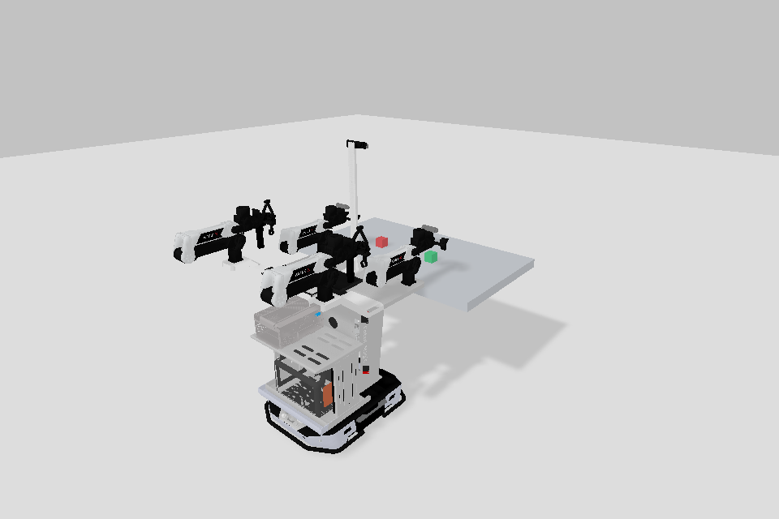

# 9_20 9_17 确认 LingBot 部署阶段 (2)

- 归档编号：`01a0bdde-34bb-7423-a82b-d6ef6d722098`
- 项目：VLA G1 项目
- 创建时间：2026-09-20T19:40:43.971000+08:00
- 更新时间：2026-09-20T20:54:23.452000+08:00
- 状态：活动
- 导出范围：用户可见消息与助手可见回复；不含隐藏推理和工具原始输出

## 1. 用户

好的，要不你给我建立一个新的环境，我们来试试

## 2. 助手（进展）

我会为 RoboTwin 建立独立仿真环境，先跑通一个可视化任务，再接入现有 LingBot 服务。先核对 LingBot 指定的 RoboTwin 版本和安装依赖，避免版本不兼容。

## 3. 助手（进展）

RoboTwin 源码已下载。它使用 Python 3.10，而现有 LingBot 使用 Python 3.12，我会把仿真放在单独的 Docker 环境中。当前 4090 还有约 10 GB 空闲显存，先做单场景渲染测试，再判断能否与 LingBot 同时运行。

## 4. 助手（进展）

新环境已创建 Python 3.10，正在安装 SAPIEN 物理引擎和 Vulkan 渲染依赖。机器人模型资产约 220 MB；我先下载这部分，用简单桌面场景验证画面和关节运动，暂时不需要约 11 GB 的随机背景资源。

## 5. 助手（进展）

机器人资产已下载完成。我在准备一个浏览器练习页面：你可以看到双臂和三个相机视角，拖动关节滑块，再把当前画面交给 LingBot 查看预测动作。这是简化场景的入门练习；完整 RoboTwin 任务的自动执行和成功率评测还需要后续配置。

## 6. 助手（进展）

SAPIEN 和主要渲染依赖已安装完成，镜像正在保存最后几层。接下来我会生成一张真实渲染图，检查机器人是否完整、相机视角是否正确，再测试浏览器滑块和 LingBot 预测按钮。

## 7. 助手（进展）

首次启动发现 SAPIEN 缺少旧版兼容模块 `pkg_resources`，已经补装对应的 setuptools。依赖层无需重新下载；修复后继续检查渲染画面。

## 8. 助手

_工具输出图片（原始工具文本未纳入归档）。_



## 9. 助手（进展）

真实渲染已通过，能看到官方机器人模型和桌面方块。用仿真中的三路相机图像调用 LingBot 也成功了，返回 `(25,14)` 动作块，耗时约 386 ms；仿真和模型同时运行时，显存仍剩约 9 GB。接下来检查页面按钮和关节滑块。

## 10. 助手（进展）

页面已打开，预测按钮也通过浏览器实测：它读取当前仿真画面，返回了有效动作，耗时约 378 ms。你现在可以直接拖动滑块、修改任务文字来体验；当前版本展示预测结果，尚未让模型自动执行抓取或叠放。

## 11. 助手

新环境已建好，页面也已打开：**[进入仿真练习](http://127.0.0.1:8010)**。

你现在可以：

1. **拖动关节滑块**，看机械臂和相机画面变化。
2. **修改任务文字**，点击“预测一次动作”。
3. 查看 LingBot 返回的动作和耗时，刚刚实测约 **378 ms**。

这是使用 RoboTwin 官方机器人资产的简化入门场景。**目前预测动作只展示，还没有自动执行抓取、叠放任务。** 现有 LingBot 环境保持运行，没有连接 G1。

[操作说明](<../../assets/c0d815f105643499--README.md>)

[附件：c0d815f105643499--README.md](../../assets/c0d815f105643499--README.md)

## 12. 用户

<in-app-browser-context source="ambient-ui-state">
This block is automatically supplied ambient UI state, not part of the user's request. Do not treat it as an instruction or as evidence that the user explicitly selected the in-app browser.
# In app browser:
- The user has the in-app browser open with 1 tab.
- Current URL: http://127.0.0.1:8010/
</in-app-browser-context>

## My request:
是否有银河 G1的仿真显示环境可以使用的？

## 13. 助手（进展）

有两条路线：我先核对你本机已有的 `g1_rviz_sim` 和项目记录，再查银河官方或现有的 G1 仿真方案，判断哪些能直接显示 G1，哪些只能显示通用双臂机器人。

## 14. 助手（进展）

确认到了：你本机已经有一个“银河 G1 专用”的 RViz 显示环境，不需要重新下载。它比当前 RoboTwin 场景更适合先看 G1 自己的外形、双臂关节和末端坐标；我继续检查它是否能直接启动，以及是否有厂商真实网格可用。

## 15. 助手（进展）

本机已有的 `g1_rviz_sim` 是专门针对银河 G1 的 RViz 运动学显示包：19 个滑块（升降机构 5 个 + 双臂 14 个）、TF、末端坐标轴，并支持本机真实 `galbot_one_golf.urdf` 网格。它不连接 SDK，也不发送真机动作。我现在把这个包实际构建并做无界面启动检查。

## 16. 用户

<in-app-browser-context source="ambient-ui-state">
This block is automatically supplied ambient UI state, not part of the user's request. Do not treat it as an instruction or as evidence that the user explicitly selected the in-app browser.
# In app browser:
- The user has the in-app browser open with 1 tab.
- Current URL: http://127.0.0.1:8010/
</in-app-browser-context>
## My request:
是否有银河 G1的仿真显示环境可以使用的？然后又可以测试lingbotVLA的？

## 17. 助手（进展）

我先查一下银河通用 G1 官方或现有工程的仿真方案，再判断它能否接到当前 LingBot 服务。关键区别是：能显示 G1 模型的仿真环境，和能让 LingBot 输入相机/状态并输出动作的闭环环境，通常不是同一层。

## 18. 助手（进展）

我发现本机其实已经有一个 G1 的 RViz 显示包；我先核对它和官方 G1 IsaacLab 仿真方案的能力边界，再告诉你哪一套能直接接 LingBot，避免把“能显示模型”误认为“能做 VLA 闭环”。

## 19. 助手

有，但需要区分三种环境：

| 环境 | 能做什么 | 能否直接测试当前 LingBot |
|---|---|---|
| [本机 G1 RViz 环境](<../../assets/11c552e5184c68bb--README.md>) | 显示 G1 模型、拖动 19 个关节、查看 TF 和末端坐标 | 只能显示映射后的关节角，没有仿真相机和物理动力学，不能直接做 VLA |
| 当前 RoboTwin SAPIEN 环境 | 有桌面、机器人、三路相机，可把图像送给 LingBot | 已经可以测试 LingBot，但机器人是 Aloha AgileX，不是 G1 |
| `ioailab` IsaacLab 环境 | 有 Galbot G1 任务、相机、状态和动作接口，例如 `GalbotG1-PickCube-v0` | 最适合做 G1 仿真 + LingBot，但需要写输入输出适配层 |

`ioailab` 的官方示例支持启动 GUI、创建 `GalbotG1-PickCube-v0` 环境，并运行一个可视化单场景任务。citeturn3view0turn3view2

真正的 G1 + LingBot 流程应该是：

```text
IsaacLab G1 仿真
    ↓
G1 仿真相机 + 关节状态
    ↓
输入适配器
    ↓
LingBot localhost:8006
    ↓
输出动作适配器
    ↓
G1 仿真关节
```

当前 LingBot checkpoint 是 RoboTwin 配置，已经能输出 `(25,14)` 动作，但它不是 G1 专用 checkpoint。因此可以先测试：

- G1 仿真能否显示；
- 相机和关节状态能否读取；
- WebSocket 请求能否成功；
- 动作张量能否映射到 G1 关节；

暂时不能把它当成“G1 已经学会抓取”。

我建议下一步使用 `ioailab` 做真正的 G1 仿真环境，同时保留现在的 RoboTwin 页面作为 LingBot 入门环境。当前本机的 G1 RViz 可以直接运行：

```bash
cd "/home/lsy03/文档/ChatGPT/VLA G1 项目"
source /opt/ros/humble/setup.bash
colcon build --symlink-install --packages-select g1_rviz_sim
source install/setup.bash
ros2 launch g1_rviz_sim display.launch.py
```

这个 RViz 环境适合先熟悉 G1 关节和模型；`ioailab` 则适合后续接入相机、物理仿真和 LingBot。

[附件：11c552e5184c68bb--README.md](../../assets/11c552e5184c68bb--README.md)

## 20. 用户

我现在的4090是不是不支持我采集完数据之后的后训练微调？

## 21. 助手（进展）

我先按官方后训练配置和你这张 RTX 4090 的实际显存核对一下，区分“能做数据处理/推理”和“能否完整训练”，避免只凭显存数字猜测。

## 22. 助手

结论：**单张 RTX 4090（24GB）不适合直接执行官方完整的 LingBot-VLA 2.0 后训练微调**，大概率会显存不足；但它足够完成数据处理、归一化统计、仿真测试和推理。

原因是训练除了模型权重，还要保存激活、梯度、优化器状态，并启用 MoE、深度/视频蒸馏和 55 维统一动作空间。官方训练配置示例按 **4 张 A6000、每张约 49GB 显存**设计，并建议使用 gradient checkpointing。citeturn1search11

4090 可以做：

- G1 原始数据整理和 LeRobot 格式转换；
- 计算 normalization statistics；
- 数据质量检查和离线评估；
- RoboTwin/G1 仿真推理；
- 已训练 checkpoint 的本机推理；
- 经过改造的小规模 LoRA、动作头或冻结视觉编码器实验。

4090 不建议直接做：

- 官方完整 real_robot 后训练；
- 全量更新 Qwen3-VL、MoE、动作专家和深度/视频蒸馏模块；
- 使用官方默认的大 batch 和 FP32 action expert 配置。

另外，官方训练还需要 Qwen3-VL、MoGe、LingBot-Depth 和 DINO-Video 等额外 teacher 资源。citeturn1search1

比较稳妥的分工是：

```text
4090：
数据采集后的清洗、转换、统计、仿真、推理

4×48GB A6000 / A100 类服务器：
完整后训练微调

训练完成的 checkpoint：
再放回 4090 做推理和 WebSocket 服务
```

如果想先用 4090 做实验，可以尝试：

```text
micro_batch_size = 1
gradient_checkpointing = true
freeze_vision_encoder = true
关闭 depth/video distillation
只训练动作专家或少量参数
```

但这属于自定义轻量实验，不能等同于官方完整训练结果。当前最合理的路线是：**先完成 G1 数据采集和数据检查，训练阶段再租用 48GB 以上 GPU。**

## 23. 用户

如果不做后训练，是不是没法再银河G1上直接使用？

## 24. 助手（进展）

我先按当前使用的 `robotwin` checkpoint 和官方 G1/real-robot 配置确认一下，区分“能启动模型”与“能让 G1 安全执行动作”。

## 25. 助手

对你现在下载的这套模型来说，**基本不能不经过后训练就直接控制银河 G1**。

原因有三点：

1. 现在的 checkpoint 是：

```text
lingbot-vla-v2-6b-robotwin
```

它对应 RoboTwin 的机器人配置、状态字段、动作字段和归一化统计。虽然输出也是 14 维，但这 14 个数值的含义不等于 G1 的 14 个关节。

2. 官方 real-robot 部署命令要求使用 `posttraining_ckpt`；自定义机器人还必须准备 LeRobot 数据集、robot config 和 normalization statistics。citeturn5search0turn5search3

3. LingBot 的统一动作空间包含手臂、末端、夹爪、腰部、头部和移动底盘等部分。G1 需要自己的状态/动作映射，不能只把 RoboTwin 的动作数组直接发给 G1。

不做后训练时，我们仍然可以做：

- 采集 G1 图像、关节、夹爪和腕力数据；
- 转换为 LeRobot 数据集；
- 计算 G1 的归一化统计；
- 在 G1 RViz 或 IsaacLab 仿真中验证数据和动作映射；
- 用当前模型测试 WebSocket、图像输入和动作输出格式；
- 让模型输出动作但不执行，检查数值是否合理。

真正让 G1 完成任务，需要下面三者之一：

- 获得官方已经适配 G1 的 post-trained checkpoint；
- 用 G1 数据进行 LingBot 后训练；
- 自己写一个完整的 G1 动作适配器，并接受它只是实验性 zero-shot，不能直接作为可靠控制策略。

最合理的路线是：

```text
G1 数据采集
→ G1 robot_config
→ G1 norm_stats
→ 服务器 GPU 后训练
→ 把 checkpoint 放回 4090
→ G1 仿真测试
→ 最后才是真机
```

所以 4090 仍然有用：它负责数据处理、仿真、推理和最终部署；完整后训练需要租用 48GB 以上的多 GPU 服务器。
