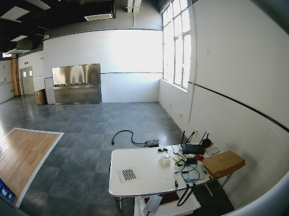
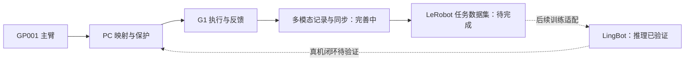
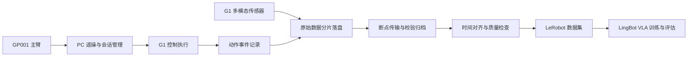

# 整理 VLA G1 项目进展计划

- 归档编号：`01a0bdf9-4f76-7690-a6c6-d9aa41429af5`
- 项目：VLA G1 项目
- 创建时间：2026-09-20T16:40:27.766000+08:00
- 更新时间：2026-09-20T16:48:19.490000+08:00
- 状态：活动
- 导出范围：用户可见消息与助手可见回复；不含隐藏推理和工具原始输出

## 1. 用户

给我整理一下“VLA G1 项目”这整个项目从开始到现在的所有工作，大概百十来个字写一下就行，再带上图片和结构图说明也行，还有未来一个月的计划

## 2. 助手（进展）

我先查看项目资料和相关任务记录，整理成简短回顾，再附上未来一个月的计划。

## 3. 助手

_工具输出图片（原始工具文本未纳入归档）。_

## 4. 助手

**项目回顾（截至 9 月 20 日，约 150 字）**

项目从设备故障修复、GP001 接口适配起步，逐步打通主臂—PC—G1 链路，完成单关节跟随验证及左臂七关节联调，补充夹爪控制、保护停止和数据记录功能。已部署 LingBot 推理与可视化仿真环境，验证多模态传感器读取及 LeRobot 样本存取。目前正完善时间同步和完整数采，尚未形成模型控制真机的任务闭环。

**未来一个月计划（9 月 21 日—10 月 20 日）**

- 第 1 周：完善时间同步，完成单臂跟随、夹爪联动与异常停止验收。
- 第 2 周：打通图像、深度、腕力、关节及动作的同步记录和数据转换。
- 第 3 周：完成 30 分钟连续采集测试，试采 10 段任务数据并检查质量。
- 第 4 周：通过数据验收后，开展模型适配、训练读取与离线评估，为真机闭环做准备。

G1 头部相机实采画面：

## 5. 用户

给我再加上lingbot VLA的部署情况 不论是项目回顾还是未来计划

## 6. 助手

**项目回顾（截至 9 月 20 日）**

项目已完成设备修复、GP001 接口适配及主臂—PC—G1 链路搭建，推进左臂七关节遥操、夹爪控制和数据记录。LingBot VLA 已完成 Docker 部署、RTX 4090 单卡推理及 WebSocket 接口验证，并搭建可视化仿真环境；多模态传感器读取与 LeRobot 样本存取已验证，完整数采和模型控制 G1 的闭环仍待打通。

**未来一个月计划（9 月 21 日—10 月 20 日）**

- **第 1 周：**完善时间同步和遥操验收；固化 LingBot VLA 部署环境，明确 G1 图像、状态及动作映射。
- **第 2 周：**打通多模态同步记录与 LeRobot 导出；完成 LingBot 数据加载、归一化及训练配置适配。
- **第 3 周：**完成连续采集测试和首批 10 段任务试采；数据验收后开展小规模微调与离线评估。
- **第 4 周：**部署适配后的模型，验证推理延迟与动作回放；通过安全验收后，尝试低速真机闭环并统计任务成功率。

## 7. 用户

再给我加上数采软件架构设计

## 8. 助手

**项目回顾（截至 9 月 20 日）**

项目已完成设备修复、GP001 适配及主臂—PC—G1 链路搭建，推进七关节遥操、夹爪控制和数据记录。LingBot VLA 已完成 Docker 部署、单卡推理及可视化仿真验证。数采软件已形成“机器人端原始记录—PC 端校验归档—时间对齐—LeRobot 导出”架构草案，完成传感器读取和样本存取验证，完整数采与真机模型闭环仍待打通。

**数采软件架构设计**

采用机器人端与 PC 端分工：G1 按原始频率记录图像、深度、腕力、关节及夹爪反馈，关联实际控制指令；PC 负责会话管理、数据传输校验、时间对齐、质量检查和训练集导出。记录与控制独立运行，避免写盘或传输阻塞遥操。

以上为目标架构，完整记录、传输与转换链路尚待实现和验收。

**未来一个月计划（9 月 21 日—10 月 20 日）**

- **第 1 周：**完善遥操与时间同步；确定数采字段、动作语义和模块接口；固化 LingBot 部署环境及 G1 输入输出映射。
- **第 2 周：**实现机器人端多模态记录、PC 端校验归档及 LeRobot 转换；完成 LingBot 数据加载与训练配置适配。
- **第 3 周：**完成 30 分钟连续采集及断网恢复测试，试采 10 段任务数据；验收后开展小规模微调和离线评估。
- **第 4 周：**完善数采质量报告和操作流程，部署适配后的 LingBot；通过动作回放与安全验收后，尝试低速真机闭环。

## 9. 用户

给我生成一个 .md文档

## 10. 助手（进展）

我把上述项目回顾、数采架构和月度计划整理成 Markdown 文档，保留结构图。

## 11. 助手

已生成，包含项目回顾、LingBot 部署情况、数采架构图、实采图片及未来一个月计划。

[查看 Markdown 文档](<../../assets/dc6e2e1b29740f98--VLA_G1_%E9%A1%B9%E7%9B%AE%E5%9B%9E%E9%A1%BE%E4%B8%8E%E6%9C%88%E5%BA%A6%E8%AE%A1%E5%88%92_20260920.md>)

[附件：dc6e2e1b29740f98--VLA_G1_项目回顾与月度计划_20260920.md](../../assets/dc6e2e1b29740f98--VLA_G1_%E9%A1%B9%E7%9B%AE%E5%9B%9E%E9%A1%BE%E4%B8%8E%E6%9C%88%E5%BA%A6%E8%AE%A1%E5%88%92_20260920.md)
