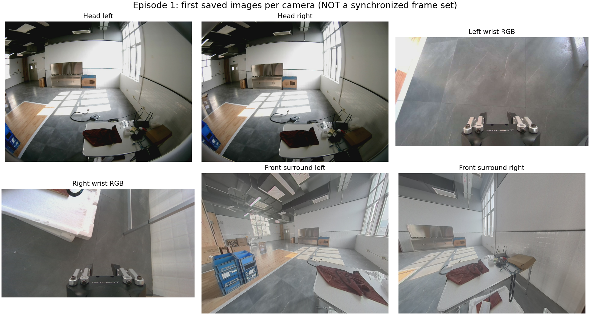
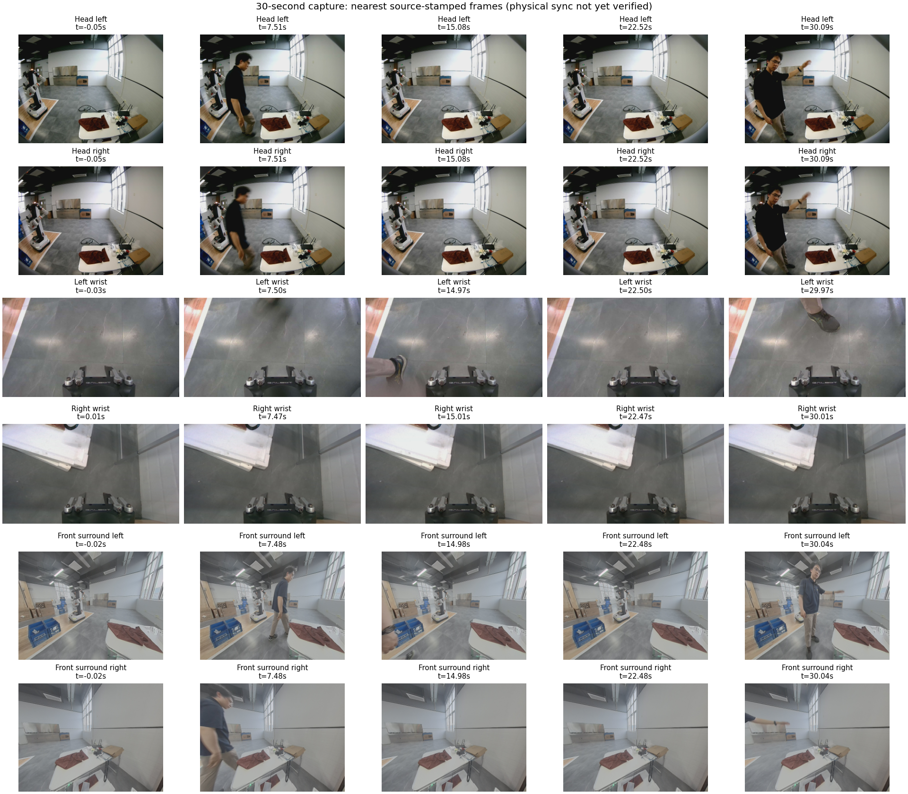
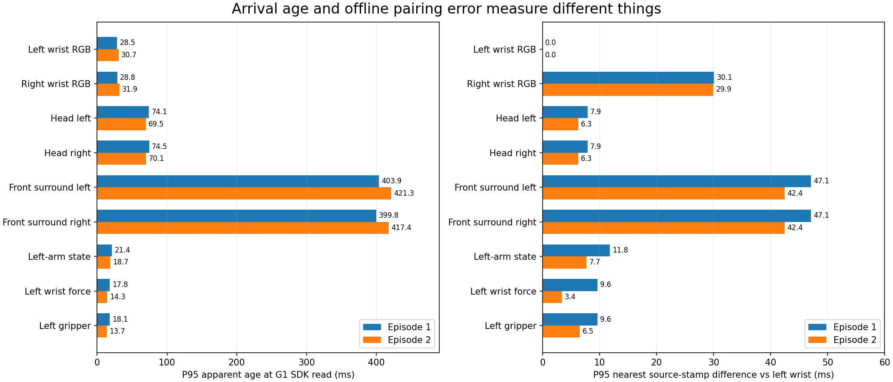
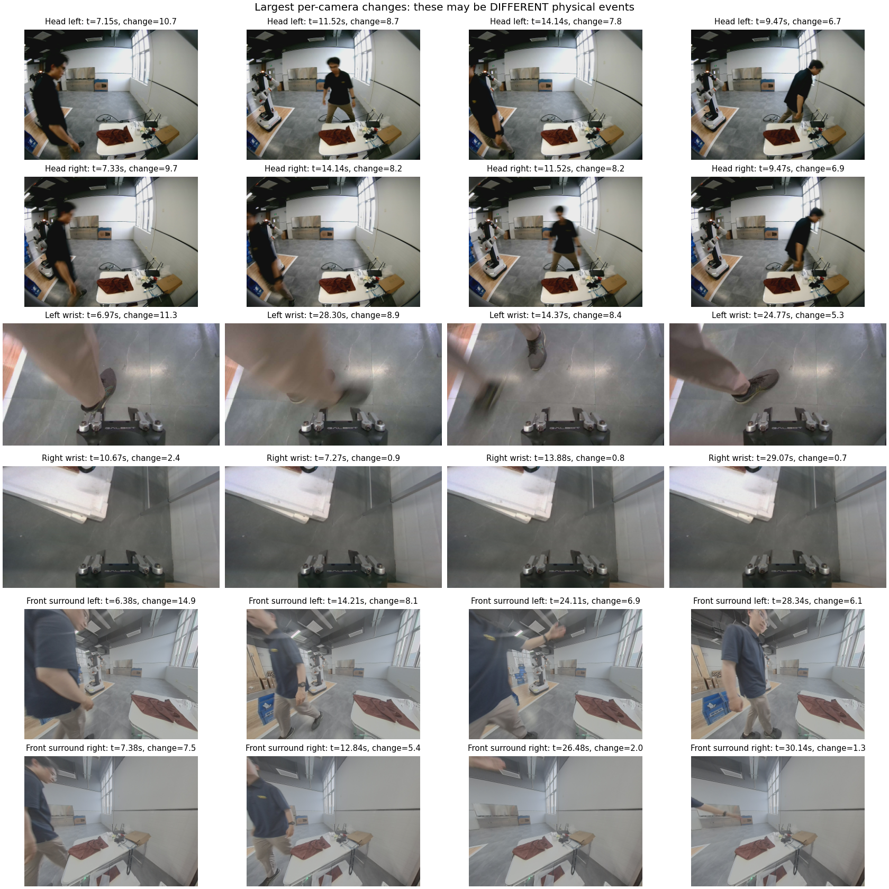

# 制定G1传感器与LeRobot 数据采集时间对齐

- 归档编号：`01a0c707-561b-7b60-8c9d-05b84e02d86c`
- 项目：VLA G1 项目
- 创建时间：2026-09-22T10:52:21.922000+08:00
- 更新时间：2026-09-22T18:34:19.152000+08:00
- 状态：活动
- 导出范围：用户可见消息与助手可见回复；不含隐藏推理和工具原始输出

## 1. 用户

我们在“9\_20 9\_18 数采 评估 G1 传感器与 LeRobot 支持”的基础上继续，看下我们下一步做啥，给我计划

## 2. 助手（进展）

我先查看这项任务的最近进展和待办，再整理下一步计划。

## 3. 助手

**下一步是搭建数采平台第一版，跑通一个“动作可追溯、时间可对齐、能完整回读并导出 LeRobot”的 episode。**

我核对了原任务和当前代码，有一个新的进展：**9 月 22 日双臂遥操已经加入高频反馈、机械臂及夹爪下发日志**，可以复用，不需要重新做动作记录。

目前的基础和缺口是：

- **已验证**：G1 17 路传感器完成短录，传回 PC 后通过完整性校验和图像、深度解码。
- **已有代码**：双臂、双夹爪动作日志，包含指令编号、SDK 调用前后时间与返回状态。
- **还没贯通**：手柄控制 episode、两端统一编号、持续时钟映射、联合回放和正式 LeRobot 导出。遥操入口仍沿用历史 `104 ms` 补偿，不能视为当前准确值。

建议按下面顺序推进：

| 步骤 | 要做什么 | 验收结果 |
|---|---|---|
| **1. 统一 episode 管理** | PC 创建 `episode_id`，串联 G1 传感器记录与 PC 动作日志；加入就绪、录制、落盘、完成、异常状态 | 一次开始／结束对应一个 episode，两端边界可追溯 |
| **2. 接入手柄录制键** | 按你之前提出的交互：记录键开始，再按结束；取消键结束并标记失败，保留数据；加入防抖和状态反馈 | 能连续录几段，不重复触发、不串段；落盘期间不能误开下一段 |
| **3. 补齐时间映射与动作关联** | 持续记录 PC↔G1 时钟关系，保留源时间戳；关联双臂、夹爪实际下发目标、返回结果和状态反馈 | 每段有时钟映射和各路对齐质量报告，明确缺帧、过期数据及不可对齐区间 |
| **4. 完成首个联合短录** | 先静态联调，再由你完成约 30–60 秒低速遥操；联合记录全部传感器与动作 | 在 PC 回看图像、关节、夹爪、腕力与指令，确认对应关系 |
| **5. 导出 LeRobot 并验证读取** | 固定关节顺序、单位、action 语义及采样规则；原始深度无损保留；生成训练数据和质量报告 | 数据加载器能读取样本，图像和数值正确，episode 边界正确 |
| **6. 连续采集与稳定性验收** | 先连续录 5–10 个 episode，再做 30 分钟压力和断线、中断恢复测试 | 无跨段混淆，异常数据有明确标记，存储与传输可持续 |

架构继续沿用：**G1 保存传感器原始数据；PC 负责遥操、录制管理、数据取回、对齐、回放和转换。**

实施时有三处需要明确处理：

- **任务结果与数据质量分开**：任务成功不代表数据合格；失败示范也可能完整可用。分别保存。
- **动作时间分清含义**：SDK 返回成功不等于硬件已经执行，必须结合反馈验证。
- **长录前检查容量**：此前约 10 秒产生 722 MB，按该速率估算，30 分钟约 **130 GB**，需要先确认 G1 和 PC 的空间及持续写入能力。

**建议下一轮先完成第 1–3 步，交付“手柄控制的双端 episode 记录流程”，然后做首个真机联合短录。** 你之前提出的取消录制是否同时暂停运动、再次按记录键是否直接判成功，还没有最终确认；这两项在接入按键时明确即可，不影响先搭建底层会话与时间映射。

## 4. 用户

bash teleoperation/run\_dual\_arm\_one\_press.sh --execute --seconds 600 \\
&#x20; \--speed-rad-s 1.0 --gripper-speed-m-s 0.16

能否在这个基础上进行lerobot数据构建？先给我方案计划，明确目标

## 5. 助手（进展）

我先检查这个一键双臂入口的控制和日志实现，确定哪些可以直接复用，再给你明确的目标和实施计划。

## 6. 助手

**可以，就以你这条 `run_dual_arm_one_press.sh` 命令作为遥操基础，接入数采功能并构建 LeRobot 数据集。** 我检查了代码：这个入口复用了双臂控制循环，已经记录双臂反馈、机械臂下发轨迹、双夹爪目标、指令编号和 SDK 调用时间，具备动作数据基础。

**第一阶段目标：你使用现有双臂、双夹爪遥操方式，按手柄开始和结束一次任务，系统自动生成一个包含图像、状态和动作、经过时间对齐、能被 LeRobot 加载的 episode。**

你给出的机械臂速度 `1.0 rad/s`、夹爪命令速度 `0.16 m/s` 会作为该批数据的控制配置保存。`--seconds 600` 目前是遥操程序的运行时限，**不等于一个 episode 必须录 600 秒**；一轮运行应支持录制多段任务。

**拟定的数据内容**

| 数据 | 第一版方案 |
|---|---|
| 图像 observation | 原始采集保留六路 RGB；训练优先使用头部一路、左右腕三视角，保留扩展选择 |
| 机器人状态 | 双臂 14 个关节实测角度＋双夹爪实测开度，组成 16 维基础状态 |
| action | 双臂 14 个关节的下发目标＋双夹爪下发开度，组成 16 维目标动作 |
| 附加数据 | 双腕力、双路无损深度、其余关节状态继续保存，按模型需要选择使用 |
| 元数据 | 任务描述、成功／失败／中断、关节顺序、单位、控制参数、代码版本和时间映射 |

action 必须来自**经过映射和限幅后实际提交的控制目标**，不能直接拿手柄原始角度或从臂实测位置代替。原始日志保留完整轨迹段、SDK 返回结果；导出时明确轨迹目标的时间含义。SDK 接受指令也不代表硬件已完成执行。

**实施计划**

| 阶段 | 具体工作 | 验收目标 |
|---|---|---|
| **1. 确定数据契约** | 固定 16 维 state/action 的顺序、单位、轨迹取值规则；定义单侧暂停、夹爪保持和无有效指令时的处理 | 每个字段含义清楚，训练与后续执行一致 |
| **2. 接入 episode 管理** | PC 统一编号，协调 G1 17 流记录器与现有遥操日志；接入手柄记录键、取消键、状态提示 | 连续录制多段，编号和边界一致；失败数据保留 |
| **3. 完成时间对齐** | 实测并持续记录 PC↔G1 时钟关系，替代将固定 `104 ms` 当作准确映射；保留各路原始时间戳 | 输出各流时间偏差、帧龄、缺帧和时钟异常报告 |
| **4. 联合短录与回看** | 先静态检查，再录一段 30–60 秒遥操；同步查看图像、状态和下发动作 | 动作有来源，全部必采流齐全，数据能够完整回读 |
| **5. LeRobot 导出** | 重采样、生成图像与数值数据、计算统计信息，并在现有环境加载验证 | 能实际读取训练 batch，维度、图像、任务和 episode 边界正确 |
| **6. 小批量验收** | 连续采 5–10 段，再做长录及中断恢复 | 能稳定重复使用，异常数据不会混入合格训练集 |

训练数据采样率建议**先评估 10 Hz**：现有机械臂轨迹按约 100 ms 更新，主要相机约 15 Hz。原始数据仍按各自实际频率保存；最终导出频率由联合短录结果确定。图像匹配需要记录实际时间差，不能通过重复帧宣称同步达标。

手柄交互沿用你之前的设想：

- 记录键：开始；再次按下结束。
- 取消键：结束并标记失败，保留数据。
- 落盘完成后：允许下一段。
- 设备断流、日志故障或程序到时：标记异常中断，不自动算成功。

其中“正常结束是否直接标成功”和“取消录制是否同时暂停运动”，在实现按键行为前需要明确。

**最终交付是：一个接在当前遥操入口上的采集流程、一份可回放的原始 episode、一份通过读取验证的 LeRobot 数据集，以及对应的数据质量报告。** 下一步先完成数据契约和 episode 管理，再接时钟映射，随后进行首段联合试采。

## 7. 用户

遥操脚本你是否还需要修改？要不新建一个遥操作数采脚本算了。之后的操作我使用 Luna max 进行，给我详细的方案计划，并明确目标。

## 8. 助手

**建议新建一个“遥操作数采”入口，保留现在的一键双臂遥操脚本。** 新入口复用现有控制代码，增加 episode 管理、传感器采集协调、时钟映射和数据导出。

现有遥操已经有动作与反馈日志，因此主要工作是把这些日志与 G1 传感器数据串起来。实施时可能需要给共享控制循环增加少量事件接口，但不需要复制整套控制逻辑，也不应改变原入口的默认行为。

下面这份计划可以直接交给 **Luna max** 执行；切换模型后继续本任务即可。

**一、明确目标**

第一阶段完成下面这条流程：

> 启动新的遥操作数采脚本 → 使用现有方式控制双臂、双夹爪 → 按记录键开始一次任务 → 再次按键结束，或按取消键标记失败 → 两端数据归入同一个 episode → PC 校验、对齐和回放 → 导出能够被 LeRobot 加载的数据集。

第一阶段的完成标准：

1. 连续完成至少 **3 个 episode**，覆盖正常结束、人工取消、下一段重新开始。
2. 每段同时包含 **G1 的 17 路原始传感器数据和 PC 动作日志**。
3. 动作可以追溯到下发指令、SDK 返回结果和对应反馈。
4. 时间映射有实测依据，对齐质量有报告。
5. 至少一个合格 episode 完成 LeRobot 导出与真实数据加载。
6. 原遥操入口通过回归检查，保持既有操作方式。

这阶段验收的是**采集与数据构建闭环**；模型训练效果和自主执行效果安排在后续。

**二、脚本与模块安排**

建议新增以下入口，名称为拟定：

| 入口／模块 | 职责 |
|---|---|
| `teleoperation/run_dual_arm_capture.sh` | 新的遥操作数采启动入口 |
| `teleoperation/dual_arm_capture.py` | 复用一键双臂遥操，接入采集会话 |
| `acquisition/session/` | episode 状态机、两端协调、任务标注 |
| `acquisition/time_alignment/` | 时钟采样、映射、离线对齐与质量报告 |
| `acquisition/export_lerobot/` | 原始 episode 转换为 LeRobot 数据集 |
| `acquisition/review/` | 图像、状态、动作联合回看 |

继续复用现有 G1 原始记录器，以及遥操动作日志组件。

新入口预期用法如下，**这是待实现的接口，不是现在已经可用的命令**：

```bash
bash teleoperation/run_dual_arm_capture.sh \
  --execute \
  --seconds 600 \
  --speed-rad-s 1.0 \
  --gripper-speed-m-s 0.16 \
  --task "双臂抓取并放置物体"
```

`600` 秒仍代表整轮遥操运行时限；其中可以包含多个独立 episode。开始下一段时应提示剩余运行时间，运行到时仍未结束的 episode 标记为中断。

**三、操作流程与状态管理**

建议使用以下状态：

```text
准备中 → 就绪 → 启动录制 → 录制中 → 完成落盘 → 就绪
                         └→ 异常中断 → 检查／恢复
```

| 操作或事件 | 数据处理 |
|---|---|
| 就绪时按记录键 | 生成新 episode 编号，启动两端记录 |
| 两端确认录制已就绪 | 发出“开始录制”反馈，允许进行本次任务 |
| 录制时再按记录键 | 结束本段并保存结果 |
| 录制时按取消键 | 结束本段，标记人工失败，保留数据 |
| 落盘期间按记录键 | 提示等待，不创建重叠 episode |
| 必采流断流、记录失败、进程退出 | 标记异常中断，保留原因和已有数据 |
| 恢复并重新就绪 | 使用新编号开始下一段 |

实现时必须区分两个概念：

- **任务结果**：成功、失败、中断、尚未标注。
- **数据质量**：完整、缺流、动作缺失、时间对齐不合格等。

任务失败的数据仍可能完整；任务成功的数据也可能不适合训练。

按键按下沿触发，并做防抖。录制开始、结束、失败和异常需要清晰的终端反馈，提示音可作为辅助。

尚需明确的两项交互可以留到按键接入前确认，底层模块先继续开发：

- 再次按记录键结束，是否直接代表“任务成功”。
- 取消录制，是否同时暂停机器人运动。

**四、数据如何组织**

保持现有两端分工：

| 位置 | 保存内容 |
|---|---|
| G1 | 17 路传感器原始数据、源时间戳、接收时间、分片及校验信息 |
| PC | 手柄输入、控制状态、机械臂和夹爪下发记录、episode 事件、时钟映射 |
| PC 汇总目录 | 两端原始数据、完整性报告、对齐结果、LeRobot 导出结果 |

PC 与 G1 共用 `session_id` 和 `episode_id`。启动和停止都要有请求、确认及实际时间记录；不能把“同时发送开始命令”视为已经同步。

停止采集后先完成本地落盘，再取回数据。传输和转换放到后台，不阻塞遥操控制循环。机器人原件在 PC 校验完成前保留。

**五、训练数据定义**

第一版建议采用以下基础结构：

| 字段 | 定义 |
|---|---|
| `observation.state` | 左臂 7 关节＋右臂 7 关节＋左右夹爪实测开度，共 16 维 |
| `action` | 左右臂下发目标角度＋左右夹爪目标开度，共 16 维 |
| 图像 | 训练默认选择头部一路与左右腕 RGB；原始六路 RGB 全部保留 |
| 附加观测 | 腕力、深度及其他关节状态保留，按训练需求扩展 |
| 任务信息 | 任务描述、结果、episode 编号 |
| 配置 | 关节名称、单位、控制速度、代码与配置版本 |

数据契约中要明确：

- 关节角使用 rad，夹爪开度使用 m，左右顺序固定。
- action 取**实际提交的轨迹目标**，保留轨迹起终点和时长，不能用手柄原始目标替代。
- SDK 下发失败不能作为有效动作。
- 单臂未启用、单侧暂停及夹爪保持时，保存控制状态与有效性信息，不能随意补零。
- episode 开始时记录当前有效目标，避免首条新指令之前没有动作上下文。
- 完整保存原始命令事件；重采样规则单独版本化，便于以后重新导出。

先评估以 **10 Hz** 导出基础数据集。各传感器原始数据仍按实际频率保存，最终频率通过联合试录确认。

**六、时间对齐是核心工作**

当前入口默认的 `104 ms` 是历史固定补偿，不能直接作为新数据集的准确时间映射。

需要完成：

1. 录制前、录制中及结束时采样 PC↔G1 时钟关系。
2. 保存原始采样、往返耗时、映射参数及适用区间。
3. 检测时钟跳变，按区间处理，不跨异常区间强行对齐。
4. 分清设备源时间、PC 接收时间、SDK 调用时间和目标轨迹时间。
5. 对齐后报告各路时间差、帧龄、缺失率和最大数据间隔。
6. 超出允许误差的样本明确标记或排除，不能无限复用旧帧。

**采集时间映射与控制指令时间补偿分别验证。** 先实现旁路采样和离线映射，再评估如何接入控制端，避免直接替换时间参数影响已有控制行为。

**七、按六个阶段执行**

| 阶段 | 工作内容 | 交付与通过条件 |
|---|---|---|
| **P0：代码核对与契约** | 检查最新一键入口、按键映射、动作字段、17 流契约、当前 LeRobot 环境 | 数据契约、接口清单、实施计划；明确可复用部分和缺口 |
| **P1：独立入口与会话** | 新建采集入口、状态机、统一编号；为共享控制代码增加必要接口 | 模拟数据下可连续开始、结束、取消；旧入口回归通过 |
| **P2：双端记录与时钟** | 接入 G1 记录器、动作日志、时钟采样、落盘与取回 | 静态短录可完整回读；异常能明确结束并保留记录 |
| **P3：联合遥操试采** | 现场完成 30–60 秒任务，查看图像、动作、反馈 | 一段数据链路完整，有对齐质量报告 |
| **P4：LeRobot 转换** | 实现重采样、图像导出、统计信息、加载检查 | 能读取真实训练 batch，字段、单位、边界一致 |
| **P5：连续采集验收** | 连续采集、人工取消、进程中断与恢复；之后开展长录 | 形成可重复使用的第一版采集流程和操作文档 |

Luna max 应先完成 P0–P2 的代码与离线验证，再组织 P3 真机联调。**本条消息中的 `--execute` 是计划所依据的使用方式，不需要现在启动机器人。**

**八、交给 Luna max 的执行要求**

可以直接按以下要求继续：

> 以现有一键双臂遥操为基础，新建遥操作数采入口，复用控制逻辑和日志组件。先核对最新代码与项目说明，再完成数据契约、episode 状态机、G1 原始记录协调、PC 动作关联和持续时钟采样。保留现有入口的默认行为，新增功能不得阻塞控制循环。所有模拟数据和只读日志必须明确标识，不能混作真机训练数据。按 P0–P5 分阶段交付，每阶段说明实现内容、验证证据和未完成项；涉及真机运动时安排现场联调。最终交付可连续录制的采集入口、完整原始 episode、对齐质量报告、可加载的 LeRobot 数据集及操作文档。

**下一步具体从 P0 开始：确定数据契约与新入口接口，然后实现 episode 管理。**

## 9. 用户

好的，我们开始执行

## 10. 助手（进展）

我开始按 P0→P2 执行：先固定数据契约和新入口接口，再实现 episode 会话状态机与离线测试；现有遥操入口会保持不变，暂不启动真机运动。

## 11. 助手（进展）

我已经确认了现有入口的关键点：动作与反馈日志可复用，轨迹记录键/取消键的候选索引也已有辨识记录（记录键 1/10，取消键 8/17）。我先把这些定义固化成版本化契约，并把新入口接到现有控制循环的旁路接口上。

## 12. 助手（进展）

P0 和 P1 的第一版代码已经落地：版本化数据契约、episode 状态机、新入口脚本和按键防抖都已接入；接下来我在做回归测试，重点确认旧的一键双臂控制路径没有被改变。

## 13. 用户

要不我们先暂停？下午再继续

## 14. 助手（进展）

可以，先暂停。我会停止仍在后台运行的全量回归测试，保留当前代码和测试结果，下午从这里继续。

## 15. 助手

好的，已暂停，没有启动真机运动。

当前已完成并保留：

- 新数据契约与 16 维 state/action 定义
- episode 开始、成功结束、取消失败、中断状态机
- 新入口：[run_dual_arm_capture.sh](/home/lsy03/文档/ChatGPT/VLA G1 项目/teleoperation/run_dual_arm_capture.sh)
- 按键防抖和旧遥操入口兼容
- 新增离线测试全部通过
- 全量回归测试已停止，未完成，不视为通过

下午从 **P2：协调 G1 原始传感器记录、接入时间映射和联合 episode** 继续。

## 16. 用户

我们继续

## 17. 助手（进展）

我先复核暂停时的代码和测试，补齐 episode 边界处理，再接 G1 记录协调与时钟采样。

## 18. 助手（进展）

复核发现上一版有几处需要先修正：结束 episode 时会丢失开始时间，传感器尚未接入就标成了 `complete`，清单写盘也仍在控制循环内。我先修好这些问题，再接入异步录制协调。

## 19. 助手（进展）

两项按键语义已经发给你确认；我会继续完成不依赖回答的部分。远端检查将使用 `galbot-136-ssh` 技能中的凭据方式，通过项目现有有线地址检查 G1 环境和记录器目录。

## 20. 用户

<send_user_message_question_reply>
[{"questionItemId":"[\"request_user_input_async\",\"call_GskCPUcqcFG9NMVUxEkk2T68\",0]","question":"录制中再次按记录键，是否直接标记本次任务成功？","answer":"直接标记成功"},{"questionItemId":"[\"request_user_input_async\",\"call_GskCPUcqcFG9NMVUxEkk2T68\",1]","question":"按取消键标记失败并结束录制时，机器人应如何处理？","answer":"继续遥操，仅结束录制"}]
</send_user_message_question_reply>

## 21. 助手（进展）

已确认：记录键再次按下即标记成功；取消键标记失败并结束录制，遥操继续。G1 有线 SSH 正常，现有记录器目录也在，磁盘约剩余 1.5 TB。接下来会把录制启动、停止和写盘放到后台，并让界面等两端确认后再显示“录制中”。

## 22. 助手（进展）

异步链路已经接上：PC 控制线程只提交录制请求，后台通过宿主机 SSH 与 G1 通信，凭据留在宿主机。开始录制会等待 17 路数据齐备，结束后会等待 G1 清空写盘队列。时钟采样也已加入；它能估计跨主机时钟关系，但还不能证明相机曝光与动作物理同步。

## 23. 助手（进展）

离线测试已覆盖连续录制、成功结束、取消保留和异常中断；原始记录器的 11 项测试也通过了。新版只读服务已部署到 G1 独立目录，接下来用两段约 3 秒静态录制验证两端编号、开始确认、正常结束和时钟采样。

## 24. 助手（进展）

第一段静态录制通过了；第二段在同一进程重新初始化 SDK 后，17 路数据全部没有更新。我会改为每个 episode 使用独立的只读采集子进程，再复测连续录制。

本次时钟采样还发现，G1 相对 PC 的偏移在数秒内约为 65–73 ms，并非固定 104 ms。当前数据会继续标记为时间对齐未验证。

## 25. 助手（进展）

改为每段独立采集进程后，两段静态录制都通过了：第一段正常结束，第二段取消并保留数据。两段的 17 路数据均完成落盘，正在传回 PC 校验。旧遥操的完整回归测试也已结束，191 项全部通过。

## 26. 助手（进展）

两段数据已通过 PC 全量校验，507 帧 RGB 和 189 帧深度全部解码成功。代码也已按你的选择实现“取消录制后继续遥操”，并通过模拟控制测试。现在新增了只检查手柄按键的入口，下一步可以现场确认四个按键和长按防抖。

## 27. 助手

已推进到**双端连续录制通过静态验证**：

- 新入口已接入 G1 的 17 路记录、episode 管理和持续时钟采样。
- 连续两段约 3 秒录制通过，成功结束和取消保留均正常。
- 数据传回 PC 后校验通过，507 帧 RGB、189 帧深度全部解码成功。
- 193 项遥操回归、9 项会话测试通过。本轮没有执行机器人运动。

**时间对齐和 LeRobot 导出仍未完成。** 本次时钟偏移约 65–75 ms，存在变化，不能直接使用固定 104 ms 对齐训练数据。

下一步需要你现场确认手柄按键。退出已有遥操后运行：

```bash
bash teleoperation/run_dual_arm_capture.sh --controls-only --seconds 30
```

依次短按**左记录、右记录、左取消、右取消**，再长按一次记录键，检查是否只触发一次。这个命令仅检查手柄，不控制机器人。

详细结果见[阶段验收记录](<../../assets/942fac11437e6a7e--%E9%98%B6%E6%AE%B5%E9%AA%8C%E6%94%B6_20260922.md>)。

[附件：942fac11437e6a7e--阶段验收_20260922.md](../../assets/942fac11437e6a7e--%E9%98%B6%E6%AE%B5%E9%AA%8C%E6%94%B6_20260922.md)

## 28. 用户

lsy03\@lsy03-System-Product-Name:\~/文档/ChatGPT/VLA G1 项目$ bash teleoperation/run\_dual\_arm\_capture.sh --controls-only --seconds 300
仅检查手柄：请依次短按左记录、右记录、左取消、右取消；再检查长按只出现一次。
error hex :  ED 00 00 00 00 00 73 B0 23 03 12 45 89 BF 92 4C 0E BC 00 50 F5 BE 00 00 00 00 54 66 CB BF 92 45 A4 3D 00 00 7A 3C 00 00 00 00 C5 AB D7 C0 92 8A 57 BD 00 00 C8 3D 00 00 00 00 E1 9A 5D BD 00 C8 AF BC 00 00 61 3D 00 00 00 00 6E 08 C5 C0 DB 79 3F BE 00 00 00 00 00 00 00 00 4D C3 2B BE 25 CA 82 BD 00 00 C8 3B 00 00 00 00 7E 98 21 3C B7 2B 4F 3D 00 00 00 00 00 00 00 00 19 79 EA AE
record\_left: record
record\_right: record
cancel\_left: cancel
cancel\_right: cancel
^CTraceback (most recent call last):
&#x20; File "\<frozen runpy>", line 198, in \_run\_module\_as\_main
&#x20; File "\<frozen runpy>", line 88, in \_run\_code
&#x20; File "/workspace/acquisition/lerobot\_capture/buttons.py", line 45, in \<module>
&#x20;   main()
&#x20; File "/workspace/acquisition/lerobot\_capture/buttons.py", line 39, in main
&#x20;   time.sleep(.01)
KeyboardInterrupt
lsy03\@lsy03-System-Product-Name:\~/文档/ChatGPT/VLA G1 项目$&#x20;


你看看这个验证有没有问题？

## 29. 助手（进展）

四个按键的输出都与预期一致。我再核对 `error hex` 的来源和这次日志，确认它对验证结果的影响。

## 30. 助手

**四个按键的基础映射验证通过；长按防抖和通信稳定性还需要补测。** 我核对了保存的日志，正好四条事件，均为 `fault: null`，没有重复触发。

你看到的两处输出分别是：

- **`error hex`**：底层通信库输出的异常报文诊断。随后四个按键仍正常识别，说明这次没有阻断按键读取；仅凭这一行还不能确定是校验失败还是解析异常，也不能判断是否持续丢帧。
- **`KeyboardInterrupt`**：你按 `Ctrl+C` 主动退出产生的提示。脚本目前没有将它转换为友好的退出消息，**不是程序自行崩溃**。

这份日志没有单独的长按测试记录，因此还不能确认现场长按防抖通过。建议继续用同一只读命令补测：

**长按记录键 2–3 秒 → 松开 → 再短按一次。预期总共出现两条 `record`，长按期间不重复输出。**

同时观察 `error hex` 是否频繁出现。补测通过后，再进入手柄与 G1 传感器的只读联合录制。

## 31. 用户

lsy03\@lsy03-System-Product-Name:\~/文档/ChatGPT/VLA G1 项目$ bash teleoperation/run\_dual\_arm\_capture.sh --controls-only --seconds 300
仅检查手柄：请依次短按左记录、右记录、左取消、右取消；再检查长按只出现一次。
record\_left: record
record\_left: record
record\_right: record
record\_right: record
^CTraceback (most recent call last):
&#x20; File "\<frozen runpy>", line 198, in \_run\_module\_as\_main
&#x20; File "\<frozen runpy>", line 88, in \_run\_code
&#x20; File "/workspace/acquisition/lerobot\_capture/buttons.py", line 45, in \<module>
&#x20;   main()
&#x20; File "/workspace/acquisition/lerobot\_capture/buttons.py", line 39, in main
&#x20;   time.sleep(.01)
KeyboardInterrupt
lsy03\@lsy03-System-Product-Name:\~/文档/ChatGPT/VLA G1 项目$&#x20;
现在如何？

## 32. 助手

**如果你左右两侧都按“长按 → 松开 → 再短按”操作，那么这次防抖验证通过了。**

- 左右记录键各输出两次，符合预期。
- 这次贴出的输出没有 `error hex`。
- `KeyboardInterrupt` 仍然只是你按 `Ctrl+C` 主动退出。

下一步做**手柄与 G1 传感器的只读联合录制**，运行：

```bash
bash teleoperation/run_dual_arm_capture.sh \
  --seconds 120 \
  --task "只读联合录制验证"
```

这条命令不带 `--execute`，不会下发运动指令。按下面顺序操作：

1. 按记录键，等待出现“两端录制就绪”。
2. 等约 5 秒，再按记录键，验证成功结束。
3. 等“本段落盘完成”，再次按记录键。
4. 录制约 5 秒后按取消键，验证失败结束并保留数据。
5. 等程序到时退出，把终端输出发给我。

这一步验证录制流程与两端数据关联，尚不作为带动作的训练数据。

## 33. 用户

你是不是应该能看到日志，现在数采按键是否有问题？

[附件：1272fa2c17f1b207--pasted-text.txt](../../assets/1272fa2c17f1b207--pasted-text.txt)

## 34. 助手（进展）

是的，我可以直接读取项目里的日志。我现在核对这次会话的按键事件、录制状态和你贴出的终端输出。

## 35. 助手（进展）

日志里已经能确认：左右记录键都成功完成过“开始→结束→落盘”。有一次按键在录制启动期间被忽略；最后退出则是 G1 反馈年龄达到 310.3 ms，触发了超时保护。我继续核对启动录制前后的反馈，区分按键响应和数据链路的问题。

## 36. 助手

是的，我能直接读取日志，后续你不用反复粘贴终端输出。

**结论：左右记录键识别正常，但联合数采流程存在反馈超时问题，尚未完全验收通过。** 最新一轮日志显示：

| 操作 | 实际结果 |
|---|---|
| 左记录键开始、再次结束 | 第 1 段成功，17 路数据完成落盘 |
| 启动期间再次按键 | 被明确忽略，原因是 `starting` |
| 右记录键开始、再次结束 | 第 2 段成功，17 路数据完成落盘 |
| 右记录键启动第 3 段 | 尚未就绪，G1 反馈超时，录制标记为中断 |

你感觉按键没反应，有两处原因：

- **启动需要约 3.5–4.1 秒**。这期间再次按键不会结束录制；当前表格持续刷屏，也容易淹没录制提示。
- **最后退出由反馈超时触发**：反馈时间戳停止更新，年龄逐步升至 **310.3 ms**。当时控制循环仍约每 11 ms 运行，说明不是按键处理或清单写盘把循环卡住。

此外，当前仍使用历史 **104 ms** 补偿，而这轮采样主要约 **78–79 ms**，会额外增加约 25 ms 的计算年龄。它可能加剧触发，但不能解释全部反馈停顿。

**下一步应处理录制启动时的反馈停顿、更新时钟补偿，并把数采状态固定显示出来。** 这轮还没有出现“取消键结束录制”的事件，因此取消功能的联合验收仍待补齐。

## 37. 用户

要不我们先检查一下数据如何？数据时间戳是否对齐？各个相机是否有延迟，是否能够对齐为后续VLA拿来用？

## 38. 助手（进展）

我先检查刚才录成的两段数据：核验原始文件，再分析各相机、关节、夹爪和腕力的时间戳、更新间隔及可配对误差，判断哪些能用于后续 VLA、还缺哪些验证。

## 39. 助手（进展）

原始文件已取回，前两段完整，第三段保留了中断标记。初步看到部分环视图像的源时间明显早于读取时间；我会把“数据到达时有多旧”和“保存后能否按时间戳配对”分别统计，避免把时间戳接近误判为低延迟。

## 40. 助手（进展）

结果比较明确：头部和腕部相机约 15 Hz，前环视约 10 Hz；保存后可以按源时间戳做近邻配对。但前环视在 G1 被读取时，数据年龄 P95 约 400–420 ms，明显高于腕相机的约 29–32 ms。当前两段没有实际下发动作，因此还不能验证 observation 与 action 的对齐。

## 41. 助手

_工具输出图片（原始工具文本未纳入归档）。_




## 42. 助手（进展）

离线组帧试算表明，头部一路＋双腕图像＋状态可以组成一部分 10 Hz 候选样本，但需要裁掉边界缺数据的部分，并标记个别状态时间缺口。完整报告已写好，会保留“软件时间戳可配对”与“物理同步尚未验证”的区别。

## 43. 助手

**数据保存正常，有离线对齐的基础，但目前还没有完成同步验收，不能直接作为 VLA 训练演示。**

我检查了最新两段完整数据，共约 **3.84 秒**：17 路数据齐全，318 帧 RGB、118 帧深度全部解码通过。第三段为中断数据，已单独排除。

下面是两段各自 P95 的范围：

| 数据 | G1 读取时的数据年龄 | 离线配对后，相对左腕图像的时间差 |
|---|---:|---:|
| 左腕 RGB | 29–31 ms | 0，作为参考 |
| 右腕 RGB | 29–32 ms | **约 30 ms** |
| 头部左右 RGB | 70–75 ms | **6–8 ms** |
| 左右前环视 | **400–421 ms** | 42–47 ms |
| 关节状态 | 19–21 ms | 8–12 ms |
| 腕力／夹爪 | 14–18 ms | 3–10 ms |

这里的数据年龄是“读取时间－源时间戳”，包含缓存、传输、轮询及源时钟误差，**尚不能视为经过校准的纯相机延迟**。

有三个关键结论：

1. **头部＋双腕适合继续做对齐验证。** 头部和腕相机约 15 Hz，同侧腕 RGB 与深度的时间戳一致。不过，左右腕仍有约 30 ms 相位差，最近邻配对不能让它们变成同时曝光。

2. **环视需要重点排查。** 它可以在离线数据中匹配到接近的历史时刻，但图像约晚 0.4 秒才被读取。若实时策略也等待环视，可能增加明显的观测延迟。需要区分缓存延迟和时间戳基准偏差。

3. **动作与观测对齐尚未验证。** 这两段实际下发动作数为 **0**，机器人基本静止，无法判断图像中的变化是否与动作对应。另外，本轮 G1−PC 时钟差约 **78–80 ms**，不能继续用固定 104 ms 对齐数据。

建议下一步按这个顺序做：

- 先用**头部一路＋双腕＋双臂状态＋夹爪**构建候选样本，保留全部原始流。
- 完成跨机时钟映射、边界裁剪和缺帧检查，再验证 10 Hz 组帧。
- 用共同可见的移动标记或闪光验证相机实际时序，随后录一段带动作日志的低速任务。
- 通过后再做 LeRobot 导出和训练加载验收。

完整数字、图像检查和对齐方法已写入[数据质量与时间对齐评估](<../../assets/a2ef60472d23858c--%E6%95%B0%E6%8D%AE%E8%B4%A8%E9%87%8F%E4%B8%8E%E6%97%B6%E9%97%B4%E5%AF%B9%E9%BD%90%E8%AF%84%E4%BC%B0.md>)。本次样本很短，结论用于指导下一轮验证，不能代表长期采集质量。

[附件：a2ef60472d23858c--数据质量与时间对齐评估.md](../../assets/a2ef60472d23858c--%E6%95%B0%E6%8D%AE%E8%B4%A8%E9%87%8F%E4%B8%8E%E6%97%B6%E9%97%B4%E5%AF%B9%E9%BD%90%E8%AF%84%E4%BC%B0.md)

## 44. 用户

好的，我们开始

## 45. 助手（进展）

我会先把现有数据的时钟映射、组帧预览和质量检查做成可复用工具，并接到 LeRobot 导出流程上。需要你现场配合的相机时序和低速动作验证，等离线工具就绪后再进行。

## 46. 助手（进展）

分段时钟映射和组帧工具已完成。加入时钟不确定度、边界覆盖和状态缺口检查后，现有两段分别有 21/25、7/14 个候选时刻通过；无效行会保留原因，连续有效区间会分开处理，避免删掉坏行后把时间压缩。接下来验证这些真实图像和状态能否被 LeRobot 正确读取。

## 47. 助手（进展）

LeRobot 读取验证通过了：真实数据已导出为 26 帧、4 个连续预览片段，三路图像和 16 维状态逐帧重载正常，批次状态形状为 `[2,16]`。它没有 action 字段，仍标记为观测预览。

我也补上了启动等待提示、预热期间的时钟采样，以及停止后的短暂延迟数据收集。接下来准备一条只录传感器的 30 秒检查命令，供你现场验证图像里的同一事件是否在各相机中同步出现。

## 48. 助手

已完成第一轮工具与格式验证：

- 分段时钟映射、10 Hz 组帧和缺口检查已实现。
- 真实数据导出为 **26 帧、4 个连续片段的 LeRobot 观测预览**，逐帧重载及 `[2,16]` 状态批次读取通过。
- 15 项会话／对齐测试、17 项相关遥操测试通过。

目前没有动作标签，物理同步也未验证，因此仍不能用于正式训练。

下一步请保持机器人静止，退出已有遥操程序，运行：

```bash
bash teleoperation/run_camera_timing_check.sh --seconds 30
```

这是**纯传感器录制，不发送运动指令**。看到“开始”后，在头部和腕相机共同可见的区域，移动明显标记几次；若三路没有共同视野，可以先验证头部与其中一路腕相机。

结束后告诉我即可，我直接读取日志和数据。此前的采集启动反馈停顿仍待解决，低速运动验证留在后续。

[本阶段结果](<../../assets/b77c9ce27020ee4b--%E5%AF%B9%E9%BD%90%E4%B8%8ELeRobot%E9%A2%84%E8%A7%88%E9%98%B6%E6%AE%B5%E7%BB%93%E6%9E%9C.md>)

[附件：b77c9ce27020ee4b--对齐与LeRobot预览阶段结果.md](../../assets/b77c9ce27020ee4b--%E5%AF%B9%E9%BD%90%E4%B8%8ELeRobot%E9%A2%84%E8%A7%88%E9%98%B6%E6%AE%B5%E7%BB%93%E6%9E%9C.md)

## 49. 用户

lsy03\@lsy03-System-Product-Name:\~/文档/ChatGPT/VLA G1 项目$ bash teleoperation/run\_camera\_timing\_check.sh --seconds 30
只读传感器检查：正在预热17路数据，不启用遥操或机器人运动。
【开始】请让同一标记或闪光事件被待检查相机共同看见；机器人保持静止。
剩余约 30 秒；请做几次清晰、可重复的可见变化。
剩余约 25 秒；请做几次清晰、可重复的可见变化。
剩余约 20 秒；请做几次清晰、可重复的可见变化。
剩余约 15 秒；请做几次清晰、可重复的可见变化。
剩余约 10 秒；请做几次清晰、可重复的可见变化。
剩余约 5 秒；请做几次清晰、可重复的可见变化。
【完成】原始传感器数据已落盘；尚未判定物理时序是否合格。
会话目录：lerobot\_runs/camera\_timing\_20260922\_162948\_488647
取回命令：python3 -B -m acquisition.lerobot\_capture.fetch lerobot\_runs/camera\_timing\_20260922\_162948\_488647
lsy03\@lsy03-System-Product-Name:\~/文档/ChatGPT/VLA G1 项目$&#x20;
&#x20;
你看看这个

## 50. 助手（进展）

这段已经正常完成。我直接取回这次 30 秒数据，检查帧率、延迟和时间戳，并查看画面中的变化是否足以验证各相机的实际时序。

## 51. 助手（进展）

清单显示这段写盘正常，但有个新问题：双腕各保存了 461 帧，头部左右目各只有 178 帧。头部的实际更新率明显低于此前的 15 Hz；我会核对时间戳和画面，确认是持续低帧率还是间歇性缺帧。

## 52. 助手

_工具输出图片（原始工具文本未纳入归档）。_


## 53. 助手（进展）

这次头部相机是持续约 5.78 Hz，帧间隔约 152–188 ms；双腕仍稳定在 15 Hz。按现有质量规则，这段没有形成合格的三视角 10 Hz 连续样本。

画面中能看到走动、抬手等变化，但右腕视野里几乎没有同一目标，所以还不足以完成头部与双腕的物理同步验收。

## 54. 助手

**录制成功，但这次时序质量还没通过验收。** 我已取回数据，完整性校验及 **1883 帧 RGB、922 帧深度**解码全部通过。

主要结果：

| 相机 | 实际取得帧率 | 数据年龄 P95 |
|---|---:|---:|
| 头部左右目 | **5.78 Hz** | 126–127 ms |
| 左右腕 | **15 Hz** | 35–36 ms |
| 左右前环视 | 约 9.8 Hz | 约 398 ms |

数据年龄是“G1 读取时间－源时间戳”，包含缓存和时钟误差，不等于已经测准的纯相机延迟。

**当前最突出的问题是头部降帧。** 此前约 15 Hz，这次持续只有约 5.8 Hz，帧间隔达到 152–188 ms。相对左腕的近邻配对误差 P95 也增至 **83 ms**。按现有三视角 10 Hz 质量规则，301 个候选时刻没有合格行。

画面里能看到走动、抬手等变化，但**右腕视野中几乎没有同一目标**，所以还不能证实头部与双腕的物理同步。

我只读检查了配置：头部目标仍为 `15 fps`，自动曝光开启。**降帧根因尚未确定**，不能直接归因于曝光或采集程序。

下一步应先排查头部低帧率，再安排共同可见事件复测；目前先不进入带动作的正式数采。

[完整验收结果](<../../assets/9bfe37b7b052adfc--%E9%AA%8C%E6%94%B6%E7%BB%93%E6%9E%9C.md>) · [六路关键帧](<../../assets/27cca3ea86e8f1e7--contact_sheet.png>)

[附件：9bfe37b7b052adfc--验收结果.md](../../assets/9bfe37b7b052adfc--%E9%AA%8C%E6%94%B6%E7%BB%93%E6%9E%9C.md)



## 55. 用户

继续排查

## 56. 助手（进展）

我继续定位头部降帧发生在哪一层：先检查相机驱动与曝光设置，再对比“只订阅头部”和“全量读取”的帧率、耗时及系统负载。先保持配置不变，用只读检查缩小范围。

## 57. 助手（进展）

只订阅头部、完全不写图像文件时，当前帧率仍只有约 2.51 Hz；SDK 读取通常不到 0.2 ms，轮询约每 4 ms 一次。这说明降帧在写盘之前就已出现。当前 CPU/GPU 也没有满载，我继续检查底层相机出帧和自动曝光的证据。

## 58. 助手（进展）

绕过 SDK 后，头部图像发布主题也只有 2.50–2.53 Hz，降帧已经出现在驱动发布端。全量读取时头部仍约 2.51 Hz，双腕维持约 15 Hz，暂未看到其他传感器读取拖慢头部的证据。

运行参数上报目标帧率仍为 15、自动曝光开启。我也确认了实际设备是 USB/UVC 相机；还需要区分相机出帧变慢与驱动内部处理变慢。

## 59. 助手（进展）

驱动自身的统计也确认了：头部 `target_fps=15`，但 `capture_fps` 和 `publish_fps` 都约为 2.51，采集阶段就已变慢。

另一个线索是，帧间隔从约 68 ms 增长到 176 ms、398 ms 时，数据年龄也随之增长；“数据年龄－半个帧间隔”三次都约为 29 ms。这个规律支持优先检查曝光或相机出帧节奏，但还不足以直接认定自动曝光是根因。相机参数目前没有改动。

## 60. 助手

**问题已缩小到头部相机的采集端，数采写盘和 Python 轮询不是当前主因。**

最新对照结果：

| 检查方式 | 头部帧率 |
|---|---:|
| 只订阅头部，不写图像文件 | 2.513 Hz |
| 全量读取，不写图像文件 | 2.514 Hz |
| 绕过 SDK，直接统计图像主题 | 2.50–2.53 Hz |
| 驱动自身统计 | **目标 15，采集与发布均约 2.51 Hz** |

同时，双腕仍约 15 Hz；SDK 读取通常不到 0.2 ms，轮询约每 4 ms 一次。当前没有看到整机资源满载。

**自动曝光或相机内部出帧节奏是优先排查方向，但还没有证实具体根因。** 头部帧率从下午约 15 Hz，降到 16:29 的 5.78 Hz，再到现在约 2.51 Hz。自动曝光仍开启；本次没有修改参数或重启服务。

下一步最有区分度的是**补光对照**：请把头部相机视野内的场景照亮，完成后告诉我。我会保持参数不变，再测 15 秒，判断采集帧率是否恢复。

[详细诊断报告](<../../assets/4050a0e81c511d18--%E5%A4%B4%E9%83%A8%E9%99%8D%E5%B8%A7%E5%AE%9A%E4%BD%8D.md>)

[附件：4050a0e81c511d18--头部降帧定位.md](../../assets/4050a0e81c511d18--%E5%A4%B4%E9%83%A8%E9%99%8D%E5%B8%A7%E5%AE%9A%E4%BD%8D.md)

## 61. 助手

_历史投影中的图片引用（用于补全本地对话资源）。_




