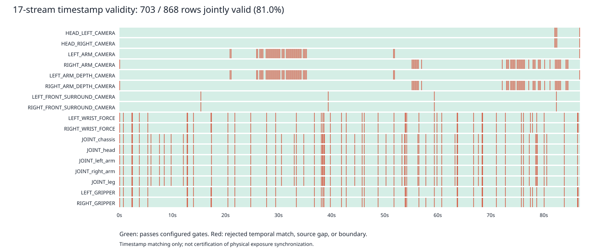
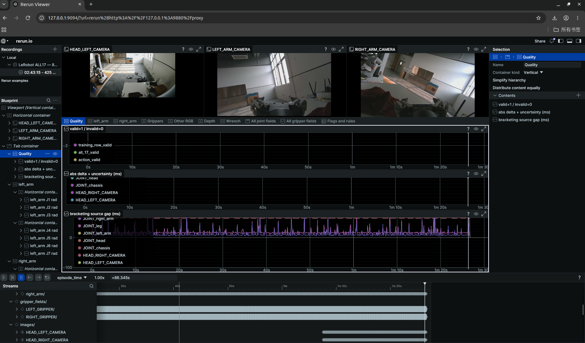
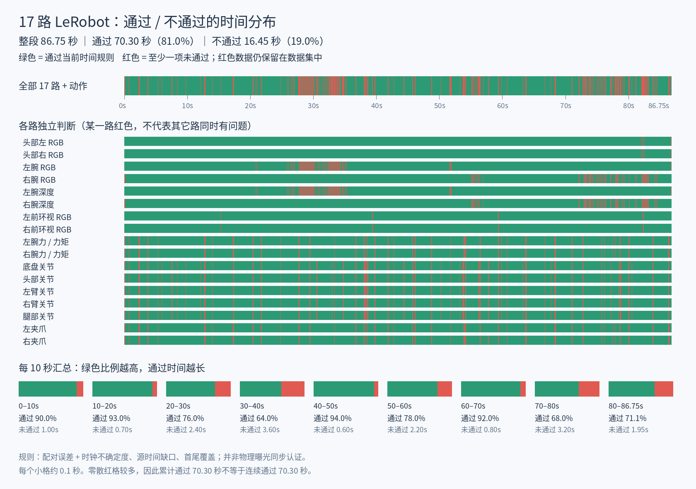
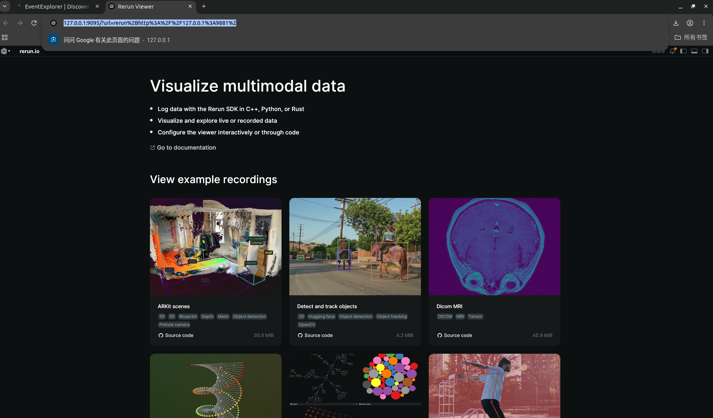

# 9_23 制定G1传感器与LeRobot对齐方案 （2）

- 归档编号：`01a0cbc1-d956-7921-af91-28e9b8db1183`
- 项目：VLA G1 项目
- 创建时间：2026-09-24T14:09:22.444000+08:00
- 更新时间：2026-09-24T15:41:40.347000+08:00
- 状态：活动
- 导出范围：用户可见消息与助手可见回复；不含隐藏推理和工具原始输出

## 1. 用户

我们在“制定G1传感器与LeRobot 数据采集时间对齐”的基础上继续，下一步如何操作？

## 2. 助手（进展）

我先查看“制定G1传感器与LeRobot 数据采集时间对齐”任务里的结论和进度，再给出下一步操作顺序。

## 3. 助手

**下一步先做“补光前后对照”，确认头部相机能否恢复稳定帧率，再继续时间对齐验收。**

我已接上前一个任务。上次停在这里：

- 时钟映射、10 Hz 组帧及 LeRobot 观测预览已跑通。
- **头部相机从约 15 Hz 降到 5.78 Hz，最后约 2.51 Hz**；驱动采集端已经低帧率，写盘不是当前主因。
- 自动曝光是待验证方向，尚未确认根因；相机物理同步、动作标签仍未验收。

这些是 **9 月 22 日的结果**，今天需要重新测量。

**1. 先录当前光照下的基线**

保持机器人静止，退出遥操／手柄检查，在项目目录运行：

```bash
bash teleoperation/run_camera_timing_check.sh --seconds 15
```

这一轮只测帧率，不需要移动标记；命令仅录传感器，不发送运动指令。

**2. 补光后再录一次**

打开房间照明或照亮头部相机看到的场景，保持相机位置和参数不变，等待几秒，再运行同一命令：

```bash
bash teleoperation/run_camera_timing_check.sh --seconds 15
```

保留两次终端输出的“会话目录”，注明哪个是补光前、哪个是补光后。我会对比头部帧率、帧间隔、数据年龄，并用双腕作为参照。

- **如果补光后恢复到约 15 Hz**：继续验证低照度／曝光策略，再做持续录制检查。
- **如果仍低帧率**：继续检查 USB/UVC 错误及驱动取帧情况。

**3. 帧率稳定后，做共同可见事件验证**

再录 30 秒，让明显标记在头部与腕相机共同视野中移动几次。三路没有共同视野时，分成“头部＋左腕”和“头部＋右腕”两轮，检查画面事件与时间戳是否一致。

随后处理此前**启动记录器导致反馈停顿**的问题，再进入低速带动作试录，验证 observation、实际下发目标和反馈的对应关系，最终导出带 action 的训练数据。

**现在先完成前两次 15 秒录制即可。**

## 4. 用户

lsy03\@lsy03-System-Product-Name:\~/文档/ChatGPT/VLA G1 项目$ bash teleoperation/run\_camera\_timing\_check.sh --seconds 15
只读传感器检查：正在预热17路数据，不启用遥操或机器人运动。
【开始】请让同一标记或闪光事件被待检查相机共同看见；机器人保持静止。
剩余约 15 秒；请做几次清晰、可重复的可见变化。
剩余约 10 秒；请做几次清晰、可重复的可见变化。
剩余约 5 秒；请做几次清晰、可重复的可见变化。
【完成】原始传感器数据已落盘；尚未判定物理时序是否合格。
会话目录：lerobot\_runs/camera\_timing\_20260923\_085801\_508217
取回命令：python3 -B -m acquisition.lerobot\_capture.fetch lerobot\_runs/camera\_timing\_20260923\_085801\_508217
lsy03\@lsy03-System-Product-Name:\~/文档/ChatGPT/VLA G1 项目$ bash teleoperation/run\_camera\_timing\_check.sh --seconds 15
只读传感器检查：正在预热17路数据，不启用遥操或机器人运动。
【开始】请让同一标记或闪光事件被待检查相机共同看见；机器人保持静止。
剩余约 15 秒；请做几次清晰、可重复的可见变化。
剩余约 10 秒；请做几次清晰、可重复的可见变化。
剩余约 5 秒；请做几次清晰、可重复的可见变化。
【完成】原始传感器数据已落盘；尚未判定物理时序是否合格。
会话目录：lerobot\_runs/camera\_timing\_20260923\_090057\_508768
取回命令：python3 -B -m acquisition.lerobot\_capture.fetch lerobot\_runs/camera\_timing\_20260923\_090057\_508768
lsy03\@lsy03-System-Product-Name:\~/文档/ChatGPT/VLA G1 项目$&#x20;


你看看日志如何？

## 5. 助手（进展）

两次录制都正常结束了。我会取回原始数据，比较头部和双腕的帧率、帧间隔及数据年龄；先按第一次补光前、第二次补光后解读。

## 6. 助手（进展）

两段数据的完整性校验均通过，17 路数据齐全；两次头部左右目都各录到 237 帧，说明今天这两段没有重现昨晚约 2.5 Hz 的降帧。我继续检查帧间隔和组帧质量。由于第一段也已恢复，暂时不能据此确认补光是恢复原因。

## 7. 助手

**两次录制都成功，头部相机已恢复约 15 Hz；但整段数据的时间对齐还没有全部通过。** 我已取回原始数据，17 路完整性校验及图像解码均通过。

| 指标 | 第一次 08:58 | 第二次 09:00 |
|---|---:|---:|
| 头部左右目帧率 | 15.02 Hz | 15.03 Hz |
| 双腕帧率 | 14.99 Hz | 15.00 Hz |
| 头部最大帧间隔 | 68.1 ms | 68.3 ms |
| 头部数据年龄 P95 | 70–71 ms | 71–73 ms |
| 双腕数据年龄 P95 | 31–34 ms | 35 ms |
| 10 Hz 组帧通过数 | **140/151（92.7%）** | **126/151（83.4%）** |

数据年龄是“读取时间－源时间戳”，不等于测准的相机物理延迟。

目前有三个结论：

- **昨晚的头部低帧率没有重现。** 第一段就已经恢复，因此这次不能证明是补光解决了问题，也不能确认自动曝光就是根因。
- **剩余问题主要在状态连续性和跨机测时。** 关节、夹爪记录中仍有约 90–121 ms 的时间缺口；第二段另有约 1 秒时钟映射区间被质量检查拒收，影响 10 行。这还不能直接认定为系统时钟跳变。
- **帧率正常不代表物理同步已通过。** 这两段没有动作标签，也尚未完成共同可见事件的时序验证。

**下一步优先排查这些状态缺口和测时异常，再做共同标记的 30 秒同步验证。** 目前不用急着改相机参数，也不建议直接进入正式动作数采。

[完整检查报告](<../../assets/bef45b76fc96ce4c--%E4%B8%A4%E6%AC%A1%E5%BD%95%E5%88%B6%E6%A3%80%E6%9F%A5.md>)

[附件：bef45b76fc96ce4c--两次录制检查.md](../../assets/bef45b76fc96ce4c--%E4%B8%A4%E6%AC%A1%E5%BD%95%E5%88%B6%E6%A3%80%E6%9F%A5.md)

## 8. 用户

我们继续

## 9. 助手（进展）

我继续分析两段数据中的状态缺口和跨机测时异常，先判断是传感器更新中断、采集轮询停顿，还是时钟映射规则触发了拒收。

## 10. 助手（进展）

发现两点：状态缺口期间，相机仍在持续记录，因此不是整个记录器停了约 120 ms；第二段的跨机时差在约 1 秒内变化了 7.02 ms，超过现有规则的 4.43 ms 边界，拒收有明确依据。

另外，G1 今天约 08:52 重启过，这也可能影响头部帧率恢复的判断。我接下来做一次不写图像、不发送运动指令的短时读取对照，检查状态缺口是否仍会出现。

## 11. 助手（进展）

短时对照也复现了状态更新缺口：不写图像时，关节最大源时间间隔约 64 ms；连图像读取也跳过后，仍有约 57 ms。两轮的最大轮询间隔分别只有 5.4 ms 和 8.7 ms。

这说明写盘和图像读取不能解释全部缺口，下一步应查 SDK 状态缓存或其上游数据流。现有质量阈值先保留，不通过放宽阈值让数据“合格”。

## 12. 助手（进展）

时钟异常有了更具体的线索：G1 同时运行 NTP 和 PTP 的 `phc2sys`，两者都在调整系统时间。09:01:05，`phc2sys` 日志中的偏差突增约 7 ms，与第二段被拒收的时段吻合。新的独立测时也观察到约 11.6 ms 的变化。

“双重调时相互干扰”现在是优先验证的原因，但还需要受控对照才能确认。我先整理证据和可恢复的验证步骤；目前没有修改任何同步服务。

## 13. 助手

**排查有了进展：状态缺口仍存在，时钟方面发现了 NTP 与 PTP 同时调时的线索。**

- **状态缺口**：不写图像时，关节最大间隔仍约 **64 ms**；跳过图像读取后仍约 **57 ms**。轮询本身正常，问题需要继续查 SDK 状态缓存或上游数据流。
- **时钟异常**：G1 同时运行 `systemd-timesyncd` 和 `phc2sys`。09:01:05 的系统时间偏差突变约 **7 ms**，与第二段拒收时段吻合；独立测时又观察到约 **11.6 ms** 的变化。竞争调时是优先验证方向，尚未确认因果。

建议下一步做一个可恢复对照：**机器人静止、退出控制任务后，临时停止 NTP 90 秒，保留 PTP，测量时钟变化，再自动恢复原状态。**

是否同意执行这个对照？需要确认是因为它会改变 **G1 整机的系统时间同步服务**，影响范围超出数采程序；目前我只做了只读检查。

[诊断证据与完整验证方案](<../../assets/3041926e505895ea--%E8%AF%8A%E6%96%AD%E7%BB%93%E8%AE%BA%E4%B8%8E%E9%AA%8C%E8%AF%81%E6%96%B9%E6%A1%88.md>)

[附件：3041926e505895ea--诊断结论与验证方案.md](../../assets/3041926e505895ea--%E8%AF%8A%E6%96%AD%E7%BB%93%E8%AE%BA%E4%B8%8E%E9%AA%8C%E8%AF%81%E6%96%B9%E6%A1%88.md)

## 14. 用户

我们现在是否能保证各路数据的时间戳是对齐的，这样，传输过来的数据保有正确的时间戳，我们之后手动对齐不就行了。现在的问题点究竟在哪里？ 我现在需要开始采集数据然后训练模型了

## 15. 助手

**你的思路是对的：只要源时间戳准确、各路时钟关系已知，数据晚到也可以离线对齐，不必在传输过程中同步到达。**

**但目前我们只能确认“原始时间戳被保存下来”，还不能保证“各路时间戳代表同一套时间、同一个真实采样时刻”。** 前面我把帧率、传输延迟和时钟问题混在一起讲了，这里把它们拆开。

| 问题 | 离线能否处理 | 我们目前的情况 |
|---|---|---|
| 数据晚到、传输延迟不同 | **可以**，按源时间排序、缓存和配对 | 原始源时间与接收时间都已保存 |
| PC 动作时间与 G1 时间有偏差 | **可以**，但需要可靠的时钟映射 | 已有逐段映射；部分时段出现约 7 ms 变化 |
| 各传感器时间戳是否对应真实采样时刻 | 需要先验证；不能只靠数值接近判断 | **尚未完成物理事件验证** |
| 中间没有取得新样本 | 无法恢复真实数据，只能有限插值、标记或剔除 | 状态存在约 50–120 ms 的缺口 |
| 动作标签缺失 | 无法仅靠对齐补出来 | **这两次纯传感器录制没有 action** |

**所以，当前不是“传输过来之后没法对齐”，而是我们还没有验证时间戳的语义，以及观测与实际下发动作的对应关系。**

例如，头部和腕部时间戳都写着 `10:00:00.100`，但如果一个代表曝光时刻、另一个代表驱动处理完成时刻，它们仍可能不是同一时刻的画面。人工拖动时间轴可以校正已测出的固定偏移，却不能可靠修复随时间变化的偏差。

另外，**140/151、126/151 的通过率是按我们当前较严格的工程规则算的，不等于剩余数据全部不能训练，也不意味着必须做到毫秒级同步才有价值。** 对慢速操作，几十毫秒误差可能可以接受，需要结合动作速度和训练结果判断。

你现在要开始采集和训练，我建议把目标改成：**尽快拿到一批时间关系可解释、带真实 action 的小规模演示，先跑通训练。**

具体顺序是：

1. **做一次短时动态验收。** 先用共同可见标记验证头部与腕部图像时间关系；再用低速遥操作，检查实测关节、图像和下发目标是否对应。此前启动记录器导致反馈停顿的问题，也要在这一轮确认。
2. **通过后先采 10–20 条同一种慢速任务演示。** 使用头部一路＋双腕＋双臂／夹爪状态，保存实际下发目标及全部原始时间信息，环视暂不加入第一版训练输入。
3. **离线生成 10 Hz 数据并训练验证。** 保留真实时间轴，异常区间分段处理，不能把实测状态冒充 action，也不能无限重复旧帧来补缺口。

**不必把所有传感器和整机同步都彻底优化好才开始试采；但在批量采集之前，至少要验证一次“画面—状态—动作”确实对应。** 暂停 NTP 的实验可以作为时钟专项排查，不必成为开始小规模试采的唯一前置条件。

## 16. 用户

好的我们开始做一次短时动态验收

## 17. 助手（进展）

我先检查现有验收入口和遥操保护条件，准备短时动态验收。先完成相机共同标记检查，再进入需要你现场操作的低速动作记录。

## 18. 助手

我们先做**30 秒相机动态验收：机器人保持静止，由你移动标记**。现有脚本已核对，不发送运动指令。

退出遥操／手柄检查，保持照明稳定，在项目目录运行：

```bash
bash teleoperation/run_camera_timing_check.sh --seconds 30
```

看到 **“【开始】”** 后：

1. 前 **5 秒**：保持画面静止。
2. 中间 **20 秒**：拿一张有明显黑白边界的纸板，在**头部与左腕相机共同可见区域**，左右移动、停住，重复约 5 次，每次停顿 1–2 秒。
3. 最后 **5 秒**：保持静止，等待自动结束。

**关键是两路相机同时看到同一块纸板。** 如果右腕也能看到，就一起验证；否则这一轮先验头部＋左腕，之后补另一组。不要分别在不同相机前做不同动作。

结束后，把终端输出的**会话目录**发来，并注明哪些相机看到了纸板。我会检查同一事件的图像时间差、偏移是否稳定，以及可保留的连续数据区间。

这一轮验证图像时序；随后再进行**低速机械臂／夹爪动作与下发日志的联合验收**。

## 19. 用户

明确一下，现在采集的数据有多少路？

## 20. 助手

当前原始采集共 **17 路数据流**：

| 类型 | 内容 | 路数 |
|---|---|---:|
| RGB 图像 | 头部左、右；左腕、右腕；左前环视、右前环视 | 6 |
| 深度图像 | 左腕、右腕 | 2 |
| 关节状态 | 底盘、头部、左臂、右臂、腿部，按组记录 | 5 |
| 腕部力／力矩 | 左腕、右腕 | 2 |
| 夹爪状态 | 左夹爪、右夹爪 | 2 |
| **合计** | | **17** |

**这次 30 秒检查仍然录全部 17 路**，只是重点分析头部与腕部相机的时间关系。

第一版训练计划从中选用：

- **3 路 RGB**：头部左目＋左腕＋右腕。
- **16 维状态**：左右臂各 7 个关节＋左右夹爪开度。

注意：**17 路不包含下发动作 action。** 当前纯传感器检查没有动作标签；后续联合遥操采集才会另外记录动作目标和下发时间。

## 21. 用户

通过后先采 10–20 条同一种慢速任务演示。需要有 17 路数据流 ，如何？给我脚本，我来运行

## 22. 助手（进展）

我会基于现有双臂数采入口准备一个保留全部 17 路原始数据和动作日志的试采脚本，先核对速度参数、录制按键和停止保护，再给你运行命令。

## 23. 助手（进展）

现有入口会录制全部 17 路传感器，并另外保存机械臂和夹爪的下发日志。我会给新入口设置较低的默认速度，并在启动前重新测量 PC–G1 时差，避免沿用历史 104 ms。

10–20 条演示由你逐条按键开始、结束。首次先录一条短动作，检查此前的反馈停顿是否重现，再继续同一任务的批量录制。

## 24. 助手

脚本已准备好：**保留全部 17 路原始传感器数据，另外记录实际下发动作及时间戳。** 配置检查和 10 项相关测试通过，尚未启动真机。

在项目目录运行，替换任务描述：

```bash
bash teleoperation/run_capture_pilot.sh \
  --execute \
  --seconds 600 \
  --task "将积木从左侧移到右侧"
```

默认关节速度上限 **0.2 rad/s**，夹爪速度 **0.02 m/s**；启动自动重新测量控制时差，测时异常则不启动遥操。

操作顺序：

1. 退出其他遥操程序，保持机器人周围无遮挡、急停可用。**此入口没有碰撞避障。**
2. 先保持双臂未启用跟随，按记录键，等待 **“两端录制就绪”**。
3. 主从臂对齐至 `READY`，按对应固定键开启跟随。
4. **首条只做 10–15 秒小幅慢动作和夹爪开合**，再次按记录键结束，等待落盘。
5. 首条检查通过后，再重复同一任务采集 10–20 条；失败按取消键保留失败数据。

**结束／取消录制不会暂停遥操**，暂停需按对应固定键。600 秒是整个跟随会话时限，采不完可另开会话。

此前录制启动时的反馈停顿尚未确认解决；若触发保护，保留日志，不绕过保护。先把首条的会话目录发来检查。原始数据还需对齐和动作导出，不能直接把现有观测预览当训练集。

[脚本](</home/lsy03/文档/ChatGPT/VLA G1 项目/teleoperation/run_capture_pilot.sh>) · [完整操作说明](<../../assets/9943be7980d24384--CAPTURE_PILOT_USAGE.md>)

[附件：9943be7980d24384--CAPTURE_PILOT_USAGE.md](../../assets/9943be7980d24384--CAPTURE_PILOT_USAGE.md)

## 25. 用户

这个任务我们改成叠毛巾

## 26. 助手

可以，任务描述改成“叠毛巾”，运行：

```bash
bash teleoperation/run_capture_pilot.sh \
  --execute \
  --seconds 600 \
  --task "将展开的毛巾对折并叠整齐"
```

首批统一动作：**毛巾平铺 → 对折一次 → 整理边缘 → 双手松开**。尽量保持毛巾、初始摆放位置和折叠方向一致。

全部 **17 路数据＋动作日志**照常保存。先录一条短演示检查，通过后再采 10–20 条。

## 27. 用户

+------+----------+--------+--------+--------+--------+----------+--------+--------+--------+----------+
右J2保守限位[-89.14, +89.14]°
右侧状态原因：right\_arm\_joint2起点/GP目标不在保守限位内
左扳机=0.700，夹爪目标/实测=100.0/50.0mm，未启用 | 右扳机=0.700，夹爪目标/实测=100.0/50.0mm，未启用
【数采】READY | 无活动episode | 记录键：开始/成功结束；取消键：失败结束并继续遥操
left\_arm 正式跟随已开启（单次确认）
左夹爪已就绪：左扳机按下闭合、松开张开。

双臂实时对比 | 左：FOLLOWING | 右：LOCKED
单位：度 | 主目标=GP映射目标；有效=限幅后目标；差值=有效目标−G1从臂
各侧固定键：全部误差<15°且READY → 按一次正式跟随 → 再按暂停
+------+----------+--------+--------+--------+--------+----------+--------+--------+--------+----------+
\| 关节 | 左主目标 | 左有效 | 左从臂 | 左差值 | 左检查 | 右主目标 | 右有效 | 右从臂 | 右差值 | 右检查   |
+------+----------+--------+--------+--------+--------+----------+--------+--------+--------+----------+
\| J1   | +69.29   | +69.29 | +62.95 | +6.34  | 通过   | -62.25   | -62.25 | -66.67 | +4.42  | 通过     |
\| J2   | -80.06   | -80.06 | -71.22 | -8.84  | 通过   | +91.08   | +91.08 | +80.35 | +10.73 | 目标越界 |
\| J3   | -38.16   | -38.16 | -32.74 | -5.42  | 通过   | +50.46   | +50.46 | +43.88 | +6.58  | 通过     |
\| J4   | -10.39   | -10.39 | -3.56  | -6.84  | 通过   | -2.32    | -2.32  | +8.11  | -10.42 | 通过     |
\| J5   | -1.93    | -1.93  | -4.46  | +2.52  | 通过   | -12.77   | -12.77 | -12.22 | -0.55  | 通过     |
\| J6   | -7.04    | -7.04  | -9.19  | +2.15  | 通过   | +12.70   | +12.70 | +4.95  | +7.75  | 通过     |
\| J7   | +2.87    | +2.87  | +5.51  | -2.64  | 通过   | +1.18    | +1.18  | -9.67  | +10.84 | 通过     |
+------+----------+--------+--------+--------+--------+----------+--------+--------+--------+----------+
右J2保守限位[-89.14, +89.14]°
右侧状态原因：right\_arm\_joint2起点/GP目标不在保守限位内
左扳机=0.700，夹爪目标/实测=100.0/50.0mm，已启用 | 右扳机=0.700，夹爪目标/实测=100.0/50.0mm，未启用
【数采】READY | 无活动episode | 记录键：开始/成功结束；取消键：失败结束并继续遥操
本轮结束：SafetyReject: left\_arm\_joint4实测速度超限：实测=-0.253422rad/s，阈值=0.240000rad/s，轨迹速度上限=0.200000rad/s
lsy03\@lsy03-System-Product-Name:\~/文档/ChatGPT/VLA G1 项目$&#x20;

速度阈值是否正确？ 怎么感觉你给太小了？

## 28. 助手（进展）

我核对一下速度保护的计算方式和这次启动参数，确认是阈值设置过紧，还是实际跟随速度超过了命令限速。

## 29. 助手

**阈值计算没错，但我给新脚本设的 `0.2 rad/s` 是保守试采值，没有经过这套真机跟随的验证，确实可能设得过紧。这个默认值是我加的。**

当前保护规则是：

| 项目 | 本次值 |
|---|---:|
| 轨迹速度上限 | 0.200 rad/s |
| 瞬时停止阈值：上限 × 1.2 | **0.240 rad/s** |
| 左 J4 实测速度 | **0.253 rad/s** |

因此这次触发符合代码规则。

我检查了完整日志：**只下发了第一个轨迹段，就在起步时触发了保护**。该段要求 J4 在 0.1 秒内移动 0.02 rad，平均速度是 0.2 rad/s，但实际运动的瞬时速度超过了它。相邻位置反馈也显示明显运动，不能直接认定为速度读数噪声。

这里的问题是：**轨迹段的平均限速，不一定等于实际运动的峰值速度；当前保护直接按它的 1.2 倍判断，起步时可能不匹配。** 单纯提高速度参数，会同时提高运动速度和保护阈值，不能证明问题解决。

另外有两个独立情况：

- **右臂没有启动**：右 J2 目标为 **91.08°**，超过保守上限 **89.14°**，需调整主臂位置。
- **本轮尚未开始录制 episode**：日志一直是 `READY / 无活动episode`，所以还没有得到一条叠毛巾演示。

下一步应先核对下发轨迹的插值方式，调整起步轨迹与速度保护的匹配关系，保留超速保护；再做短时验证。**不能把我设的 0.2 当作已验证的合适速度，也不应直接把保护阈值调大后开始批量采集。**

## 30. 用户

给我参考 “bash teleoperation/run\_dual\_arm\_one\_press.sh --execute --seconds 600 \   --speed-rad-s 1.0 --gripper-speed-m-s 0.16” 这个版本的速度限制

## 31. 助手（进展）

我会把新数采入口的默认速度改为你指定版本的关节 1.0 rad/s、夹爪 0.16 m/s，并保留原有的速度保护规则。

## 32. 助手

已按你指定的一键双臂版本修改，运行：

```bash
bash teleoperation/run_capture_pilot.sh \
  --execute --seconds 600 \
  --speed-rad-s 1.0 \
  --gripper-speed-m-s 0.16 \
  --task "将展开的毛巾对折并叠整齐"
```

速度设置为：

- 关节轨迹上限：**1.0 rad/s**
- 瞬时超速停止：**超过 1.2 rad/s**
- 持续超速停止：**超过 1.1 rad/s 持续 150 ms**
- 夹爪命令速度：**0.16 m/s**

全部 **17 路数据＋动作日志**继续保存。配置检查和 7 项测试通过，未启动真机。

右 J2 的目标越界仍需通过调整主臂位置解决；按记录键后，等“两端录制就绪”再开始叠毛巾。

## 33. 用户

\| J1   | +69.44   | +69.44 | +69.40 | +0.04  | 通过   | -66.46   | -66.46 | -66.40 | -0.06  | 通过   |
\| J2   | -77.88   | -77.88 | -77.90 | +0.01  | 通过   | +74.03   | +74.03 | +73.88 | +0.15  | 通过   |
\| J3   | -45.12   | -45.12 | -45.16 | +0.03  | 通过   | +59.78   | +59.78 | +59.39 | +0.39  | 通过   |
\| J4   | -13.90   | -13.90 | -13.89 | -0.01  | 通过   | -4.01    | -4.01  | -4.00  | -0.01  | 通过   |
\| J5   | +17.99   | +17.99 | +18.03 | -0.03  | 通过   | -15.38   | -15.38 | -16.60 | +1.22  | 通过   |
\| J6   | +1.08    | +1.08  | +1.08  | -0.01  | 通过   | +20.22   | +20.22 | +19.40 | +0.82  | 通过   |
\| J7   | +6.71    | +6.71  | +6.51  | +0.20  | 通过   | -3.48    | -3.48  | -3.07  | -0.41  | 通过   |
+------+----------+--------+--------+--------+--------+----------+--------+--------+--------+--------+
左扳机=0.700，夹爪目标/实测=100.0/100.0mm，已启用 | 右扳机=0.700，夹爪目标/实测=100.0/100.0mm，已启用
【数采】STARTING | episode\_000001 | 记录键：开始/成功结束；取消键：失败结束并继续遥操

双臂实时对比 | 左：FOLLOWING | 右：FOLLOWING
单位：度 | 主目标=GP映射目标；有效=限幅后目标；差值=有效目标−G1从臂
各侧固定键：全部误差<15°且READY → 按一次正式跟随 → 再按暂停
+------+----------+--------+--------+--------+--------+----------+--------+--------+--------+--------+
\| 关节 | 左主目标 | 左有效 | 左从臂 | 左差值 | 左检查 | 右主目标 | 右有效 | 右从臂 | 右差值 | 右检查 |
+------+----------+--------+--------+--------+--------+----------+--------+--------+--------+--------+
\| J1   | +69.40   | +69.40 | +69.42 | -0.03  | 通过   | -66.51   | -66.51 | -66.50 | -0.01  | 通过   |
\| J2   | -77.84   | -77.84 | -77.88 | +0.04  | 通过   | +73.97   | +73.97 | +73.97 | -0.00  | 通过   |
\| J3   | -44.98   | -44.98 | -45.15 | +0.17  | 通过   | +59.62   | +59.62 | +59.71 | -0.09  | 通过   |
\| J4   | -13.77   | -13.77 | -13.87 | +0.10  | 通过   | -3.97    | -3.97  | -3.97  | +0.00  | 通过   |
\| J5   | +18.00   | +18.00 | +18.02 | -0.02  | 通过   | -15.42   | -15.42 | -15.74 | +0.32  | 通过   |
\| J6   | +0.90    | +0.90  | +1.07  | -0.17  | 通过   | +20.50   | +20.50 | +19.97 | +0.53  | 通过   |
\| J7   | +6.97    | +6.97  | +6.60  | +0.37  | 通过   | -3.38    | -3.38  | -3.45  | +0.06  | 通过   |
+------+----------+--------+--------+--------+--------+----------+--------+--------+--------+--------+
左扳机=0.700，夹爪目标/实测=100.0/100.0mm，已启用 | 右扳机=0.700，夹爪目标/实测=100.0/100.0mm，已启用
【数采】STARTING | episode\_000001 | 记录键：开始/成功结束；取消键：失败结束并继续遥操
本轮结束：SafetyReject: left\_arm目标更新超过300ms：距上次轨迹更新=310.6ms；请检查新反馈及控制循环记录
lsy03\@lsy03-System-Product-Name:\~/文档/ChatGPT/VLA G1 项目$&#x20;


现在数采记录到底有没有开始？ 能否找到录制结果？  &#x20;
另外这个目标更新报错是什么问题，感觉有bug？

## 34. 助手（进展）

日志显示它还停在 `STARTING`，尚未确认“两端录制就绪”。我会检查最新会话和机器人端文件，区分是否留下原始数据，再定位这次 310.6 ms 停顿发生在反馈更新还是控制循环。

## 35. 助手（进展）

已找到并取回结果：机器人端留下了约 66 ms、71 条记录的中断片段，但 episode 没有正式进入 `RECORDING`。

这次也不是 Python 控制循环卡了 310 ms：报错前循环仍约每 11 ms 运行一次，SDK 读取不到 0.3 ms；但关节反馈时间戳连续约 232 ms 没有更新，控制器因此没有生成新轨迹，最终触发了“距上次下发超过 300 ms”的保护。

## 36. 助手

**找到录制结果了，但这次没有正式开始一条有效演示。你怀疑启动流程有问题，是有依据的。**

**录制情况**

- 按键请求已收到，进入 `STARTING`。
- 没有进入 `RECORDING`，清单中的开始时间为 `null`。
- G1 留下约 **66 ms、71 条记录**的中断片段，涉及全部 17 路，但每路样本很少。
- 原始文件已取回并通过完整性校验；状态为 `interrupted / incomplete`，**不能算一条叠毛巾训练演示**。
- PC 的遥操动作、反馈和故障日志也已保存。

[本次会话目录](</home/lsy03/文档/ChatGPT/VLA G1 项目/lerobot_runs/dual_arm_capture_20260923_110712_525879>)

**310.6 ms 报错的实际原因**

我核对了报错前的逐帧日志：

| 检查项 | 结果 |
|---|---:|
| 控制循环最大间隔 | **12.0 ms** |
| SDK 单次读取最大耗时 | **0.271 ms** |
| 最后一次新关节反馈之后，时间戳未更新 | **约 232 ms** |
| 距上次轨迹下发 | **310.6 ms** |

所以不是控制循环卡住了，而是**循环一直在读，却反复取得旧关节反馈**。代码要求有新反馈才生成轨迹；没有新轨迹超过 300 ms，就停止。两个时间不同，是因为最后一次新反馈没有正好赶上轨迹下发周期。

**保护本身按规则工作，问题在数采启动与反馈链路的相互影响。** 这已经重现此前“启动数采后反馈停顿”的现象；但具体是新增 SDK 客户端初始化、机器人端资源竞争，还是反馈发布异常，还需进一步区分。它与刚才的速度阈值不是同一个问题。

我之前提供的试采入口**没有修复这个已知启动问题**，这里需要明确纠正。下一步应优先修复、验证采集启动流程，考虑在启用跟随前完成采集服务预热，让记录键只标记 episode 边界；**不能靠增大 300 ms 超时或用旧反馈继续运动来绕过。**

## 37. 用户

\| 关节 | 左主目标 | 左有效 | 左从臂 | 左差值 | 左检查 | 右主目标 | 右有效 | 右从臂 | 右差值 | 右检查            |
+------+----------+--------+--------+--------+--------+----------+--------+--------+--------+-------------------+
\| J1   | +61.46   | +61.46 | +61.57 | -0.11  | 通过   | -65.63   | -65.63 | -91.66 | +26.03 | 差≥15°            |
\| J2   | -81.75   | -81.75 | -81.65 | -0.10  | 通过   | +87.39   | +87.39 | +71.54 | +15.85 | 差≥15°            |
\| J3   | -4.34    | -4.34  | -4.66  | +0.33  | 通过   | +61.41   | +61.41 | +39.36 | +22.06 | 差≥15°            |
\| J4   | -13.04   | -13.04 | -13.70 | +0.67  | 通过   | -1.57    | -1.57  | +85.29 | -86.86 | 差≥15°            |
\| J5   | -3.43    | -3.43  | -6.77  | +3.34  | 通过   | -59.78   | -59.78 | -5.12  | -54.66 | 差≥15°            |
\| J6   | -1.22    | -1.22  | +1.82  | -3.04  | 通过   | +45.10   | +45.10 | +44.14 | +0.96  | 目标越界/从臂越界 |
\| J7   | +4.33    | +4.33  | +7.08  | -2.75  | 通过   | +32.08   | +32.08 | -21.35 | +53.43 | 差≥15°            |
+------+----------+--------+--------+--------+--------+----------+--------+--------+--------+-------------------+
右J6保守限位[-39.14, +44.14]°
右侧状态原因：right\_arm\_joint6起点/GP目标不在保守限位内
左扳机=0.700，夹爪目标/实测=100.0/100.0mm，已启用 | 右扳机=0.700，夹爪目标/实测=100.0/100.0mm，未启用
【数采】STARTING | episode\_000001 | 记录键：开始/成功结束；取消键：失败结束并继续遥操
本轮结束：SafetyReject: left\_arm目标更新超过300ms：距上次轨迹更新=304.6ms；请检查新反馈及控制循环记录
lsy03\@lsy03-System-Product-Name:\~/文档/ChatGPT/VLA G1 项目$&#x20;
给我看下这次的数采结果如何？

## 38. 助手（进展）

我检查最新会话的状态、动作日志和机器人端原始文件，确认这次实际保存了多少数据，以及是否进入了正式录制。

## 39. 助手

**这次仍未形成有效演示：停在 `STARTING`，留下了很短的中断数据。** 原件已取回，完整性校验通过。

| 项目 | 本次结果 |
|---|---|
| 正式录制开始时间 | `null`，未进入 `RECORDING` |
| 原始采集运行时长 | 约 **60 ms** |
| 数据量 | **62 条记录，17 路都有少量数据** |
| RGB／深度 | **10 帧 RGB、4 帧深度** |
| 关节状态 | 每组 **4 条** |
| 腕力／夹爪 | 每路 **7 条** |
| 验收状态 | `interrupted / incomplete`，不能用于训练 |

PC 端另外保存了 **38,498 条控制日志记录**，没有日志队列丢弃；这些包含录制前的遥操过程，**不代表有对应的完整图像演示**。

本次与上次是同一种故障：

- 控制循环最大间隔 **11.9 ms**，没有整体卡住。
- SDK 读取最大耗时 **0.353 ms**。
- 关节反馈时间戳连续约 **229 ms** 没更新，最终距上次轨迹下发 **304.6 ms**，触发停止。

右臂的大角度差和 J6 越界让右臂无法启用；**导致本轮退出的是左臂反馈更新停顿，两者要分开处理。**

[查看本次录制文件](</home/lsy03/文档/ChatGPT/VLA G1 项目/lerobot_runs/dual_arm_capture_20260923_111827_528453>)

**现在不建议继续用同一入口反复试采。启动数采导致反馈停顿已再次复现，应先修复采集初始化与遥操并行的问题，再开始叠毛巾批量采集。**

## 40. 用户

这个故障有没有可能是我按了停止录制然后没反应之后按压急停按钮后导致的？

## 41. 助手（进展）

有这个可能。我会核对这次日志中的记录键、停止请求、急停按钮和超时事件顺序，区分是按钮导致退出，还是超时后程序自动执行了停止。

## 42. 助手

**有可能，尤其如果你按的是机器人本体的硬件急停。仅凭这份日志，还不能排除它影响了反馈更新。** 我之前把原因直接归到“启动数采导致反馈停顿”，说得过于确定；目前只能确认两者在时间上相邻。

我重新核对了这次事件：

- 程序只识别到一次记录键，含义是**开始录制**，随后进入 `STARTING`。
- 没有记录到第二次停止录制请求，也没有记录到手柄急停触发事件 `emergency_stop`。
- 有 `emergency_stop_request`，但这是**程序调用停止接口的日志**；超时异常后的自动清理也会产生它，不能据此认定你按了急停。
- 最终退出原因仍记录为轨迹更新超时。

另外，**当前 `STARTING` 阶段再次按记录键，会被忽略，不会立即停止启动流程**。这个交互确实容易让人觉得“按了没反应”，需要改进。不过这次连“按键被忽略”的事件也没记录到，因此无法确认程序收到了你的第二次按压。

请确认一下：**你最后按的是 GP001 手柄上的 STOP，还是机器人本体的实体急停？大约是在按记录键后多久按的？** 这会直接影响故障判断。

## 43. 用户

我想了解一下，最近一次录制中，按下录制键之后开始录制然后直接出现了“关节反馈时间戳连续约 **229 ms** 没更新，最终距上次轨迹下发 **304.6 ms**，触发停止”是这样吗？

## 44. 助手

**基本是这个顺序，但“开始录制”应准确地说是“开始准备录制”。**

最近一次日志显示：

1. 按下录制键，程序收到请求，进入 **`STARTING`**。
2. 准备期间，控制循环仍正常运行，但关节反馈时间戳连续约 **229 ms** 没有更新。
3. 因为缺少新反馈，没有生成新的轨迹下发；距上次下发达到 **304.6 ms**，触发超时保护并执行停止。
4. 程序退出，episode 标记为中断，**始终没有进入 `RECORDING`**。

229 ms 与 304.6 ms 的计时起点不同：前者从最后一次新反馈算，后者从最后一次轨迹下发算。

**这个事件顺序已由日志确认；但“按下录制键导致反馈停顿”这一因果关系尚未确认，也还不能完全排除你随后按下实体急停的影响。**

## 45. 用户

按下录制键，程序收到请求，进入 **`STARTING`****&#x20;为什么没有开始 &#x20;**`RECORDING` ？ 这是什么情况，设计逻辑是什么样的？“采集初始化与遥操并行” 是否还有问题？  或者你有没有什么想问我的？

## 46. 助手（进展）

我再核对 `STARTING → RECORDING` 的具体条件，以及异常退出时后台采集如何收尾，给你说明这次卡在哪一步。

## 47. 助手

**没有进入 `RECORDING`，是因为采集端尚未完成就绪确认，遥操已经先触发超时退出了。不是按键没有收到，也不是在等待所有数据时间戳完美对齐。**

当前代码的设计顺序是：

```text
按记录键
  ↓
STARTING：后台启动 G1 采集进程
  ↓
初始化 SDK、订阅全部 17 路
  ↓
每路至少读到两个不同时间戳的样本
  ↓
读取设备信息、校验关节名称和图像尺寸
  ↓
开始保存原始数据，17 路都至少提交一条记录
  ↓
G1 返回就绪，PC 收到确认
  ↓
RECORDING：显示“两端录制就绪”，设置正式开始时间
```

**`STARTING` 期间遥操仍然继续运行，原有 300 ms 保护也继续生效。** 设计意图是把耗时初始化放到后台，避免直接阻塞控制循环。

但“后台运行”只能避免直接阻塞，**不能保证新 SDK 客户端的初始化、订阅及机器人端资源使用，不影响已有反馈链路。**

这次发生的是：

1. 收到记录键，后台开始初始化。
2. PC 控制循环仍正常运行，但一段时间只能读到旧关节反馈。
3. 新轨迹下发超时，控制循环进入停止、退出流程。
4. 退出收尾会先等待后台启动任务结束，再中止采集。因此可能留下几十毫秒的原始文件，**但 PC 从未确认正式开始录制**。

这也解释了为什么“有文件”却没有有效 episode。

**“采集初始化与遥操并行”仍是未解决的问题。** 目前有两点可以明确：

- **启动与控制的隔离尚未通过真机验证**，且相似故障已重复出现；具体因果仍需排除你操作急停的影响。
- **启动阶段交互不完善**：`STARTING` 时记录键和取消键都会被忽略，退出还可能等待初始化完成。这确实容易让你觉得“按了没反应”。

更合适的批量采集设计是：**在启用遥操前初始化并预热采集服务，保持采集连接；录制键只负责开始／结束一条数据，而不在每条开始时重新初始化 SDK。** 这需要修改和验证，当前脚本还不是这种实现。

我最需要你确认两件事，刚才已发出问题：

- 最近一次是否又按过停止或急停，按的是哪一种、间隔多久？
- 是否试过双臂未开启跟随时先按录制键，能否成功看到“两端录制就绪”？

这两个回答能帮助区分：**初始化本身不能完成，还是它与正在运行的遥操相互影响。**

## 48. 用户

第一次按压轨迹记录键后，`STARTING` 时如果显示“两端录制就绪”，设置正式开始时间，再次按压轨迹记录键，正式开始数据采集记录，第三次按压轨迹记录键，如何？

## 49. 助手

可以，**改成三次按键很合适**。需要新增一个“采集已就绪、等待开始”的状态：

| 按键 | 行为 | 状态 |
|---|---|---|
| 第一次 | 初始化 SDK、预热并检查 17 路数据 | `STARTING` |
| 初始化完成 | 显示“两端采集就绪，请再次按记录键开始” | `ARMED` |
| 第二次 | **设置正式开始时间**，开始本条演示 | `RECORDING` |
| 第三次 | 设置结束时间，收尾保存本条演示 | `FINALIZING` |
| 保存完成 | 保持采集连接，等待下一条 | `ARMED` |

这里调整一点：**正式开始时间应在第二次按键时设置，不是在“两端就绪”时设置。** 就绪时间另行记录。

后续每条只需两次按键：**开始 → 结束**，无需重新初始化。17 路在就绪阶段可以持续读取并丢弃非录制数据，正式记录另加必要的边界缓冲。

另外：

- `STARTING` 时重复按记录键只提示“正在准备”，不排队自动开始。
- 取消键在准备／就绪阶段取消准备，在录制阶段结束并标失败。
- 第三次按键**只结束录制，不停止遥操**。

**但三次按键本身不能消除初始化引起的反馈停顿。** 应配套要求：第一次准备时双臂尚未开启跟随；采集就绪后再开启遥操，之后保持采集服务运行。这才同时解决操作流程和每条重复初始化的问题。

这是一版设计建议，当前脚本尚未修改。

## 50. 用户

先按照这个修改一版

## 51. 助手（进展）

我会把流程改成“第一次准备、第二次开始、第三次结束”，保存后保持采集连接，下一条只需开始／结束两次按键。同时会让准备阶段支持取消，并要求初始化时双臂尚未开启跟随。

## 52. 助手（进展）

底层正在改为一个会话只初始化一次 SDK，结束一条后继续读取 17 路，等待下一条。第二次按键才记录正式开始时间；原有传感器检查入口会保留原来的单次录制流程，避免影响已有工具。

## 53. 助手（进展）

三次按键流程及取消逻辑已完成，228 项采集与遥操测试通过。测试也确认：准备阶段不创建演示，第二次按键设置开始时间，连续两条复用同一个 SDK 实例。接下来部署到新的独立目录，并在互斥锁保护下做一次不发送运动指令的两段试录。

## 54. 助手（进展）

G1 上的两段只读试录已完成：第一次准备后进入 `ARMED`，两段都正常结束并回到 `ARMED`，每段均记录了全部 17 路。正在做取回校验；这次未发送运动指令，开启遥操后的连续录制还需你现场验证。

## 55. 助手

已修改并部署新版。**228 项测试通过，G1 两段只读试录均保存了全部 17 路，取回校验通过。** 尚未做真机运动验收。

运行命令不变：

```bash
bash teleoperation/run_capture_pilot.sh \
  --execute --seconds 600 \
  --speed-rad-s 1.0 \
  --gripper-speed-m-s 0.16 \
  --task "将展开的毛巾对折并叠整齐"
```

新操作顺序：

1. **双臂先不跟随**，第一次按记录键：准备采集。
2. 等待 **“两端采集就绪（ARMED）”**，再用固定键开启跟随。
3. 第二次按记录键：正式开始本条演示。
4. 第三次按记录键：结束并保存，完成后回到 `ARMED`。

后续每条只需 **开始／结束两次按键**，不再重新初始化 SDK。准备阶段支持取消；原有 300 ms、速度和限位保护保留。

**先录一条 10–15 秒短动作检查。结束录制不会暂停遥操。**

[完整操作说明](<../../assets/9943be7980d24384--CAPTURE_PILOT_USAGE.md>)

[附件：9943be7980d24384--CAPTURE_PILOT_USAGE.md](../../assets/9943be7980d24384--CAPTURE_PILOT_USAGE.md)

## 56. 用户

我现在没有进行遥操作，但是按压了轨迹记录键，你看看现在我们现在是否采集到数据，这只是一个采集测试

[附件：1ddf1777fd4d07d7--pasted-text.txt](../../assets/1ddf1777fd4d07d7--pasted-text.txt)

## 57. 助手（进展）

我先查看你贴的输出和最新会话，确认按键是否进入正式录制、17 路数据是否保存。这次按纯采集测试检查，不要求有遥操作动作。

## 58. 助手（进展）

这次确实采到了数据：共 4 段，前三段正常结束，第四段录制中按 `Ctrl+C`，因此标记为中断；四段都有全部 17 路。日志中没有机械臂或夹爪的实际下发动作，符合你说的纯采集测试。原始文件正在取回校验。

## 59. 助手

**是的，这次真正采到数据了，三次按键流程已跑通。** 原始文件已取回，四段完整性校验均通过。

| 片段 | 按键定义的录制时长 | 数据流 | 结果 |
|---|---:|---:|---|
| 000001 | 3.26 秒 | 17/17 | 正常保存 |
| 000002 | 7.41 秒 | 17/17 | 正常保存 |
| 000003 | 4.06 秒 | 17/17 | 正常保存 |
| 000004 | 5.85 秒 | 17/17 | `Ctrl+C` 中断，已有数据保留 |

合计保存 **19,384 条传感器记录**，其中包含 **1,809 帧 RGB、675 帧深度**。前三段另有约 0.6 秒收尾采集。

这次符合你的测试目的：

- 没有机械臂或夹爪的实际下发动作。
- `LOCKED`、主从角度差较大只影响开启跟随，**不妨碍纯传感器采集**。
- 全程只准备一次，随后连续记录四段，未出现之前的目标更新超时退出。
- 第四段中断是你在 `RECORDING` 时按了 `Ctrl+C`；正常结束应先按记录键，等保存完成再退出。

**静态采集流程验证成功；带遥操作的联合采集和时间对齐仍需另外验证。**

[查看本次数据目录](</home/lsy03/文档/ChatGPT/VLA G1 项目/lerobot_runs/dual_arm_capture_20260923_142355_544292>)

## 60. 用户

为什么右臂没有对齐会影响左臂遥操作？ 这个不是解耦了吗？

[附件：bd34c632ab847952--pasted-text.txt](../../assets/bd34c632ab847952--pasted-text.txt)

## 61. 助手（进展）

我先看这次完整输出和对应日志，确认是右臂未对齐直接阻止了左臂，还是触发了两臂共用的停止保护。

## 62. 助手

**左右臂的对齐和启用仍然独立。最新这次左臂没启动，主要不是被右臂未对齐挡住，而是新版增加的“采集先就绪”条件。**

我检查了最近两次日志：

**最新一次 14:43：**

- 你按过左侧固定键，部分时刻左臂已是 `READY`。
- 但数采一直是 **`READY`，没有进入 `ARMED`**，也没有记录到采集准备请求。
- 新版要求先准备采集，因此拦住了左臂跟随。
- 后面左臂自身也出现了未对齐，例如 J5 差约 **29°**，同样不能启动。

这里两个 `READY` 容易混淆，是我这版提示不够清楚：

| 显示 | 含义 |
|---|---|
| 左臂 `READY` | 左臂自身满足启动条件 |
| 数采 `READY` | 尚未准备采集 |
| 数采 `ARMED` | 采集准备完成，可以开启单臂或双臂跟随 |

**前一次 14:41** 则确实因右臂触发了全局退出，但原因是 **“右臂未启用时发生异常移动”**，不是“右臂未对齐”。当前异常运动、急停等保护仍是全局的；独立启用不代表所有故障都独立处理。

你现在只操作左臂，应按：

**记录键准备 → 等数采 `ARMED` → 只把左臂对齐至 `READY` → 按左固定键。**

**右臂可以保持 `LOCKED`，不需要对齐或启用。** 右臂的主目标越界提示本身也不会阻止左臂启动。

## 63. 用户

改一下逻辑，应该先进入遥操作

## 64. 助手（进展）

我会改成先用固定键进入遥操作，再按记录键开始／结束采集。为避免运动中初始化 SDK 再次干扰反馈，采集连接会在启动阶段自动预热；就绪后不录制数据，等你按记录键才正式开始。

## 65. 助手

已改成 **先遥操作，再按键录制**：

1. 启动脚本，自动预热采集连接，等待“启动完成”。
2. 对齐需要操作的手臂，按本侧固定键进入遥操作，**不需要先按记录键**。
3. 按记录键开始采集，再按一次结束。
4. 保存后遥操继续，等待下一条。

左右臂独立，可只开启左臂。全部 17 路数据和动作日志照常保存，速度设置保持不变。

仍运行原命令：

```bash
bash teleoperation/run_capture_pilot.sh \
  --execute --seconds 600 \
  --speed-rad-s 1.0 \
  --gripper-speed-m-s 0.16 \
  --task "将展开的毛巾对折并叠整齐"
```

11 项相关测试通过，未启动真机运动。请退出旧进程后重新运行。

## 66. 用户

\| 关节 | 左主目标 | 左有效 | 左从臂 | 左差值 | 左检查 | 右主目标 | 右有效 | 右从臂 | 右差值 | 右检查   |
+------+----------+--------+--------+--------+--------+----------+--------+--------+--------+----------+
\| J1   | +63.75   | +63.75 | +65.83 | -2.08  | 通过   | -63.07   | -63.07 | -59.40 | -3.67  | 通过     |
\| J2   | -88.44   | -88.44 | -80.71 | -7.73  | 通过   | +90.15   | +90.15 | +80.79 | +9.36  | 目标越界 |
\| J3   | -30.93   | -30.93 | -10.64 | -20.29 | 差≥15° | +74.44   | +74.44 | +52.61 | +21.82 | 差≥15°   |
\| J4   | -6.23    | -6.23  | -13.80 | +7.56  | 通过   | +2.78    | +2.78  | -4.42  | +7.20  | 通过     |
\| J5   | -3.29    | -3.29  | -19.57 | +16.29 | 差≥15° | -37.39   | -37.39 | -25.21 | -12.18 | 通过     |
\| J6   | -7.40    | -7.40  | +1.90  | -9.29  | 通过   | +8.00    | +8.00  | +3.08  | +4.92  | 通过     |
\| J7   | +4.68    | +4.68  | +3.58  | +1.10  | 通过   | -1.74    | -1.74  | -7.01  | +5.28  | 通过     |
+------+----------+--------+--------+--------+--------+----------+--------+--------+--------+----------+
右J2保守限位[-89.14, +89.14]°
左侧状态原因：七关节起步未对齐（每关节差值要求≤15°）
右侧状态原因：right\_arm\_joint2起点/GP目标不在保守限位内
左扳机=0.700，夹爪目标/实测=100.0/100.0mm，未启用 | 右扳机=0.700，夹爪目标/实测=100.0/100.0mm，未启用
【数采】ARMED | 无活动episode | 记录键：ARMED开始 / RECORDING结束；取消键：录制中标失败，待命时保持连接

双臂实时对比 | 左：LOCKED | 右：LOCKED
单位：度 | 主目标=GP映射目标；有效=限幅后目标；差值=有效目标−G1从臂
各侧固定键：全部误差<15°且READY → 按一次正式跟随 → 再按暂停
+------+----------+--------+--------+--------+--------+----------+--------+--------+--------+----------+
\| 关节 | 左主目标 | 左有效 | 左从臂 | 左差值 | 左检查 | 右主目标 | 右有效 | 右从臂 | 右差值 | 右检查   |
+------+----------+--------+--------+--------+--------+----------+--------+--------+--------+----------+
\| J1   | +63.75   | +63.75 | +65.83 | -2.08  | 通过   | -63.07   | -63.07 | -59.40 | -3.66  | 通过     |
\| J2   | -88.43   | -88.43 | -80.70 | -7.72  | 通过   | +90.15   | +90.15 | +80.79 | +9.36  | 目标越界 |
\| J3   | -30.93   | -30.93 | -10.64 | -20.29 | 差≥15° | +74.44   | +74.44 | +52.61 | +21.83 | 差≥15°   |
\| J4   | -6.24    | -6.24  | -13.80 | +7.56  | 通过   | +2.77    | +2.77  | -4.42  | +7.20  | 通过     |
\| J5   | -3.29    | -3.29  | -19.57 | +16.28 | 差≥15° | -37.38   | -37.38 | -25.20 | -12.18 | 通过     |
\| J6   | -7.40    | -7.40  | +1.90  | -9.29  | 通过   | +7.99    | +7.99  | +3.08  | +4.91  | 通过     |
\| J7   | +4.66    | +4.66  | +3.58  | +1.08  | 通过   | -1.72    | -1.72  | -7.02  | +5.29  | 通过     |
+------+----------+--------+--------+--------+--------+----------+--------+--------+--------+----------+
右J2保守限位[-89.14, +89.14]°
左侧状态原因：七关节起步未对齐（每关节差值要求≤15°）
右侧状态原因：right\_arm\_joint2起点/GP目标不在保守限位内
左扳机=0.700，夹爪目标/实测=100.0/100.0mm，未启用 | 右扳机=0.700，夹爪目标/实测=100.0/100.0mm，未启用
【数采】ARMED | 无活动episode | 记录键：ARMED开始 / RECORDING结束；取消键：录制中标失败，待命时保持连接

双臂实时对比 | 左：LOCKED | 右：LOCKED
单位：度 | 主目标=GP映射目标；有效=限幅后目标；差值=有效目标−G1从臂
各侧固定键：全部误差<15°且READY → 按一次正式跟随 → 再按暂停
+------+----------+--------+--------+--------+--------+----------+--------+--------+--------+----------+
\| 关节 | 左主目标 | 左有效 | 左从臂 | 左差值 | 左检查 | 右主目标 | 右有效 | 右从臂 | 右差值 | 右检查   |
+------+----------+--------+--------+--------+--------+----------+--------+--------+--------+----------+
\| J1   | +63.75   | +63.75 | +65.83 | -2.08  | 通过   | -63.07   | -63.07 | -59.40 | -3.67  | 通过     |
\| J2   | -88.42   | -88.42 | -80.70 | -7.72  | 通过   | +90.14   | +90.14 | +80.79 | +9.35  | 目标越界 |
\| J3   | -30.94   | -30.94 | -10.64 | -20.30 | 差≥15° | +74.45   | +74.45 | +52.61 | +21.83 | 差≥15°   |
\| J4   | -6.24    | -6.24  | -13.80 | +7.56  | 通过   | +2.77    | +2.77  | -4.42  | +7.20  | 通过     |
\| J5   | -3.29    | -3.29  | -19.57 | +16.28 | 差≥15° | -37.39   | -37.39 | -25.20 | -12.19 | 通过     |
\| J6   | -7.40    | -7.40  | +1.90  | -9.29  | 通过   | +8.00    | +8.00  | +3.08  | +4.92  | 通过     |
\| J7   | +4.67    | +4.67  | +3.58  | +1.09  | 通过   | -1.73    | -1.73  | -7.02  | +5.29  | 通过     |
+------+----------+--------+--------+--------+--------+----------+--------+--------+--------+----------+
右J2保守限位[-89.14, +89.14]°
左侧状态原因：七关节起步未对齐（每关节差值要求≤15°）
右侧状态原因：right\_arm\_joint2起点/GP目标不在保守限位内
左扳机=0.700，夹爪目标/实测=100.0/100.0mm，未启用 | 右扳机=0.700，夹爪目标/实测=100.0/100.0mm，未启用
【数采】ARMED | 无活动episode | 记录键：ARMED开始 / RECORDING结束；取消键：录制中标失败，待命时保持连接
^C本轮结束：KeyboardInterrupt:&#x20;
lsy03\@lsy03-System-Product-Name:\~/文档/ChatGPT/VLA G1 项目$&#x20;


我现在采集了一段数据，给我看看如何？

## 67. 助手（进展）

你贴出的末尾是 `ARMED / 无活动episode`，可能是前面已录完一段、现在回到待命。我会检查最新会话的记录和原始数据，确认实际录到了什么。

## 68. 助手（进展）

这次是一段正常结束的联合采集：正式录制约 86.75 秒，17 路都有数据；录制期间还有 794 次机械臂下发和 145 次夹爪下发被接受。你是在保存完成、回到 `ARMED` 后才按 `Ctrl+C`，所以没有中断这条数据。我继续核验原始文件和时间对齐质量。

## 69. 助手

**这次成功录到了一段带双臂、夹爪动作的完整数据，采集链路跑通了。** 原始文件已取回并校验。

| 项目 | 结果 |
|---|---|
| 正式录制时长 | **86.75 秒** |
| 原始数据流 | **17/17 路齐全** |
| 传感器记录 | **74,085 条** |
| 图像 | **6,995 帧 RGB＋2,621 帧深度**，解码通过 |
| 录制期间接受的动作 | 机械臂 **794 次**，夹爪 **145 次** |
| 结束状态 | 正常结束并保存，随后才 `Ctrl+C` |

录制期间双臂均为 `FOLLOWING`。末尾的 `LOCKED / ARMED` 是录制结束后的状态，**不代表前面没录到动作**。这次没有出现此前的启动超时中断。

时间质量还有待处理：

- 头部、双腕稳定在约 **15 Hz**，环视约 **10 Hz**。
- 状态数据仍有最大约 **134 ms** 的缺口。
- 按现有较严格的 10 Hz 观测组帧规则，**705/868 行通过，约 81.2%**；通过行分成了多个短片段，不能直接把整段当作连续同步数据。
- 动作日志已经存在，但**还未完成带 action 的训练格式导出及对齐验收**。

**这条应保留，作为第一条联合采集验收样本。下一步先用它完成观测—动作对齐和导出，再决定批量采集参数。** 日志中的“成功”是按键结束标签，尚不代表毛巾折叠效果已验收。

[完整检查报告](<../../assets/11fc931c33a70ed8--%E9%AA%8C%E6%94%B6%E7%BB%93%E6%9E%9C.md>) · [原始数据目录](</home/lsy03/文档/ChatGPT/VLA G1 项目/lerobot_runs/dual_arm_capture_20260923_145410_548687>)

[附件：11fc931c33a70ed8--验收结果.md](../../assets/11fc931c33a70ed8--%E9%AA%8C%E6%94%B6%E7%BB%93%E6%9E%9C.md)

## 70. 用户

给我看下数据是否能够对齐？能否整合成lerobot格式？

## 71. 助手（进展）

我会用这条录制实际检查观测与动作的时间对应关系，并尝试导出带 `action` 的 LeRobot 数据。会保留缺口和不合格原因，不把断开的数据拼成连续演示。

## 72. 助手（进展）

动作日志已接到原来的 10 Hz 时间轴上：868 个候选时刻中，867 个能找到有效动作目标；与观测质量条件合并后，仍有 705 行通过。动作取自实际被 SDK 接受的目标，没有用实测关节位置代替。接下来会把连续合格区间导出，并用 LeRobot 重新加载检查。

## 73. 助手（进展）

这条数据可以做离线配对，但不是各相机同时曝光：通过检查的行中，三路图像相对目标时刻的偏差 P95 约 32 ms，图像彼此的时间跨度 P95 约 60 ms。当前规则下，排除孤立单帧后可导出 638 帧、61 个连续片段；这些片段都来自同一条演示。LeRobot 导出正在运行，随后检查重载结果。

## 74. 助手

**可以做离线时间配对，也已实际导出带 `action` 的 LeRobot 格式，重新加载验证通过。** 但目前只能把合格区间作为候选数据，不能认定整段都已精确同步。

| 检查 | 结果 |
|---|---|
| 10 Hz 候选行 | 868 行 |
| 观测＋动作联合通过 | **705 行，81.2%** |
| 排除孤立单帧后导出 | **638 帧、61 个连续片段** |
| LeRobot 重载 | 全部通过 |
| state／action 批次形状 | 均为 **[2,16]** |

本次 LeRobot 包含：**头部左目＋双腕 RGB、16 维实测状态、16 维实际下发目标、任务描述**。全部 17 路原始数据仍完整保留，其余通道没有删除。

需要注意：

- 这是按时间戳的近邻配对；三路图像彼此的时间跨度 P95 约 **60 ms**，并非同时曝光。
- 61 个片段来自**同一条演示**，最长约 3.1 秒，不能当成 61 条独立演示。
- `action` 是当时已经被 SDK 接受的目标，不是推测出的动作；物理时序及训练部署的时间约定仍待验证。

**现在可以用它验证训练数据加载流程；暂不建议直接据此批量训练并判断叠毛巾效果。**

[LeRobot 数据目录](</home/lsy03/文档/ChatGPT/VLA G1 项目/lerobot_runs/lerobot_towel_candidate_20260923_145410>) · [对齐与导出报告](<../../assets/fce2b06dff220ae7--LeRobot%E5%AF%B9%E9%BD%90%E4%B8%8E%E5%AF%BC%E5%87%BA%E7%BB%93%E6%9E%9C.md>)

[附件：fce2b06dff220ae7--LeRobot对齐与导出结果.md](../../assets/fce2b06dff220ae7--LeRobot%E5%AF%B9%E9%BD%90%E4%B8%8E%E5%AF%BC%E5%87%BA%E7%BB%93%E6%9E%9C.md)

## 75. 用户

LeRobot 有没有什么可视化的同时查看方式？我记得有个什么软件是吗

## 76. 助手（进展）

你记得的很可能是 **Rerun**。我核对一下 LeRobot 的可视化入口，以及我们当前数据能否用它同步查看图像、状态和动作。

## 77. 助手

有，你记得的很可能是 **Rerun**。LeRobot 的本地可视化工具支持在同一个时间轴上查看：

- **多路相机画面**：头部、左右腕同时播放。
- **实测状态 `observation.state`**：关节角、夹爪开度曲线。
- **动作目标 `action`**：与实测状态对照。
- 播放、暂停、拖动时间轴，检查同一时刻的画面与数值。[LeRobot 官方说明](https://huggingface.co/docs/lerobot/using_dataset_tools)

针对我们目前的数据，有两种查看方式：

| 查看对象 | 能看到什么 |
|---|---|
| 已导出的 LeRobot 数据 | 3 路 RGB＋16 维状态＋16 维动作，按已切分的 61 个片段查看 |
| 原始 17 路数据 | 完整约 87 秒、所有相机和传感器；需要写一个 Rerun 接入脚本 |

**我建议先用 Rerun 查看完整原始录制，把三路主要画面、关节状态和动作目标放在同一时间轴上，并标出缺口。** 这样更容易判断数据为什么被切分，是否存在明显错位。

另外还有 **Foxglove** 和 LeRobot 网页数据集查看器；我们这次本地检查用 Rerun 就合适。**可视化播放只读取数据，不会让机器人执行动作。**

## 78. 用户

能否给我安排？

## 79. 助手（进展）

我会先检查本机的 Rerun 环境，为这条叠毛巾录制准备统一时间轴的查看入口，展示相机画面、状态和动作目标，并标出数据缺口。整个过程只读数据，不控制机器人。

## 80. 助手（进展）

已装好的 Rerun 可以直接使用。我正在生成这条完整录制的查看文件：默认显示头部和双腕画面，下方可切换关节“实测／目标”曲线、夹爪、深度、腕力和时间质量。预览图会缩小以提高播放速度，原始 17 路文件保持不变。

## 81. 助手

**已安排好，Rerun 已打开并加载这条录制。** 我已确认三路画面、实测／目标曲线显示正常，拖动时间轴能联动切换。

[打开本地 Rerun 查看器](http://127.0.0.1:9092/?url=rerun%2Bhttp%3A%2F%2F127.0.0.1%3A9878%2Fproxy)

- 上方：头部＋双腕画面。
- 下方标签：左右臂、夹爪、深度、其他相机、腕力。
- **Timing**：查看时间缺口和对齐通过／拒收情况。
- 底部时间轴：播放、暂停、拖动，查看完整约 **86.75 秒**录制。

以后重新打开，在项目目录运行：

```bash
bash teleoperation/view_towel_capture.sh
```

全部 **17 路**均已接入查看器。仅在本地读取数据，不会控制机器人。

## 82. 用户

rerun查看器是否显示所有的采集数据？

## 83. 助手

**17 路数据流都已接入，但并不是原始记录的每一个字段都显示了。**

| 数据 | 查看位置／显示内容 |
|---|---|
| 6 路 RGB | 上方三视角＋`Other cameras` |
| 2 路深度 | `Depth` |
| 5 组关节状态 | 左右臂标签＋`Other joints`，目前显示位置 |
| 2 路腕力 | `Wrench`，力和力矩 |
| 2 路夹爪 | `Grippers`，实际开度 |
| 额外动作日志 | 双臂接受的目标位置、夹爪目标开度 |
| 时间质量 | `Timing`、`Events` |

当前查看的是**完整约 86.75 秒演示的时间范围**，不是只看 LeRobot 导出的 638 帧；收尾额外采集的数据没有包含在这个显示范围内。

有三点区别：

- 图像预览缩小到 **640 像素宽**，深度也做了空间抽样；原始文件保持完整。
- 关节速度、加速度、力矩、电流，以及夹爪速度、力等字段，**目前没有全部画出来**。
- 共用时间轴表示按时间戳对应显示，**不代表各传感器已被证明同时采样**。

## 84. 用户

先确认一下我们采集到的lerobot 格式数据是什么？ 在哪里？ 我需要查看完整的 lerobot 数据

## 85. 助手（进展）

我先核对已导出的 LeRobot 目录、字段和片段数量，再给你打开一个专门查看这份 LeRobot 数据的入口。之前的 Rerun 展示的是原始 17 路录制，需要与这份导出数据区分开。

## 86. 助手（进展）

已确认：目前的 LeRobot 数据是 **v3.0、10 Hz、638 帧、61 个片段**，包含三路 RGB、16 维状态和16 维动作；完整 17 路仍在另一个原始数据目录中。我会让新查看器直接读取这份 LeRobot 的全部 638 帧，并显示片段编号和帧编号。

## 87. 助手（进展）

已打开独立的 LeRobot 查看页，它直接读取数据集，覆盖全部 638 帧。页面中的 `state`、`action`、片段编号、帧编号和时间戳都来自 LeRobot 文件；默认按全局帧号浏览，也可以切换到原始录制时间轴。

## 88. 助手

**目前已有的 LeRobot 数据是“筛选后的候选数据集”，不是完整 17 路原始录制。**

数据保存在：[LeRobot 数据目录](</home/lsy03/文档/ChatGPT/VLA G1 项目/lerobot_runs/lerobot_towel_candidate_20260923_145410>)

| 内容 | 实际数据 |
|---|---|
| 格式 | LeRobot v3.0，10 Hz |
| 数量 | **638 帧、61 个派生片段** |
| 图像 | 头部左目、左腕、右腕 RGB |
| `observation.state` | 14 个实测关节角＋2 个夹爪开度 |
| `action` | 14 个已接受目标角＋2 个夹爪目标开度 |
| 其他字段 | 任务、时间戳、片段编号、帧编号 |

**已为你打开专用查看器，直接读取全部 638 帧及所有数据字段：**

[查看完整的已导出 LeRobot 数据](http://127.0.0.1:9093/?url=rerun%2Bhttp%3A%2F%2F127.0.0.1%3A9879%2Fproxy)

下方 **All metadata** 可查看片段编号、帧编号和时间戳。以后重新启动：

```bash
bash teleoperation/view_lerobot_towel.sh
```

需要明确：**完整约 86.75 秒、全部 17 路的数据仍在[原始录制目录](</home/lsy03/文档/ChatGPT/VLA G1 项目/lerobot_runs/dual_arm_capture_20260923_145410_548687>)，目前没有全部转换进 LeRobot。** 上面的“完整查看”指查看全部已导出的 638 帧，不包含被筛除的行和未导入的传感器通道。

## 89. 用户

<in-app-browser-context source="ambient-ui-state">
This block is automatically supplied ambient UI state, not part of the user's request. Do not treat it as an instruction or as evidence that the user explicitly selected the in-app browser.
# In app browser:
- The user has the in-app browser open with 1 tab.
- Current URL: http://127.0.0.1:9093/?url=rerun%2Bhttp%3A%2F%2F127.0.0.1%3A9879%2Fproxy
</in-app-browser-context>

## My request:
为什么 LeRobot 数据 不用 完整 17 路原始录制？

## 90. 助手

**不是 LeRobot 不能保存 17 路，而是我之前按“先跑通三视角＋双臂／夹爪训练输入”的方案，只实现了部分字段的转换。** 这是当前导出脚本的选择，不是格式限制；我应该更早说明清楚。

这里有两个独立的问题：

| 差异 | 原因 |
|---|---|
| 17 路只导出部分通道 | 当前脚本只写入三路 RGB，以及双臂／夹爪的状态和动作。其他相机、深度、腕力、全身状态尚未加入转换 |
| 86.75 秒被拆成多个短片段 | 当前严格的时间配对和缺口规则筛除了部分行，随后按连续区间切分 |

**保存完整数据与训练时选择输入，可以分开做。** 更适合你需求的方案是：

- 原始层继续完整保存 **17 路、各自原始频率和时间戳**。
- LeRobot 层包含全部 17 路对应字段，按统一训练时间轴配对，并保存各路源时间、配对误差和有效标记。
- 训练时再选择三路图像或其他需要的字段，不必在导出时就排除它们。

但“统一时间轴”不能无损保留每一路的全部高频样本。例如约 110 Hz 的腕力放进 10 Hz 的数据行，需要明确采用最近邻、窗口统计或其他处理方式，所以**原始文件仍应保留，不能仅用重采样后的 LeRobot 文件替代**。深度也应保留数值和单位，不能当普通 RGB 压缩。

**因此，当前这份是简化的 LeRobot 候选集，不是你要求的完整多传感器转换版本。17 路原件都在，没有丢失，可以重新导出。**

## 91. 用户

<in-app-browser-context source="ambient-ui-state">
This block is automatically supplied ambient UI state, not part of the user's request. Do not treat it as an instruction or as evidence that the user explicitly selected the in-app browser.
# In app browser:
- The user has the in-app browser open with 1 tab.
- Current URL: http://127.0.0.1:9093/?url=rerun%2Bhttp%3A%2F%2F127.0.0.1%3A9879%2Fproxy
</in-app-browser-context>

## My request:
能否给我导出一份 17路的 LeRobot 数据集？

## 92. 助手（进展）

我会另外导出一份包含全部 17 路的 LeRobot 数据集，保留深度数值、各路源时间戳和有效性标记。会先核对现有 LeRobot 版本对这些字段的支持，导出后再重新加载验证，原来的三视角版本不覆盖。

## 93. 用户

<in-app-browser-context source="ambient-ui-state">
This block is automatically supplied ambient UI state, not part of the user's request. Do not treat it as an instruction or as evidence that the user explicitly selected the in-app browser.
# In app browser:
- The user has the in-app browser open with 1 tab.
- Current URL: http://127.0.0.1:9093/?url=rerun%2Bhttp%3A%2F%2F127.0.0.1%3A9879%2Fproxy
</in-app-browser-context>

## My request:
等一下，我们先明确一下17路是什么

## 94. 助手

先暂停导出。我们说的 **17 路，是 17 个传感器数据流，不是 17 个数值维度**：

| 编号 | 数据流 | 主要内容 |
|---|---|---|
| 1 | 头部左目 RGB | 彩色图像 |
| 2 | 头部右目 RGB | 彩色图像 |
| 3 | 左腕 RGB | 彩色图像 |
| 4 | 右腕 RGB | 彩色图像 |
| 5 | 左前环视 RGB | 彩色图像 |
| 6 | 右前环视 RGB | 彩色图像 |
| 7 | 左腕深度 | 原始 `uint16` 深度图及深度比例 |
| 8 | 右腕深度 | 原始 `uint16` 深度图及深度比例 |
| 9 | 底盘关节状态 | 该组各关节的位置、速度等 |
| 10 | 头部关节状态 | 该组各关节的位置、速度等 |
| 11 | 左臂关节状态 | 左臂 7 个关节的位置、速度等 |
| 12 | 右臂关节状态 | 右臂 7 个关节的位置、速度等 |
| 13 | 腿部关节状态 | 该组各关节的位置、速度等 |
| 14 | 左腕力／力矩 | Fx、Fy、Fz、Tx、Ty、Tz |
| 15 | 右腕力／力矩 | Fx、Fy、Fz、Tx、Ty、Tz |
| 16 | 左夹爪状态 | 开度、速度、力、运动状态等 |
| 17 | 右夹爪状态 | 开度、速度、力、运动状态等 |

每条记录还保存**源时间戳、接收时间、序号等信息**。

需要区分：

- **17 路**：机器人实际观测到的数据。
- **16 维 `observation.state`**：从中提取的左右臂各 7 个关节角＋左右夹爪开度。
- **16 维 `action`**：另外记录的左右臂目标角＋左右夹爪目标开度，**不计入这 17 路**。
- GP001 主臂输入、按键和控制事件也在 PC 日志中，**不计入这 17 路**。

## 95. 用户

<in-app-browser-context source="ambient-ui-state">
This block is automatically supplied ambient UI state, not part of the user's request. Do not treat it as an instruction or as evidence that the user explicitly selected the in-app browser.
# In app browser:
- The user has the in-app browser open with 1 tab.
- Current URL: http://127.0.0.1:9093/?url=rerun%2Bhttp%3A%2F%2F127.0.0.1%3A9879%2Fproxy
</in-app-browser-context>

## My request:
能否给我导出一份 17路的 LeRobot 数据集？

## 96. 助手（进展）

我会另建一份包含全部 17 路的 LeRobot 数据集，并加入已有的动作标签。默认保留整段演示的 10 Hz 时间轴，用各路有效性标记标出配对误差和缺口，不再因某一路不合格就删除整行；原始高频数据和之前的三视角版本都保留。

## 97. 助手（进展）

小样本测试确认了深度可以无损保存：两路深度将直接存为 `uint16` 数组，不转成 RGB 或视频。LeRobot 加载器会把它们读成 `int64` 张量，但测试中的像素值完全一致。正在补查整段 episode 的加载和有效性标记。

## 98. 助手（进展）

整段 868 行已经写入，正在逐行核验。新版保留为一条完整时间轴，包含六路 RGB、两路原数值深度、五组关节状态、双腕力和双夹爪；不合格的配对保留在表中并标记，动作无法有效匹配的行也会单独标出。

## 99. 助手（进展）

导出和验证已完成：868 行全部通过 Parquet 数值与图像负载核验，LeRobot 也能读取整条 episode。两路深度的批次形状均为 `[2,720,1280]`，`state` 和 `action` 的批次形状均为 `[2,16]`。我正在补充最终的数据量和有效行统计。

## 100. 助手

**已导出完成，17 路齐全，并通过文件及 LeRobot 加载验证。**

[打开新版 17 路 LeRobot 数据集](</home/lsy03/文档/ChatGPT/VLA G1 项目/lerobot_runs/lerobot_towel_all17_20260923_145410>)

- **LeRobot v3.0，10 Hz，868 行、1 个 episode**，约 **1.82 GiB**。
- 包含 **6 路 RGB、2 路原始数值深度、5 组关节状态、2 路腕力、2 路夹爪状态**。
- 另含 `state`、`action`、各路源时间戳和有效性标记。
- 保留整段时间轴，**没有因质量问题删行或拆成短片段**。
- 深度以原尺寸 `uint16` 保存，像素值核验无损。

其中 **703 行全部 17 路通过当前时间规则，867 行有有效动作**。其余行仍保留，但已标记，训练时不能忽略这些标记。

这是统一到 10 Hz 的版本；原始高频文件和旧三视角数据集都未改动。**当前 9093 查看器仍显示旧三视角版本。**

[字段与读取说明](<../../assets/1f495dcd8a6aa692--README.md>)

[附件：1f495dcd8a6aa692--README.md](../../assets/1f495dcd8a6aa692--README.md)

## 101. 用户

给我检查一下时间戳对齐情况，数据质量如何？

## 102. 助手（进展）

我会检查新版 17 路数据集的时间配对误差、各路缺口和重复取样，以及动作、深度和有效性标记，区分“文件保存完整”和“时间上适合训练”这两件事。

## 103. 助手（进展）

时间检查结果已出来：703/868 行通过当前全部 17 路的规则。主要拒收原因是状态数据缺口，以及部分腕相机配对误差接近阈值；这段录制没有被判为跨机时钟映射失效的区间。另一个质量点是深度图中约三分之一像素为零值，需要进一步看任务区域是否受影响。

## 104. 助手

**检查完了：数据保存完整，时间戳能做离线配对，但尚未达到“整段全部通道严格对齐”。** 检查对象是这份 **868 行、17 路 LeRobot 数据集**。

**时间对齐结果**

| 通道 | 相对 10 Hz 目标时刻的偏差 P95 | 通过行数／868 |
|---|---:|---:|
| 头部左右目 | 31.9 ms | 各 864 |
| 双腕 RGB／深度 | 约 33 ms | 左 821、右 824 |
| 左右前环视 | 46.0 ms | 各 864 |
| 五组关节状态 | 10.2 ms | 各 800 |
| 双腕力／夹爪 | 约 8.4 ms | 817–818 |

全部 17 路同时通过：**703/868 行，81.0%**。有效性标记重新计算后与数据集一致。

主要问题有两类：

- **相机采样相位差**：腕相机最近邻误差最大约 33.3 ms，加上时钟不确定度后，部分超过当前 34 ms 阈值。**这不等于相机丢帧。**
- **真实状态缺口**：关节、腕力、夹爪原始时间序列存在最大约 **134 ms** 的缺口，不能靠改时间戳补回来。

三路主要图像彼此的时间跨度 P95 约 **60 ms**；所以“配到同一行”仍不代表同时曝光。

**其他数据质量**

- 本段跨机测时没有触发无效映射区间；映射不确定度最大约 **1.61 ms**，但这不包含尚未校准的传感器曝光误差。
- **867 行有有效动作**；首行已用无效标记和 NaN 明确处理。
- 深度图零值像素占比：左约 **34.5%**、右约 **32.0%**。需检查毛巾／抓取区域是否有深度空洞，不能直接认定文件损坏。
- 左右臂的 `effort` 字段全零，不能把它当作已有有效关节力矩信息；这与独立腕力传感器是两回事。

**我的判断：这条数据值得保留，但不要忽略 mask 直接训练。** 若把所有不合格行直接删除，会切成 130 段，最长仅 2.9 秒。下一步应按模型实际需要的通道处理相机配对误差和状态缺口，而不是简单把全部 17 路作为每行必须通过的条件。

[完整检查报告](<../../assets/1e182fd19ff86e23--%E6%A3%80%E6%9F%A5%E6%8A%A5%E5%91%8A.md>) · [时间有效性分布图](<../../assets/ba3f04cabc34fe07--timing_validity.svg>)

[附件：1e182fd19ff86e23--检查报告.md](../../assets/1e182fd19ff86e23--%E6%A3%80%E6%9F%A5%E6%8A%A5%E5%91%8A.md)



## 105. 用户

这个通过与不通过的标准是什么？
给我个 rerun 服务查看一下这个 lerobot 数据集呗

## 106. 助手（进展）

我会把“通过／不通过”的具体阈值列清楚，并为新版 17 路 LeRobot 数据集启动独立的 Rerun 服务，显示各路有效性标记和配对误差。

## 107. 助手（进展）

这些“通过”标准是项目当前的工程检查规则，不是 LeRobot 的强制标准。判定时会检查目标时刻是否在数据覆盖内、附近是否有缺口，以及“配对误差＋时钟不确定度”是否超限。新查看器会保留不通过的行，让你直接看到它们的误差和原因。

## 108. 助手

**“通过”是通过当前项目的时间配对规则，不是 LeRobot 的硬性标准，也不等于物理同步已验证。**

每个 10 Hz 时刻，对每一路选择源时间戳最近的样本，检查：

| 数据类型 | 允许的配对误差＋时钟不确定度 | 目标时刻前后样本的最大间隔 |
|---|---:|---:|
| 头部、双腕 RGB／深度 | ≤ **34 ms** | ≤ **100 ms** |
| 左右前环视 | ≤ **51 ms** | ≤ **200 ms** |
| 关节、腕力、夹爪状态 | ≤ **10 ms** | ≤ **40 ms** |

另外要求：

- 目标时刻在该路数据覆盖范围内，不能越过首尾外推。
- 跨机时钟映射不确定度 ≤ **2 ms**。
- `all_17_valid=1`：该行全部 17 路通过。
- `training_row_valid=1`：全部 17 路通过，且动作标签有效。**这个名称只表示通过上述门槛，不保证训练效果。**

例如腕相机配对误差 **33.2 ms**、时钟不确定度 **1.1 ms**，合计 **34.3 ms**，就会标记不通过；这并不代表图像损坏。

**新版 17 路 Rerun 服务已启动并打开：**

[查看 17 路 LeRobot 数据集](http://127.0.0.1:9094/?url=rerun%2Bhttp%3A%2F%2F127.0.0.1%3A9880%2Fproxy)

这里展示的是**全部 868 行，包含不通过的行**。在 **Quality** 看通过标记、配对误差和缺口；在 **Flags and rules** 看具体拒收原因。其他标签可切换相机、深度、关节、夹爪和腕力。

以后启动：

```bash
bash teleoperation/view_lerobot_all17.sh
```

## 109. 用户

<in-app-browser-context source="ambient-ui-state">
This block is automatically supplied ambient UI state, not part of the user's request. Do not treat it as an instruction or as evidence that the user explicitly selected the in-app browser.
# In app browser:
- The user has the in-app browser open with 2 tabs.
- Current URL: http://127.0.0.1:9094/?url=rerun%2Bhttp%3A%2F%2F127.0.0.1%3A9880%2Fproxy
</in-app-browser-context>

## My request:
/home/lsy03/文档/ChatGPT/VLA G1 项目/lerobot\_runs/lerobot\_towel\_candidate\_20260923\_145410/

这一套数据时间有多长？ 其中 通过的时段和不通过的时段 时间有多长？

## 110. 助手（进展）

你指的是旧的三视角 `candidate` 数据集。我会按这份数据的原始时间轴核算：原录制时长、通过／不通过的时段，以及最终导出片段的总时长，避免把帧数除以帧率和实际首尾时间混为一谈。

## 111. 用户

<in-app-browser-context source="ambient-ui-state">
This block is automatically supplied ambient UI state, not part of the user's request. Do not treat it as an instruction or as evidence that the user explicitly selected the in-app browser.
# In app browser:
- The user has the in-app browser open with 2 tabs.
- Current URL: http://127.0.0.1:9094/?url=rerun%2Bhttp%3A%2F%2F127.0.0.1%3A9880%2Fproxy
</in-app-browser-context>
## My request:
/home/lsy03/文档/ChatGPT/VLA G1 项目/lerobot\_runs/lerobot\_towel\_candidate\_20260923\_145410/
lerobot 数据集

这一套数据时间有多长？ 其中 通过的时段和不通过的时段 时间有多长？

## 112. 助手（进展）

我会按你指定的三视角 `candidate` 数据集计算，分别列出原始录制长度、通过／不通过的时间，以及最终导出后保留的长度。当前浏览器里的 17 路版本与这份数据的筛选结果不同，我会分开说明。

## 113. 助手

你指定的是 **三视角 `lerobot_towel_candidate_20260923_145410`**，其时间统计如下：

| 项目 | 时长 | 对应数据 |
|---|---:|---:|
| 原始正式录制 | **86.75 秒** | 868 个候选时刻 |
| 通过当前对齐规则 | **70.50 秒** | 705 行，约 81.3% |
| 不通过当前对齐规则 | **16.25 秒** | 163 行，约 18.7% |
| 最终导出到该 LeRobot 目录 | **63.80 秒的采样量** | 638 帧、61 个片段 |

**为什么通过了 70.50 秒，最后只保留 63.80 秒？**

通过的行中有 **67 个孤立单帧**，前后都不连续，导出时又排除了它们，相当于 **6.70 秒的采样量**：

**70.50 − 6.70 = 63.80 秒。**

需要注意：

- 这 **63.80 秒不是一段连续录像**，而是分散在原始 86.75 秒中的 61 个片段。
- 最长片段 **32 帧**：按 10 Hz 算为 3.2 秒采样量，第一帧到最后一帧实际相隔 **3.1 秒**。
- 上表按每行覆盖最多 **0.1 秒**统计，末尾不足 0.1 秒按实际长度计算。
- 当前浏览器的 **9094 是 17 路版本**，不是你这次指定的三视角版本。

[逐段通过／不通过时间区间](<../../assets/a446dcf807ebf3a6--candidate_time_breakdown.json>)

[附件：a446dcf807ebf3a6--candidate_time_breakdown.json](../../assets/a446dcf807ebf3a6--candidate_time_breakdown.json)

## 114. 用户

<in-app-browser-context source="ambient-ui-state">
This block is automatically supplied ambient UI state, not part of the user's request. Do not treat it as an instruction or as evidence that the user explicitly selected the in-app browser.
# In app browser:
- The user has the in-app browser open with 2 tabs.
- Current URL: http://127.0.0.1:9094/?url=rerun%2Bhttp%3A%2F%2F127.0.0.1%3A9880%2Fproxy
</in-app-browser-context>

## My request:
17 路版本 的 路径是在哪？

## 115. 助手

17 路 LeRobot 数据集在：

[打开 17 路数据集目录](</home/lsy03/文档/ChatGPT/VLA G1 项目/lerobot_runs/lerobot_towel_all17_20260923_145410/>)

```text
/home/lsy03/文档/ChatGPT/VLA G1 项目/lerobot_runs/lerobot_towel_all17_20260923_145410/
```

包含 **868 行、1 个 episode、10 Hz、全部 17 路＋动作标签及有效性标记**，保留约 86.75 秒演示的完整时间轴。

## 116. 用户

<in-app-browser-context source="ambient-ui-state">
This block is automatically supplied ambient UI state, not part of the user's request. Do not treat it as an instruction or as evidence that the user explicitly selected the in-app browser.
# In app browser:
- The user has the in-app browser open with 2 tabs.
- Current URL: http://127.0.0.1:9094/?url=rerun%2Bhttp%3A%2F%2F127.0.0.1%3A9880%2Fproxy
</in-app-browser-context>

## My request:
&#x20;/home/lsy03/文档/ChatGPT/VLA G1 项目/lerobot\_runs/lerobot\_towel\_all17\_20260923\_145410/&#x20;
这一套数据时间有多长？ 其中 通过的时段和不通过的时段 时间有多长？

## 117. 助手（进展）

我按这份 17 路数据集的有效性标记重新统计时长，并把通过和不通过的时间加总核对。

## 118. 助手

这份 **17 路 LeRobot 数据集**的统计是：

| 项目 | 时长 | 数据行数 |
|---|---:|---:|
| 整段正式录制 | **86.75 秒** | 868 行 |
| 全部 17 路通过当前时间规则，且动作有效 | **70.30 秒** | 703 行 |
| 不通过上述规则 | **16.45 秒** | 165 行 |

**这份数据集保留了全部 868 行，通过和不通过的数据都在，没有删除或切成多个 episode。**

通过的时间分散在 **130 个连续区间**中，最长为 **30 帧**：相当于 3.0 秒采样量，首末帧相隔 2.9 秒。因此，70.30 秒不是一段连续通过的录像。

统计按每行覆盖 0.1 秒、末尾按实际剩余时长计算；“通过”仍指当前工程规则，不代表物理同步已经验证。

[查看逐段时间区间](<../../assets/968659d56cf7a532--time_breakdown.json>)

[附件：968659d56cf7a532--time_breakdown.json](../../assets/968659d56cf7a532--time_breakdown.json)

## 119. 用户

rerun里面能查到大概的通过与不通过的数据吗？大概画一下给我看分布情况也行



## 120. 助手（进展）

可以，Rerun 的 `Quality` 页里已有 `all_17_valid` 和 `training_row_valid`，数值 **1 表示通过、0 表示不通过**。你这张截图里上方曲线没有清楚显示出来，我先把同一份标记画成绿／红时间分布图，再按每 10 秒汇总，方便直接看哪些时段问题较多。

## 121. 助手

可以。Rerun 的 **Quality → `valid=1 / invalid=0`** 中：

- `all_17_valid`：17 路时间检查是否全部通过。
- `action_valid`：动作标签是否有效。
- `training_row_valid`：以上两项同时通过。
- **1＝通过，0＝不通过**。具体原因在 **Flags and rules** 中。

我已按真实标记画出分布：



**绿色通过，红色未通过。** 顶行是整行联合结果，下方是各路独立结果。

比较明显的时段：

| 时段 | 通过比例 | 未通过累计时间 |
|---|---:|---:|
| 30–40 秒 | **64%** | 3.60 秒 |
| 70–80 秒 | **68%** | 3.20 秒 |
| 40–50 秒 | **94%** | 0.60 秒 |

全段累计通过 **70.30 秒**、未通过 **16.45 秒**。红色大多零散分布，**不是连续缺失了 16.45 秒，也不代表对应文件损坏**，而是未满足当前时间配对规则。


## 122. 用户

rerun的服务网页给我看下

## 123. 助手（进展）

我先确认 17 路 Rerun 服务是否还在运行，再帮你打开页面。

## 124. 助手

已重新启动并打开，画面和质量曲线显示正常。

[点击查看 17 路 LeRobot 的 Rerun 页面](http://127.0.0.1:9094/?url=rerun%2Bhttp%3A%2F%2F127.0.0.1%3A9880%2Fproxy)

当前在 **Quality** 页，`1＝通过，0＝不通过`；拖动底部时间轴可同步查看画面。

## 125. 用户

| 数据类型当前配对误差＋不确定度建议试验值最大前后样本间隔 |       |              |                  |
| ---------------------------- | ----- | ------------ | ---------------- |
| 头部、双腕 RGB／深度                 | 34 ms | **36 ms**    | 保持 **100 ms**    |
| 左右前环视                        | 51 ms | **52 ms**    | 保持 **200 ms**    |
| 关节状态                         | 10 ms | **12 ms**    | 保持 **40 ms**     |
| 腕力、夹爪状态                      | 10 ms | **保持 10 ms** | 保持 **40 ms**<br> |

我们来试一下这个新标准，看下通过数有多少？


另外我看从 69s 开始才有各个摄像头的完成的数据，之前的时间总有黑的地方，你确定这个数采初始化或者数采记录没有bug吗？

## 126. 助手（进展）

我会用你给的新阈值重算通过数，和旧标准逐项比较，先不改动原数据集。关于 69 秒前的黑画面，我会分别检查数据文件、Rerun 文件和网页加载情况，确认是采集缺图、画面内容本身偏黑，还是查看器显示问题。

## 127. 助手（进展）

新标准下，通过数从 **703 行增至 799 行（92.1%）**，新增 96 行，缺口和时钟不确定度规则没有放宽。黑画面也已在网页上复现：跳到约 11 秒时，三路主要画面都是黑的。查看器显示内存上限约 2.3 GiB，我正在对照文件中的早期帧，暂时不能据此判断采集丢图。

## 128. 助手（进展）

已确认：六路相机在数据集中各有 868 张图，69 秒前各有 690 张，全部解码成功，没有整帧全黑；原 Rerun 文件里也有完整的 868 个头部相机样本。因此，这次黑画面不是“采集到 69 秒才开始有图”。证据指向查看器的内存回收，我正在生成保留全部时间点的轻量预览，并核验早期画面能否恢复。

## 129. 助手（进展）

轻量查看器已验证恢复早期画面：在约 **14 秒**处，六路 RGB 都能正常显示，文件中的时间点没有删减。原数据保持原分辨率；网页预览缩小了图像，并加入 `trial_*` 曲线对照新标准。原数据集的有效性标记仍保留旧标准，没有被覆盖。

## 130. 用户

这是啥？



## 131. 助手

这是 **Rerun 的欢迎页，还没有连接上你的数据**。下面的图片都是软件示例，不是你的录制。

截图中的地址末尾停在 `9881%2`，看起来复制不完整，缺少 `/proxy` 部分。请直接点击完整链接：

[打开修复版 17 路数据查看器](http://127.0.0.1:9095/?url=rerun%2Bhttp%3A%2F%2F127.0.0.1%3A9881%2Fproxy)

如果仍停在欢迎页，点击左上角菜单 **Open from URL…**，输入：

```text
rerun+http://127.0.0.1:9881/proxy
```

连接成功后会显示 **LeRobot ALL17、相机画面和 Quality 曲线**。

## 132. 用户

问个问题，六维力传感器的数据是否记录在数据集中？ 这个数据名字叫啥

## 133. 助手

**记录了，左右腕各一个六维力传感器，都在 17 路 LeRobot 数据集中。**

| 传感器 | 原始数据流名称 | LeRobot 字段名 |
|---|---|---|
| 左腕六维力 | `LEFT_WRIST_FORCE` | `observation.wrench.left_wrist_force` |
| 右腕六维力 | `RIGHT_WRIST_FORCE` | `observation.wrench.right_wrist_force` |

每个字段是 **6 维数组**，顺序为：

```text
[Fx, Fy, Fz, Tx, Ty, Tz]
```

- 前三维：力，单位 **N**
- 后三维：力矩，单位 **N·m**

在 Rerun 中点击 **Wrench** 标签即可查看。这里指新版 **`lerobot_towel_all17_20260923_145410`**；旧三视角 `candidate` 数据集没有包含这两个字段。
