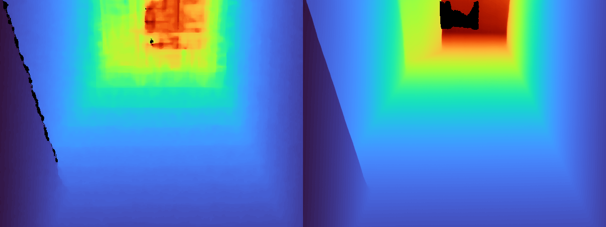

# 确认 Lingbot Depth 开源部署

- 归档编号：`01a0d220-8747-75a3-b4d4-55d923654640`
- 项目：VLA G1 项目
- 创建时间：2026-09-24T14:35:42.279000+08:00
- 更新时间：2026-09-24T15:11:04.014000+08:00
- 状态：活动
- 导出范围：用户可见消息与助手可见回复；不含隐藏推理和工具原始输出

## 1. 用户

lingbot depth 算法是不是已经开源了，我现在能不能给我本地部署一下，是否我需要做环境隔离？

## 2. 助手（进展）

我先核实 LingBot Depth 的开源仓库和部署要求，再检查这台机器的 GPU、Python 和现有环境，确定合适的隔离方式。

## 3. 助手（进展）

已经确认开源，官方提供代码和预训练权重，目前仓库推荐 v0.5。它主要处理 RGB 图像、原始深度图和相机内参，用来补全、修复深度。

你这台机器有 RTX 4090 24GB，具备部署条件；目前显存已占用约 15GB。我会使用独立 Python 环境，避免与现有 LeRobot、ROS 环境的依赖冲突，并先用官方样例验证。

## 4. 助手（进展）

源码已下载，独立环境正在安装。官方依赖实际固定了 PyTorch 2.6.0 和 xFormers，而你现有 LeRobot 使用 PyTorch 2.8，因此这里很有必要做环境隔离；独立虚拟环境即可，暂时不需要 Docker 或修改系统 CUDA。

## 5. 助手（进展）

依赖版本已确定。Hugging Face 直连失败，我已切换到官方提供的 ModelScope 下载权重，约 1.2GB，正在正常传输。环境和权重下载完成后，我会检查 CUDA 并实际跑一次深度补全。

## 6. 助手（进展）

模型权重已下载约三成，PyTorch 安装包也在下载，当前主要耗时是网络传输。启动脚本已准备好，后续可以直接处理本地 RGB-D 数据；虚拟环境会隔离依赖，但运行时仍会与现有程序共享 GPU 显存和算力。

## 7. 助手（进展）

权重已下载约八成。PyTorch 下载中途发生过一次连接中断，安装器正在断点续传，目前没有依赖冲突报错。接下来还需安装随 PyTorch 配套的 CUDA 库。

## 8. 助手（进展）

权重接近下载完成，PyTorch 也已恢复传输。部署目录是项目下的 `lingbot_depth`，模型、依赖和结果都集中在这里，后续迁移或删除会比较方便。

## 9. 助手（进展）

PyTorch 主安装包已下载完成，正在下载 CUDA 数学库；模型权重也即将完成。当前是首次安装的大文件传输阶段，后续运行不需要重复下载这些内容。

## 10. 助手（进展）

模型权重已完整下载，正在记录校验值。目前剩余工作是 CUDA 依赖安装和实际推理验证；还不能把“文件已下载”当作部署成功。

## 11. 助手（进展）

权重校验值已记录。CUDA 依赖仍在下载，速度约为每秒几 MB；我也确认了国内备用包源可访问，若当前下载继续不稳定，可以切换来源继续安装。

## 12. 助手（进展）

CUDA 基础运行库和 cuBLAS 已完成下载，目前在下载较大的 cuDNN 包。尚未运行模型，最终会以样例是否成功输出深度图和点云来确认部署结果。

## 13. 助手（进展）

备用源的小块测速没有比当前来源更快，所以继续现有下载，避免重来。环境隔离已落实：新环境不继承系统包，启动脚本也固定使用自己的 Python 和本地权重。

## 14. 助手（进展）

安装仍在正常推进，cuDNN 下载尚未结束。按当前速度，剩余 CUDA 组件还需要一些时间；我会继续完成安装和验证。

## 15. 助手（进展）

使用自己的数据时，需要一组已对齐的 RGB 图、原始深度图和相机内参。我已把输入格式写进部署说明，样例默认将深度 PNG 的毫米值转换为米，后续接相机时需要特别核对这个单位。

## 16. 助手（进展）

cuDNN 已接近下载完成，安装日志没有新增错误。官方样例会同时保存补全前后对比图和米制深度数据，验证时我会检查数值是否有效，避免只看图片。

## 17. 助手（进展）

cuDNN 已下载完成。剩下几个 CUDA 组件仍较大，我准备并行预下载后续依赖，缩短等待时间，安装仍只写入这个独立环境。

## 18. 助手（进展）

后续大依赖已开始并行下载。当前网络偶尔出现 TLS 连接中断，下载器会自动重试；模型文件已经安全落盘，不受这些依赖下载重试影响。

## 19. 助手（进展）

xFormers 已完成下载，其余 CUDA 包仍在传输。等安装结束后，我会先执行依赖一致性检查，再跑 GPU 推理，确保版本能一起正常工作。

## 20. 助手（进展）

目前仍在等待依赖下载，没有进入推理阶段。已完成的包会保留在项目缓存中，即使个别连接重试，也不需要重新下载全部内容。

## 21. 助手（进展）

cuFFT 已下载完成，正在处理 cuRAND；并行下载的其他包也仍在推进。首次安装时间比预期长，主要原因是当前下载带宽和连接重试。

## 22. 助手（进展）

cuSOLVER 的并行预下载已完成，后续安装可以直接复用缓存。还在等待其余大包，随后就能进行本机 CUDA 检查。

## 23. 助手（进展）

cuRAND 和 NCCL 已下载完成。我暂时停下了会重复下载同一文件的安装进程，等剩余并行下载完成后统一从缓存安装，避免浪费带宽。

## 24. 助手（进展）

剩余三个大包还在下载，已完成的依赖都保留在缓存中。模型本身已经就绪，网络传输结束后即可恢复安装并验证。

## 25. 助手（进展）

cuSPARSE 和 cuSPARSELt 也已完成，安装已从缓存恢复。现在只剩 Triton 大包和少量常规 Python 依赖，随后进行实际运行检查。

## 26. 助手（进展）

所有大依赖已下载完成，正在安装剩余的小包。接下来进入验证阶段：检查版本和 CUDA，再运行官方样例。

## 27. 助手（进展）

OpenCV 已完成下载，正在处理 SciPy 等最后几项依赖。安装结束后我会保存实际版本清单，方便以后复现这套环境。

## 28. 助手（进展）

依赖安装完成，隔离后的 `pip check` 已通过。检查时发现当前终端还继承了 ROS 的 `PYTHONPATH`，我已在启动脚本中清除这项继承，确保运行时也不会混入 ROS 包。

## 29. 助手（进展）

官方样例已在 RTX 4090 上成功跑通，生成了深度对比图、深度数组和点云。640×480 输出中约 98.84% 像素为有效正深度；其余像素按官方代码用 `inf` 表示无效区域，没有 NaN。脚本报告本次推理约 0.33 秒，这只是单次样例结果。

## 30. 助手

_工具输出图片（原始工具文本未纳入归档）。_



## 31. 助手

**已经开源，也已帮你在本机部署并验证成功。** 使用的是[官方仓库推荐的 v0.5 模型](https://github.com/Robbyant/lingbot-depth)，代码采用 Apache-2.0 许可。

- **环境已隔离**：独立 Python 环境，安装 PyTorch 2.6.0，与现有 LeRobot 环境分开，也清除了继承的 ROS Python 路径。
- **4090 验证通过**：官方 640×480 样例成功生成深度图和点云，脚本报告单次推理约 **0.33 秒**。
- **无需重装 CUDA 或额外使用 Docker**。但虚拟环境不会隔离 GPU 显存，多个程序仍共享资源。

直接运行：

```bash
cd '/home/lsy03/文档/ChatGPT/VLA G1 项目'
./lingbot_depth/run_example.sh --device cuda
```

它需要 **RGB 图像＋原始深度图＋相机内参**，用于深度补全和修复。

[部署与使用说明](<../../assets/df2e46596d0c6997--README.md>) · [查看补全前后对比图](<../../assets/0331ac5c45bc82f9--image-0331ac5c45bc.png>)

[附件：df2e46596d0c6997--README.md](../../assets/df2e46596d0c6997--README.md)


