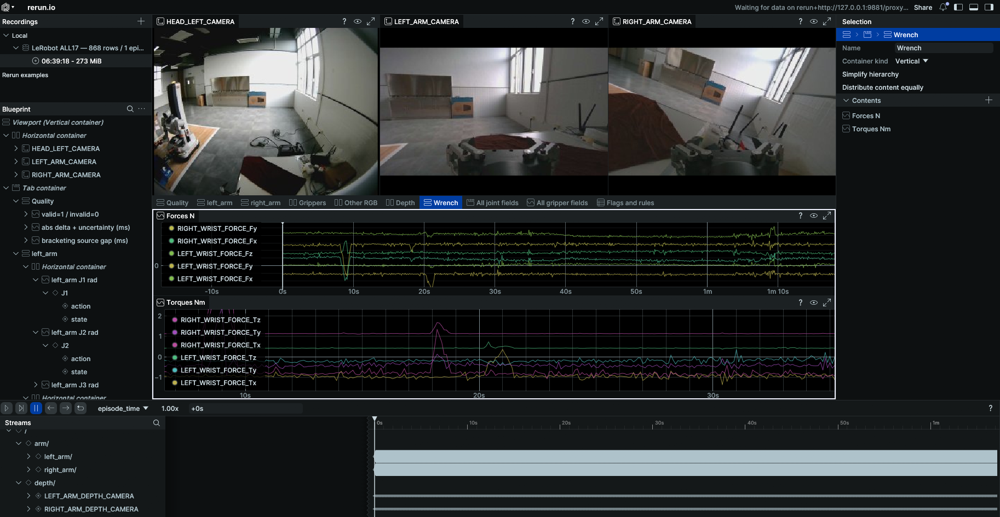

# 周报 9_28 更新VLA项目周报

- 归档编号：`01a0d284-95c7-73f0-99a6-55f4c29896d9`
- 项目：VLA G1 项目
- 创建时间：2026-09-24T16:24:59.591000+08:00
- 更新时间：2026-09-24T16:31:21.549000+08:00
- 状态：活动
- 导出范围：用户可见消息与助手可见回复；不含隐藏推理和工具原始输出

## 1. 用户

看下这个对话“整理VLA项目周报”，现在我需要更新一版 9\_21 -  9\_28 的周报，给我看看怎么写？

## 2. 助手（进展）

我先查看“整理VLA项目周报”里的内容和格式，再据此整理 9/21–9/28 这一版，缺少的进展会标出来。

## 3. 助手（进展）

上一版主要写了遥操作、LingBot 部署和多模态数采。这一版可以突出双臂控制、ACT/SmolVLA 环境，以及数据时间对齐的新进展。我正在核对各项验证到了哪一步；今天是 9 月 24 日，9/25–9/28 的内容会先列为计划。

## 4. 用户

就是 VLA G1 这个项目的

## 5. 助手

明白，**只整理“VLA G1 项目”**。我看过“整理VLA项目周报”，建议延续上一版的三个方向，突出这周新增的进展。

目前是 **9 月 24 日**，下面先作为 **9/21–9/28 周报草稿**，后半周尚未完成的工作放在计划里。

**VLA G1 项目周报（9/21–9/28）**

**1. 双臂遥操作与夹爪联动**

在前期左臂七关节联调基础上，推进双臂遥操作真机验证，已观察到左右臂同时进入正式跟随，双侧扳机夹爪控制已接入。完善左右臂独立启停、单次按键启动、关节限幅、全局急停及高频日志记录；修正持续超速判据误报，定位到反馈短时停更引起的轨迹更新超时，后续继续验证长时间运行稳定性。

**2. ACT、SmolVLA 模型环境部署**

在已有 LingBot 环境基础上，新增独立 LeRobot Docker 环境，完成 ACT、SmolVLA 的 GPU 推理、短训练／微调、权重保存及新容器重载验证，并整理统一启动脚本、版本记录和使用文档。目前已通过合成数据的软件链路验收，下一步接入 G1 真实任务数据开展训练。

**3. 多模态数采与时间对齐**

推进叠毛巾任务试采，完成一段 **86.75 秒、868 行、17 路数据**的导出与对齐质量分析，建立多模态回放及异常定位流程。完成配对阈值对比试验，联合通过率由 **80.99% 调整至 92.05%**；该结果来自阈值调整，仍需结合动态事件验证时序质量。排查并解决回放黑画面的显示问题，确认原始图像正常。同时完善采集组数、时长及各路记录数量展示，支持后续五组任务试采。

**当前问题与后续计划**

- 继续排查机器人反馈短时停更，验证双臂及夹爪连续运行稳定性。
- 完成五组叠毛巾任务试采，检查各组数据完整性和连续可用时长。
- 明确图像、状态与动作标签的对应关系，完成训练所需通道的时序验收。
- 数据验收通过后，优先开展 ACT 真实数据短训练，再推进 SmolVLA 微调及后续模型对比。

这里要保留一个关键口径：**目前已完成任务数据试采和导出，但尚未完成训练数据验收，也还没有实现模型自主控制 G1 的任务闭环。**

## 6. 用户

给我生成一份PDF报告，一页到两页就行，最好需要图片和架构流程图，最好直观一些

## 7. 助手（进展）

我会用 PDF 技能制作两页报告：第一页展示本周进展和你提供的实采画面，第二页用架构流程图说明数采、模型训练及后续闭环，并标明已完成与待验证的环节。
