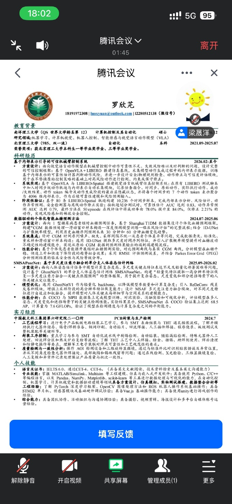
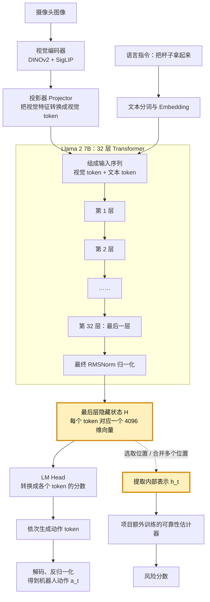

# 定位 OpenVLA 内部表示层级

- 归档编号：`01a0a4b0-3d46-7d13-a407-0b61d8ab0cb6`
- 项目：无项目对话
- 创建时间：2026-09-15T18:50:08.582000+08:00
- 更新时间：2026-09-15T18:51:55.783000+08:00
- 状态：活动
- 导出范围：用户可见消息与助手可见回复；不含隐藏推理和工具原始输出

## 1. 用户

给我讲一下，内部表示是在openVLA 的 哪个结构中的哪一层？ 给我画图直观说明



[附件：67679056525e9faf--pasted-text.txt](../../assets/67679056525e9faf--pasted-text.txt)

## 2. 助手（进展）

我先读一下你贴的上下文，再核对 OpenVLA 的结构和代码，画图标出内部表示 \(h_t\) 和动作 \(a_t\) 分别在哪里。

## 3. 助手

**你这里说的内部表示 \(h_t\)，对应的是 OpenVLA 中语言模型骨干（Llama 2）的隐藏状态。结合简历里“最后层隐藏状态”的描述，位置应在最后一个 Transformer 层之后、输出 token 的预测头之前。**

下面以**原版 OpenVLA-7B** 为例说明。不过，简历没有讲清楚取哪个 token、怎么合并，所以还不能确定他实际的 \(h_t\) 是如何提取的。

## 1. 放在整个 OpenVLA 中看：内部表示在哪里？

OpenVLA 的主要结构是：**视觉编码器 → 投影器 → Llama 2 → 动作 token**。视觉编码器组合 DINOv2 和 SigLIP，投影器把视觉特征转换成语言模型能接收的向量。[官方结构说明](https://openvla.github.io/)



**黄色位置就是你关心的地方。**
可以把 \(h_t\) 理解成：模型在形成动作输出时，中间计算得到的一组特征。

原版实现确实会把语言模型的 `hidden_states` 返回出来；风险估计器则是项目额外接上的模块。[官方实现](https://huggingface.co/openvla/openvla-7b/blob/main/modeling_prismatic.py)

## 2. “哪一层”之外，还必须问“哪个位置”

**一层里有很多个 token，每个 token 都有自己的内部表示。**

把最后一层展开，就像一张表：

```text
                     每个位置都有 4096 个数
                 ┌──────────────────────────┐
视觉 token 1     │  ·  ·  ·  ·  ·  ·  ·  · │
视觉 token 2     │  ·  ·  ·  ·  ·  ·  ·  · │
    ……           │           ……             │
文本 token 1     │  ·  ·  ·  ·  ·  ·  ·  · │
文本 token 2     │  ·  ·  ·  ·  ·  ·  ·  · │
提示词最后位置   │  ·  ·  ·  ·  ·  ·  ·  · │ ← 可以取这一行
已输入动作位置   │  ·  ·  ·  ·  ·  ·  ·  · │ ← 也可以取这些位置
                 └──────────────────────────┘

整张表：H ∈ R^(序列长度 × 4096)

取一行：                    h_t ∈ R^4096
取若干行后平均：             h_t ∈ R^4096
取 7 行直接拼接：            h_t ∈ R^28672
```

所以，**“最后一层隐藏状态”确定的是纵向深度；“选哪个 token”确定的是这一层里的具体位置。**

另外，\(t\) 通常表示**机器人第几个控制时刻**，不是 Transformer 的层号。

## 3. 这里最容易混淆：预测动作的位置，和动作 token 自己的位置

原版 OpenVLA 是**自回归预测**：当前位置的隐藏状态，用来预测**下一个 token**。

```text
输入序列：
[图像 + 指令 + 提示词结尾] [动作 token 1] [动作 token 2] ……
                       │              │
最后层隐藏状态：       h₀             h₁
                       │              │
                    LM Head        LM Head
                       │              │
预测：             动作 token 1   动作 token 2
```

因此：

- **用于预测第一个动作 token 的表示**：来自提示词最后位置。
- **第一个动作 token 输入模型后的表示**：用于预测第二个动作 token。

**这两者错开一个位置。** 简历里说“7 个动作 token 的表示”，还需要确认指的是“预测这 7 个 token 时的隐藏状态”，还是“这 7 个 token 被输入后的隐藏状态”。

## 4. 对应到代码中怎么理解？

以标准 Hugging Face 接口、一次普通前向传播为例：

```python
outputs = model(
    **inputs,
    output_hidden_states=True,
    return_dict=True,
)

# 最后层表示：包含最终归一化
H = outputs.hidden_states[-1]   # [B, S, 4096]

# 示例：取最后一个位置，前提是该位置不是 padding
h = H[:, -1, :]                 # [B, 4096]
```

这里是一个**提取示例**，并不能据此认定简历作者用了同样的方法。若通过 `generate()` 提取，还需要区分每一步生成返回的隐藏状态。

**你可以直接这样追问：**

> “你取的是 Llama 2 最后层、最终归一化后的隐藏状态吗？7 个动作对应的位置怎么对齐？最后是平均成 4096 维，还是拼接成 28672 维？”

## 4. 助手

_历史投影中的图片引用（用于补全本地对话资源）。_

> 资源未归档：`/tmp/codex-clipboard-cb577e2f-dfc1-47b5-b68d-69792fc26ce5.png`（missing）
