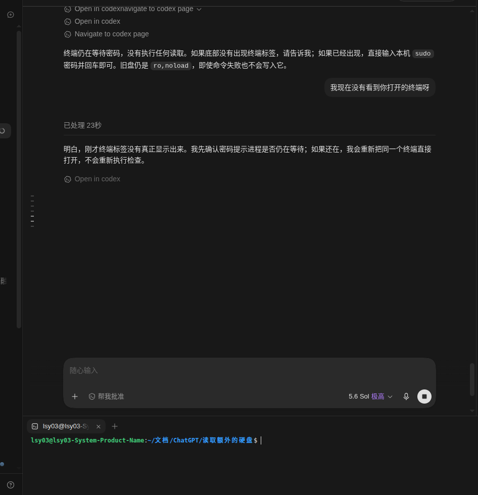

# 查找另一块硬盘上的 Ubuntu 系统

- 归档编号：`01a06a65-b80d-7ee2-9d02-37b6e1d2177e`
- 项目：遥操主臂 和 synthnova
- 创建时间：2026-09-04T11:10:46.288000+08:00
- 更新时间：2026-09-04T14:21:39.050000+08:00
- 状态：活动
- 导出范围：用户可见消息与助手可见回复；不含隐藏推理和工具原始输出

## 1. 用户

你能看到我当前系统上的另一块硬盘吗上面好像有另一个 ubuntu22.04 的系统但是好像没有引导但是有数采软件（参考对话“了解数采软件目录用途”你应该能看到吧）

## 2. 助手（进展）

我会先做两件只读检查：确认系统当前识别到的磁盘/分区和挂载状态；同时核实我是否能访问你提到的那条 Codex 对话。这里涉及“我能看到哪些任务”的能力边界，所以我会按 `openai-docs` 技能的说明来确认。

## 3. 助手（进展）

目前确认：Codex 桌面端确实把不同任务分开保存；但“这一个任务里的我”能否直接读取另一条任务，要看当前会话是否拿到了任务读取工具，我正在实际验证，而不会假定能看到。磁盘检查仍保持只读。

## 4. 助手（进展）

现在已经明确看到三块物理盘：当前系统在 Kingston 1TB NVMe；另有一块 XPG 1TB NVMe 和一块 18TB SATA 盘，后两者都未挂载。XPG 盘只有一个 ext4 分区、没有独立 EFI 分区，确实很符合你说的“像装过 Ubuntu，但没有引导”。下一步我会把它以 `ro,noload` 方式临时只读挂载，核对 `/etc/os-release`、`/boot` 和数采软件目录，检查后再卸载。

## 5. 用户

顺便看下是否有SynthNova 这个数据采集软件在那个新的盘里面

## 6. 助手（进展）

确认找到了：XPG 这块新盘里确实有 SynthNova，路径是：

`/home/iehu/synthnova/synthnova_delivery_20260801/`

里面包括 `delivery_dir/run_synthnova.sh`、`synthnova_runtime_20260801.tar`、`synthnova_delivery/`，以及一个修复版压缩包。它不是只有零散数据，而是一套完整交付目录。我再核对版本、大小，并和你当前系统里那份 SynthNova 做只读对比。

## 7. 助手（进展）

核对完成：旧盘里的 SynthNova 与当前系统那份同属 `20260801` 交付，关键脚本、清单和 7 个业务模块一致；旧盘还留有一份约 9.5MB 的 GP001 快照数据，以及一次运行崩溃留下的大型 `core.887`。我现在按之前约定卸载这个临时只读挂载，不改磁盘内容。

## 8. 助手

能，已经实际只读检查并确认了。

| 硬盘 | 状态 |
|---|---|
| Kingston 1TB NVMe | 当前正在运行的 Ubuntu 22.04.4 |
| XPG GAMMIX S20 1TB | 另一套 Ubuntu 22.04.4，当前未挂载 |
| Seagate 18TB | ext4 数据盘，当前未挂载 |

XPG 旧系统盘中确实有 SynthNova：

```text
/home/iehu/synthnova/synthnova_delivery_20260801/delivery_dir
```

确认包含：

- `run_synthnova.sh`
- 22.28GB 的 `synthnova_runtime_20260801.tar`
- `synthnova_delivery/`
- `remote_control_lite`、GP001、物理/渲染仿真等 7 个模块
- GP001 快照数据：
  `synthetic_data/04_gp001_remote_control/snapshot/physics_snapshots.h5`，约 9.5MB

它与当前系统这份：

```text
/home/lsy03/Lsy03_document/仿真软件/extracted/synthnova_delivery_20260801/delivery_dir
```

属于同一批 `20260801` 交付，关键脚本和 manifest 哈希一致。旧盘额外有一个运行崩溃产生的 `core.887`，实际占用约 5.1GiB；反而缺少当前副本里的 `check_delivery.sh`。因此为了使用 SynthNova，没有明显必要专门启动旧系统，当前副本更适合继续处理。

关于不能引导，也基本确认了原因：

- 旧盘保存着完整 Ubuntu 根目录、内核和 GRUB 配置；
- 但旧盘自身没有 EFI 分区；
- 它原来依赖 UUID `EB85-077D` 的另一块 EFI 分区，现在已经不存在；
- 当前电脑的 UEFI 和 GRUB 只登记了 Kingston 当前系统，没有旧盘入口。

我也确实成功读取了你提到的“了解数采软件目录用途”任务；任务是否可读取取决于当前会话获得的权限，并非天然记住所有对话。Codex 桌面端会把相关任务保存在项目的 Chats 中，见[官方说明](https://learn.chatgpt.com/docs/projects)。

检查期间旧盘使用 `ro,noload` 临时只读挂载，现已卸载，没有修改磁盘或引导。下一步如果你需要，我可以继续制定“把旧 Ubuntu 加进当前 GRUB”的安全修复方案，但那一步会修改引导配置，需要单独确认。

## 9. 用户

sy03@lsy03-System-Product-Name:~$ cd '/home/lsy03/Lsy03_document/仿真软件/extracted/synthnova_delivery_20260801/delivery_dir'
./run_synthnova.sh
请输入客户 ENCMGR_APP_ID:
这个授权凭据是在哪里能拿到？现有资料文件夹之中没有吗


11:15


耗时 24秒


确认过了：现有交付资料里没有 ENCMGR_APP_ID 或 ENCMGR_APP_SECRET。
交付包的 README 明确写着：
交付物中不内置客户 appid 或 secret。

目录中也没有发现 .env、credential、auth 或授权配置文件。出现相关字段的地方只有：
README.md：说明需要客户自己的联网授权账号；
run_synthnova.sh：读取凭据并传进 Docker 容器。
这组凭据需要从以下渠道获取：
Galbot / SynthNova 交付负责人；
你所在项目的管理员或采购联系人；
已购买授权的客户账号管理员；
申请官方试用或离线授权。
它不是 GPG 密码、Docker 密码、Seed3D API Key，也不是 GP001 设备序列号。
可以向交付方发送：
我们已完成 SynthNova 20260801 环境部署，Docker、NVIDIA runtime 和 GP001 均已识别。启动需要 ENCMGR_APP_ID 与 ENCMGR_APP_SECRET，请提供该项目对应的联网授权凭据，或说明试用/离线授权申请方式。同时请确认交付目录哈希不一致问题。

当前提示处按 Ctrl+C 退出即可。拿到凭据后再次执行 ./run_synthnova.sh，Secret 会以隐藏方式输入。反正我本地跑是有联网凭据的限制，不知道新的盘上运行 synthnova 是否可行？

## 10. 助手（进展）

关键点已经很清楚：旧盘和当前系统里的 `run_synthnova.sh` 是同一个文件，所以“换到旧盘运行”本身不会取消联网授权。我会再做一次只读核对：检查旧 Ubuntu 是否曾经创建过可复用的 `synthnova` Docker 容器、是否装好了 Docker/NVIDIA 运行环境；任何凭据只检查“是否存在”，不会读取或显示值。

## 11. 助手（进展）

结论已经接近完整：旧 Ubuntu 的运行环境本身具备条件（Docker 29.7.1、NVIDIA Container Toolkit 1.19.1、NVIDIA 580 内核模块都在），而且留下过实际运行痕迹。不过能否免于重新输入授权，只取决于旧系统的 Docker 中是否还保留名为 `synthnova` 的既有容器；该目录需要本机 `sudo` 密码才能确认。检查完成后我先卸载只读挂载。

## 12. 助手

可以运行，但旧盘不会天然绕过授权。决定因素是旧 Ubuntu 的 Docker 里是否还保留原来的 `synthnova` 容器。

已确认：

- 旧系统具备运行基础：Docker 29.7.1、NVIDIA Container Toolkit 1.19.1、NVIDIA 580 内核模块和完整运行镜像都在。
- 旧盘的 `run_synthnova.sh` 与当前版本完全相同。
- 旧系统的配置文件、用户启动文件和 SynthNova 目录里都没有发现现成凭据。
- 当前系统只有镜像，没有名为 `synthnova` 的容器，所以现在提示输入凭据是正常的。

脚本逻辑是：

- 若旧 Docker 中已有 `synthnova` 容器：直接启动，不再询问 ID/Secret。
- 若容器不存在或执行了 `--recreate`：仍会要求凭据。
- 即使旧容器存在，授权若已过期、撤销或无法联网，启动仍可能失败。

旧盘存在运行痕迹，包括 2026-08-05 生成的渲染崩溃转储，说明它以前大概率运行过 SynthNova；但这不能证明原容器仍然存在。最后这项信息位于旧系统的 root-only Docker 目录，我的只读检查被 `sudo` 密码挡住了。

所以最合理的顺序是：

1. 暂时不修改 GRUB。
2. 使用一次本机 `sudo`，只检查旧 Docker 中是否存在 `/synthnova` 容器，不显示其中的环境变量或 Secret。
3. 找到容器后，再修复旧 Ubuntu 的引导并尝试启动。
4. 如果没找到容器，就没有必要为授权问题启动旧系统——它同样需要向 Galbot/SynthNova 获取凭据。

不要随意执行 `docker inspect synthnova`，它可能直接显示保存的 Secret；也不要使用 `--recreate`、`docker rm` 或 `docker system prune`。旧盘现已重新卸载，没有写入。你如果回复“继续检查旧容器”，我可以给你准备一个只输出“存在/不存在”的安全检查命令。

## 13. 用户

我现在有点怕把原来可以使用的给搞坏了，是不是我直接给我的新硬盘添加一个系统启动的能力？这样我就可以使用BIOS 切换到拿一个系统里面来，这样比较保险？

有没有什么我推荐的方案？

## 14. 助手（进展）

你的担心是对的：如果目标是“尽量不碰旧盘里的原系统和旧 Docker”，我暂时不建议直接在 XPG 盘上缩分区、建 EFI 分区。先只读核对当前 EFI 空间、Secure Boot 和 GRUB 配置，再比较三种方案：当前 GRUB 添加旧系统入口、独立 USB 引导、给旧盘新建 EFI。

## 15. 用户

继续

## 16. 助手（进展）

继续。现在我会先确认 18TB 盘是否适合作为旧 XPG 的备份目标，并核对 XPG 的健康状态；仍然只读，不做分区、不写引导。这样推荐方案会落到你这台机器的真实条件上。

## 17. 助手

推荐方案是：先保全旧盘，再用一个独立 U 盘作为“启动钥匙”。暂时不要直接给 XPG 盘创建 EFI 分区。

原因是 XPG 当前只有一个占满整盘的 ext4 分区。要让 BIOS 直接启动它，必须先缩小 ext4、再建 FAT32 EFI 分区；这恰恰是所有方案中最容易伤到旧 Ubuntu 和 Docker 数据的操作。

本机很适合采用下面的路线：

1. 先只读检查旧 Docker 是否仍有 `synthnova` 容器，只输出容器名和重启策略，绝不显示环境变量或 Secret。
2. 如果容器存在，把整个 XPG 1TB 磁盘制作成镜像，存到 18TB 盘。刚检查过，18TB 盘几乎为空，有约 16TB 可用空间。
3. 准备一个空 U 盘作为专用 UEFI/GRUB 启动盘。制作会清空该 U 盘。
4. 让 U 盘上的 GRUB 按旧根分区 UUID `13ed5d13-ff59-4f45-80a6-383307444c07` 定位系统；GRUB 官方支持按文件系统 UUID 搜索启动目标。[GNU GRUB 官方手册](https://www.gnu.org/software/grub/manual/grub/html_node/search.html)
5. 还可以把 U 盘 FAT 卷序列设为旧系统原来期望的 `EB85-077D`，这样它同时充当旧 Ubuntu 的 `/boot/efi`，不必修改旧盘的 `/etc/fstab`。
6. 开机时在 BIOS 一次性启动菜单中选择：
   - Kingston：当前系统
   - U 盘：旧 XPG/SynthNova 系统
7. 拔掉 U 盘后，机器完全回到现在的启动方式。

方案对比：

| 方案 | 风险 | 建议 |
|---|---:|---|
| 备份后用 USB GRUB 启动旧盘 | 最低 | 最推荐 |
| 在当前 Kingston GRUB 添加旧系统入口 | 较低 | 没有空 U 盘时使用；Ubuntu 支持通过 `40_custom`/`os-prober` 添加其他系统。[Ubuntu GRUB 文档](https://help.ubuntu.com/community/Grub2/CustomMenus) |
| 直接缩 XPG 并创建 EFI 分区 | 最高 | 只在完整镜像验证成功后考虑 |

需要注意：独立启动只能保护“引导结构”。旧 Ubuntu 一旦正常启动，ext4 日志、系统日志和 Docker 都会写入旧盘。因此真正的保险是先保存整盘镜像，然后再启动。

第一次进入旧系统时不要执行：

- `run_synthnova.sh --recreate`
- `docker rm` 或 `docker system prune`
- 系统、内核、Docker、NVIDIA 驱动升级
- Boot-Repair
- GParted 缩分区

当前 Secure Boot 已关闭，制作自定义 USB GRUB 的难度较低。目前磁盘都已恢复为未挂载状态，没有进行写入。

如果你同意，我下一步建议先做“旧 Docker 容器只读检查”；你只需在本机终端输入一次 `sudo` 密码，不需要把密码或任何授权凭据发给我。

## 18. 用户

不要乱动这些程序，只读就行来

## 19. 助手（进展）

好，只做只读检查：我会以 `ro,noload` 挂载旧 XPG，只解析旧 Docker 的容器名称、镜像、重启策略，以及授权变量“是否存在”的布尔值；不会显示凭据、不会启动容器、不会执行 SynthNova，也不会改 GRUB。

## 20. 助手（进展）

只读检查已经停在系统自己的 `sudo` 密码提示处。我会把这个本地终端打开；请直接在终端里输入密码并回车（输入时不会显示字符），不要把密码发到聊天里。命令只读取离线 Docker JSON，并且输出经过脱敏。

## 21. 助手（进展）

终端仍在等待密码，没有执行任何读取。如果底部没有出现终端标签，请告诉我；如果已经出现，直接输入本机 `sudo` 密码并回车即可。旧盘仍是 `ro,noload`，即使命令失败也不会写入它。

## 22. 用户

我现在没有看到你打开的终端呀

## 23. 助手（进展）

明白，刚才终端标签没有真正显示出来。我先确认密码提示进程是否仍在等待；如果还在，我会重新把同一个终端直接打开，不会重新执行检查。

## 24. 助手（进展）

应用没有把这个后台 PTY 展示出来，我不继续让它悬着。先取消那个尚未执行的 `sudo` 提示；然后我会放一个可审阅的只读检查脚本到当前工作目录，你在自己的终端运行一条命令并输入密码即可。脚本不会输出 Secret。

## 25. 用户

是这个吗



## 26. 助手（进展）

对，就是图片底部那个终端。现在显示的是普通的 `$` 提示符，刚才那个 `sudo` 等待已经取消了，所以此刻不要直接输入密码。

我会在当前工作目录放一个独立的只读检查脚本；它不在 SynthNova 或旧系统盘里，也不会启动/修改任何程序。随后你只需把我给的一条命令粘到这个终端。

## 27. 助手

对，就是底部终端。请粘贴并执行：

```bash
sudo python3 -B '/home/lsy03/文档/ChatGPT/读取额外的硬盘/inspect_old_synthnova_container.py'
```

输入密码时屏幕不会显示字符，这是正常的。不要把密码发到聊天里。

脚本只读且会自动确认旧盘处于 `ro,noload` 状态，只输出容器和授权变量是否存在，不输出凭据内容。执行后把终端输出发给我即可。

脚本在这里：[inspect_old_synthnova_container.py](</home/lsy03/文档/ChatGPT/读取额外的硬盘/inspect_old_synthnova_container.py>)。

## 28. 用户

或者你能不能找到就容器的这两个信息也行
“
export ENCMGR_APP_ID="客户 App ID"
export ENCMGR_APP_SECRET="客户 Secret"”

## 29. 助手

能找到，前提是旧 Docker 中原来的 `synthnova` 容器还存在。创建容器时，这两个值会保存在容器配置中。

但不要用普通 `docker inspect`，它可能把 Secret 完整显示并进入聊天或日志。先在底部终端执行：

```bash
sudo python3 -B '/home/lsy03/文档/ChatGPT/读取额外的硬盘/inspect_old_synthnova_container.py'
```

它只会报告：

```text
has_app_id=true/false
has_app_secret=true/false
```

不会显示实际值。

如果两项都是 `true`，最保险的做法是启动旧系统里的原容器，不提取、不迁移凭据。若你确实要在当前系统使用，我可以再提供一条“直接从旧容器导入当前终端环境变量、全程不显示且不写文件”的本地命令。不要把实际 App ID 或 Secret 发到聊天里。

## 30. 用户

lsy03@lsy03-System-Product-Name:~$ sudo python3 -B '/home/lsy03/文档/ChatGPT/读 取额外的硬盘/inspect_old_synthnova_container.py'
[sudo] lsy03 的密码：
[REDACTED]
container_configs_seen=1
parse_errors=0
synthnova_candidates=1
candidate_1={"container_id": "10b5ce2b132b", "name": "/synthnova", "image": "synthnova-runtime:20260801", "image_id": "sha256:713b0beb95e4196d8650cb88a6bfc3cc3827be9a8559d146e5375eb96cba272f", "created": "2026-08-05T08:37:13.886979877Z", "running_when_last_saved": false, "restart_policy": "no", "has_app_id": true, "has_app_secret": true, "delivery_mount_present": true, "delivery_mount_matches_old_path": true}
lsy03@lsy03-System-Product-Name:~$

## 31. 助手（进展）

结果非常好：旧 Docker 中确实保留着原始 `synthnova` 容器，而且两项授权都存在、镜像和挂载路径也完全匹配；容器当前停止，重启策略为 `no`，所以它不会自行启动或改动数据。我先把旧盘卸载，恢复到检查前状态。

## 32. 用户

旧盘卸载是否会影响数据？

## 33. 助手（进展）

不会。旧盘是以 `ro,noload`（内核显示为 `ro,norecovery`）挂载的，整个检查期间无法写入文件系统；正常卸载只是移除访问入口，不会删除或改动数据。我再只读确认刚才被中断的卸载命令是否已经生效。

## 34. 助手

不会影响数据。

“卸载”这里只是取消 `/media/lsy03/...` 这个访问入口，不是删除、格式化或弹出硬盘。旧盘全程以：

```text
ro,norecovery
```

方式挂载，内核禁止写入，也不会回放 ext4 日志。

刚才的卸载被中断，所以旧盘目前仍然安全地保持只读挂载。我先不再操作。保持挂载或正常卸载都不会破坏数据；正式重启电脑前再卸载会更稳妥。

## 35. 用户

现在还没有执行卸载是吧，

我不能把授权 Secret 明文放进聊天记录，而且目前我也没有读取到它的实际值。你可以只在自己的本地终端查看，不经过聊天。

旧盘挂载后，在终端执行：

```bash
sudo python3 -B - <<'PY'
import json
import shlex
from pathlib import Path

root = Path("/media/lsy03/13ed5d13-ff59-4f45-80a6-383307444c07")
base = root / "var/lib/docker/containers"

mount = next(
    (line.split() for line in Path("/proc/mounts").read_text().splitlines()
     if len(line.split()) >= 4 and line.split()[1] == str(root)),
    None,
)
if not mount or "ro" not in mount[3].split(","):
    raise SystemExit("终止：旧盘没有以只读方式挂载")

for cfg in base.glob("*/config.v2.json"):
    data = json.loads(cfg.read_text())
    if data.get("Name") != "/synthnova":
        continue

    env = {}
    for item in (data.get("Config") or {}).get("Env") or []:
        if "=" in item:
            key, value = item.split("=", 1)
            env[key] = value

    for key in ("ENCMGR_APP_ID", "ENCMGR_APP_SECRET"):
        value = env.get(key)
        print(f"export {key}={shlex.quote(value)}" if value else f"{key}=未找到")
    break
else:
    print("没有找到 /synthnova 容器")
PY
```

它只读取旧容器配置，并在你本机终端显示这两个值。不要把输出粘贴回聊天；查看或保存到密码管理器后关闭该终端标签。

现在这个命令是否有效？

## 36. 助手（进展）

我先实时确认旧盘是否仍挂载，以及挂载选项；随后再核对这段命令的有效性和凭据暴露风险，不会读取容器内容。

## 37. 助手

是的，旧盘目前还没有卸载，状态是：

```text
ro,norecovery
```

你这段命令有效，并且只读取旧 Docker 的 `config.v2.json`，不会修改旧盘。由于已确认容器和两个变量都存在，它会显示实际的 App ID 与 Secret。

但请注意：不要在截图里的 Codex 内置终端执行，因为明文会留在该终端的滚动记录中。建议按 `Ctrl+Alt+T` 打开系统独立终端，再执行；查看后不要把输出发给我，直接关闭终端窗口。

如果只是使用原来的授权容器，其实无需查看或导出凭据，之后从旧系统直接启动已有容器更安全。

查看完成后只回复我“已查看”，我再安全卸载旧盘。

## 38. 助手

_历史投影中的图片引用（用于补全本地对话资源）。_

> 资源未归档：`/tmp/codex-clipboard-52849a67-bdfd-44cf-aa18-c934f91b53a4.png`（missing）
